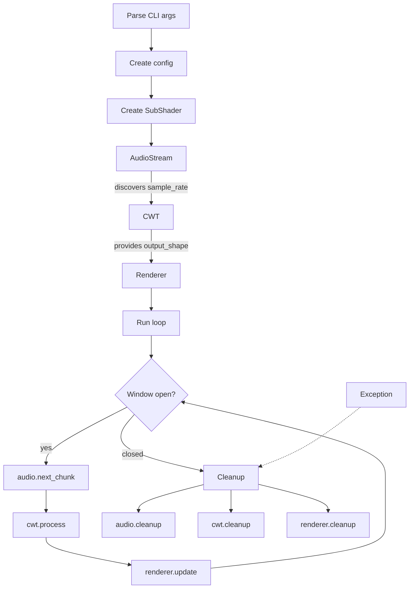

# Orchestrator Design

## Flow



## __main__.py

```python
from subshader.pipeline import SubShader
from subshader.config import PipelineConfig

def main():
    args = parse_args()
    config = PipelineConfig(file_path=args.audio_file)

    pipeline = SubShader(config)
    try:
        pipeline.run()
    except GRACEFUL_EXCEPTIONS as e:
        report(e)
    finally:
        pipeline.cleanup()
```

## pipeline.py

```python
class SubShader:

    def __init__(self, config):
        self.audio    = AudioStream(config)
        self.cwt      = GpuCWT(config) if gpu_available() else CpuCWT(config)
        self.renderer = Renderer(config, self.cwt.output_shape)

    def run(self):
        self.audio.start()

        while not self.renderer.should_close():
            chunk = self.audio.next_chunk()  # blocks/waits internally until ready
            coefs = self.cwt.process(chunk)
            self.renderer.update(coefs)

    def cleanup(self):
        self.audio.cleanup()
        self.cwt.cleanup()
        self.renderer.cleanup()
```

## Module Responsibilities

```
AudioStream     file I/O, playback, sync clock, loop detection
CpuCWT / GpuCWT kernel construction, FFT convolution, normalization, downsampling
Renderer        OpenGL context, shader, frame buffer, intensity tracking, window
```

## Directory Structure

```
src/subshader/
├── __init__.py
├── __main__.py          # CLI entry point only (argparse + main)
├── pipeline.py          # SubShader class (init, run, cleanup)
├── config.py            # PipelineConfig, CWTConfig, RendererConfig
├── exceptions.py        # SubShaderException hierarchy
│
├── audio/
│   ├── __init__.py
│   ├── audio_stream.py  # AudioStream facade
│   ├── reader.py        # File I/O, chunking (was audio_input.py)
│   └── player.py        # Playback, sync clock (was audio_player.py)
│
├── dsp/
│   ├── __init__.py
│   ├── cwt.py           # CWT base + CpuCWT + GpuCWT (was wavelet.py)
│   ├── wavelet_kernel.py
│   └── gaussian.py
│
├── renderer/            # was viz/
│   ├── __init__.py
│   ├── renderer.py      # Renderer + GLContext (was plotter.py)
│   ├── frame_buffer.py  # CircularFrameBuffer, AudioFrameBuffer
│   ├── intensity.py     # IntensityTracker (was plot_normalizer.py)
│   └── shaders/
│       ├── vertex.glsl
│       └── fragment.glsl
│
└── utils/
    ├── __init__.py
    ├── logging.py
    ├── timing.py        # @timed decorator
    ├── gpu.py           # gpu_available()
    ├── loop_timer.py
    └── os_env_setup.py
```

### What changed

| Before | After | Why |
|--------|-------|-----|
| `__main__.py` (223 lines, class + CLI) | `__main__.py` (~15 lines) + `pipeline.py` | Importable pipeline, thin entry point |
| `audio/audio_input.py` + `audio_player.py` | `audio/audio_stream.py` + `reader.py` + `player.py` | AudioStream facade, submodules for file I/O and playback |
| `dsp/wavelet.py` (700 lines, 7 classes) | `dsp/cwt.py` (flattened hierarchy) | Cleaner names, fewer classes |
| `viz/plotter.py` (812 lines, 7 classes) | `renderer/renderer.py` + `frame_buffer.py` + `intensity.py` | One concern per file |
| `viz/comparison_navigator.py` (1251 lines) | removed or `research/` | Legacy PyQtGraph tool, not part of main pipeline |

### What didn't change

- `utils/` — same directory, same purpose
- `dsp/wavelet_kernel.py`, `dsp/gaussian.py` — untouched
- `renderer/shaders/` — same GLSL files, shorter names

---

## Open Questions

- **Sleep/yield in the render loop:** Revisit the 1ms sleep call and its implications. AudioStream runs a sounddevice callback on a separate OS thread. The main thread currently polls + sleeps. Consider: should `next_chunk()` block internally (event-based wait)? Does the GIL affect this? What's the actual CPU cost of busy-waiting vs sleeping vs event.wait()? Decide during implementation.
