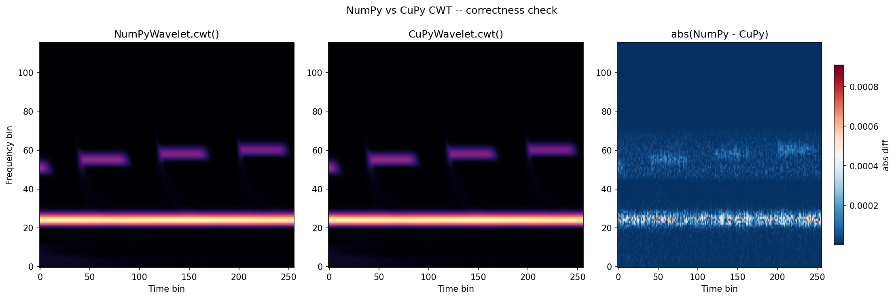

# DSP: Wavelet Transform Foundations

> **Scaffold document.** Markers guide the author:
> - `[WRITE: "topic"]` — blank section needing prose in your voice
> - `[DONE: text]` — content from the outline that is ready as-is
> - `[PLACEHOLDER: figure — "description"]` — image to be generated
> - `candidate analogy:` — suggested analogy; accept, reject, or rewrite it

---

## 1. Motivation

[WRITE: "Why time-frequency analysis matters — what frequencies are present and when they occur"]

[WRITE: "Why the Fourier Transform has limitations for this task"]

[WRITE: "Why the Wavelet Transform is better suited — signal decomposition as the common foundation for both"]

[WRITE: "Introduce the structure: simple examples first, building up to a comprehensive and intuitive understanding of how these methods decompose signals, and where each excels and falls short"]

candidate analogy: "unmixing paint" — figuring out how much of each color contributed to the final result

---

## 2. Foundations: Inner Product

### 2.1 Signal Decomposition

[WRITE: "The end goal is decomposing an arbitrary composite signal into its fundamental components — its basic building blocks — and measuring how much of each exists in the overall signal"]

[WRITE: "This motivates two things: (1) define what a signal's fundamental components are, (2) measure how much of each component is present in the signal"]

candidate analogy: "unmixing paint" — trying to figure out how much of each color ingredient contributed to the overall color; where would you even begin?

[WRITE: "Bridge to the Inner Product as the tool that lets us do both"]

---

### 2.2 Inner Product

[WRITE: "Signal decomposition really depends on the signal being analyzed and the *properties* we're interested in measuring"]

> **TERMINOLOGY NOTE:** Use "properties" here, NOT "features" or "patterns" — those are ML-level terminology that comes later in Section 7+. "Properties" is the right level of abstraction for this section (per discussion_summary.md).

[WRITE: "The Inner Product gives a quantitative way to calculate a similarity score between function f and a reference function g"]

[Include inner product notation:]

$$\langle \, \mathbf{f} \, , \, \mathbf{g} \, \rangle$$

*Inner Product Notation*

[WRITE: "The result is a measurement of how aligned the two functions are, reflecting their similarity"]

[WRITE: "Set up the bridge for audio contexts (save full explanation for Sections 3-5): function = signal, reference = signal properties we want to measure — but first, see it in its simplest form: the Dot Product"]

---

### 2.3 Dot Product (Discrete Case)

[WRITE: "The Inner Product is a generalization of what the Dot Product does to vectors in real numbers — no imaginary numbers, no abstract math domains, just basic multiplication and addition"]

[WRITE: "Walk through the Dot Product formula: take first term of a, multiply by first term of b, repeat for each term, add them all up"]

[PLACEHOLDER: figure — "2D vector dot product geometric interpretation — parallel same direction, parallel opposite direction, perpendicular vectors"]

[WRITE: "What does the result actually mean? The result indicates how parallel the two vectors are — that's the key insight for understanding how it measures alignment between two things"]

---

### 2.4 Vector Projection

#### 2.4.1 Geometric Interpretation

[WRITE: "Review what a vector is: an arrow with magnitude (how long) and direction (where it points)"]

[WRITE: "The Dot Product's geometric interpretation: how parallel two vectors are — parallel same direction = strongly similar (positive), parallel opposite = strongly opposite (negative), perpendicular = no similarity (zero)"]

[PLACEHOLDER: figure — "Parallel same/opposite and perpendicular vector pairs — visual comparison of similarity outcomes"]

[WRITE: "What about oblique vectors — neither completely parallel nor perpendicular? Introduce the idea of decomposing one vector using the other's dimensions to see how much of each component aligns"]

---

#### 2.4.2 Projection Mechanics

[WRITE: "Through the lens of Vector Projection: a vector's components contribute values in the same direction as the other vector"]

[WRITE: "The mechanics: values in the same direction increase the similarity score; values in the opposite direction decrease it; values perpendicular to the other do not affect it"]

[WRITE: "Magnitudes of each vector scale the result bigger or smaller"]

candidate analogy: "casting a shadow" — how much of one vector's shadow falls along the direction of the other

---

#### 2.4.3 Basis Decomposition (2D → ND)

[WRITE: "What are the fundamental components of vectors? In a coordinate system, the components are the basis vectors — the x and y dimensions. Start with 2D: a · b = a₁b₁ + a₂b₂"]

[PLACEHOLDER: figure — "Basis decomposition of a 2D vector into x and y components — projection visualization"]

[WRITE: "The pattern extends to 3D (a · b = a₁b₁ + a₂b₂ + a₃b₃) and to N dimensions — the math is the same, we just run out of ways to visualize it"]

[WRITE: "At high dimensions, drop the spatial language: think 'elements ordered by index' instead of 'dimensions'. The vector becomes a sequence or array."]

---

### 2.5 Sign Accumulation

[WRITE: "The dot product is a signed similarity accumulator: same signs contribute positive (agreement), opposite signs contribute negative (disagreement), and the final sum is the net agreement across all elements"]

[WRITE: "This process — measuring similarity between two sequences by multiply-accumulate — is called correlation"]

[PLACEHOLDER: figure — "Color-coded element products showing sign accumulation: positive pairs (green), negative pairs (red), net sum result"]

---

### 2.6 Continuous Extension

[WRITE: "Bridge from discrete dot product (Σᵢ aᵢbᵢ) to continuous inner product (∫ a(t) b(t) dt) — the same multiply-accumulate operation, but now operating on functions instead of vectors"]

[WRITE: "The function we compare against is the basis function — a known reference with a property we want to measure. The scalar result of this comparison is a coefficient — it tells you how much of that basis function is present"]

[WRITE: "The choice of basis function determines what properties we can detect — this is the key that unlocks Sections 3, 4, and 5"]

---

### 2.7 Inner vs Outer Product (Brief Note)

[WRITE: "Conceptual note on naming: Inner product contracts (rank 1 × rank 1 → rank 0, a scalar), outer product expands (rank 1 × rank 1 → rank 2, a matrix). Named relative to operand rank — inner goes inward toward scalars."]

---

## 3. Fourier Transform

### 3.1 The Template Question

[WRITE: "We have a signal (sequence of samples) and the inner product measures similarity to some reference — but what should that reference be?"]

[WRITE: "Answer: known basis functions. So what basis functions are well-suited to audio analysis?"]

---

### 3.2 Sine Waves as Templates

[WRITE: "What if the basis function is a pure sine wave? Comparing the signal to a sine wave at a particular frequency: high similarity = that frequency is present (large coefficient), low similarity = that frequency is absent (small coefficient)"]

[WRITE: "To get a complete picture, repeat for many frequencies — sweep through all of them"]

---

### 3.3 The Fourier Transform

[WRITE: "The Fourier Transform is the inner product of the signal with sine waves at every frequency. Each frequency gets a similarity score (a Fourier coefficient). The collection of all coefficients is the spectrum — a map of frequency content"]

[PLACEHOLDER: figure — "Fourier basis functions — several sine waves at different frequencies overlaid on a composite signal"]

---

### 3.4 FFT Limitations

[WRITE: "Sine wave templates span the entire signal — the FFT knows *what* frequencies exist, but not *when*. A note at the beginning vs the end produces the same FFT result"]

[WRITE: "The stationarity assumption: the FFT assumes signal properties don't change over time. Music is full of non-stationarities — attacks, decays, transitions — and the FFT smears them together"]

[WRITE: "Concrete examples: two close notes played sequentially vs simultaneously; a chirp (frequency sweep); a transient attack vs a sustained tone"]

---

## 4. Short-Time Fourier Transform (STFT)

### 4.1 Windowed Compromise

[WRITE: "The STFT's solution: chop the signal into short overlapping segments and apply FFT to each segment. Now we have time information (which window) + frequency information"]

[WRITE: "The window function acts as a filter — it selects which portion of the signal to analyze at each step"]

[PLACEHOLDER: figure — "STFT windowing illustration — signal chopped into overlapping windows, FFT applied to each"]

candidate analogy: "measuring with one ruler size for everything" — the window is fixed, so you're using the same ruler whether you're measuring a whole note or a fast drum hit

---

### 4.2 The Resolution Tradeoff

[WRITE: "Window size is fixed — and this is the fundamental limitation. Short window → good time resolution but poor frequency resolution. Long window → good frequency resolution but poor time resolution"]

[WRITE: "Why this tradeoff exists: you need enough cycles to accurately measure a frequency. Low frequencies have slow cycles — they need longer windows. High frequencies have fast cycles — they need shorter windows. A fixed window can't serve both optimally"]

[WRITE: "Practical impact on audio: 100 Hz vs 200 Hz is a 100% frequency difference (very audible), while 10,000 Hz vs 10,100 Hz is a 1% difference (barely audible). Fixed resolution wastes precision where it's not needed and lacks it where it is"]

---

## 5. Wavelet Transform

### 5.1 Core Idea: Adaptive Resolution

[WRITE: "What if the template's width varied with frequency? Low frequencies → wide template (good frequency resolution), high frequencies → narrow template (good time resolution). This is the wavelet transform's key insight"]

candidate analogy: "measuring with different rulers at different frequencies" — longer rulers for low frequencies, shorter rulers for high frequencies

---

### 5.2 Wavelets as Templates

[WRITE: "Wavelets are localized oscillations — unlike infinite sine waves, they have a start and end. The prototype shape is called the mother wavelet — the base pattern before any scaling. Scaled (stretched/compressed) copies detect different frequencies"]

[WRITE: "Still using the inner product — same fundamental operation as the Fourier Transform. The wavelet becomes the kernel — the pattern we slide across the signal"]

---

### 5.3 Why This Works for Audio

[WRITE: "Adaptive resolution matches how human hearing perceives frequency differences — we're more sensitive to relative changes (ratios) than absolute differences, especially in the low frequencies"]

[WRITE: "It also matches how musical information is structured: the chromatic scale is logarithmic, and SubShader's frequency list follows it exactly"]

[WRITE: "Computational cost is higher than STFT, but the results are more meaningful for audio"]

---

### 5.4 Convolution Implementation

[WRITE: "To get coefficients at every time point, we slide the kernel across the signal. At each position: compute inner product → coefficient for that time and frequency. This sliding inner product operation is convolution"]

[WRITE: "The kernel is also called the impulse response — what the filter outputs when given a single spike as input. Convolution with a wavelet kernel = full time-frequency map = scalogram"]

[PLACEHOLDER: figure — "Wavelet scaling at different frequencies — mother wavelet stretched for low freq (wide, slow), compressed for high freq (narrow, fast)"]

---

## 6. Implementation Deep Dive

### 6.1 Wavelet Construction

[WRITE: "How SubShader builds wavelet kernels: starting from the mother wavelet (Morlet/Gaussian-modulated sinusoid) and scaling it for each frequency in the chromatic scale"]

[WRITE: "Key parameters from WaveletConfig:"]

| Parameter | Default | Controls |
|-----------|---------|----------|
| `notes_per_octave` | `12` | Number of semitones per octave (chromatic scale) |
| `num_octaves` | `10` | How many octaves to cover |
| `root_note_a0_hz` | `27.5` | Root note frequency (A0 on piano) — lowest frequency analyzed |
| `typical_sampling_freq` | `44100.0` | Expected audio sample rate (Hz) |
| `num_cycles` | `6` | Number of carrier cycles per wavelet kernel |
| `num_fwhm_cycles` | `3` | Gaussian FWHM width in cycles — controls time-frequency tradeoff |
| `target_width` | `64` | Output time dimension after downsampling |

[WRITE: "What each parameter controls and when you'd change it"]

[WRITE: "Admissibility conditions — what makes a valid mother wavelet (zero mean, finite energy)"]

---

### 6.2 CWT Pipeline

The full pipeline from `Wavelet.cwt()` in `src/subshader/dsp/wavelet.py`:

```python
# Source: src/subshader/dsp/wavelet.py — Wavelet.cwt()
cwt_coefs = self.class_specific_cwt(np.asarray(input_data, dtype=np.float64))
cwt_coefs = self.normalize_by_scale(cwt_coefs)
mag_coefs = self.compute_mag(cwt_coefs)
reliable_coefs = self.discard_unreliable_coefs(mag_coefs)
hop_center_coefs = self.extract_hop_center(reliable_coefs)
downsampled_coefs = self.downsample(hop_center_coefs, self.output_n)
```

[WRITE: "Walk through each step — what it does and why it's in the pipeline in this order"]

---

### 6.3 Post-Processing Pipeline

[WRITE: "L1 kernel normalization at construction: the bias is structural (wider wavelets physically collect more energy), so the fix belongs at the source — kernel construction — not as a post-hoc correction"]

[WRITE: "Cone of influence and edge contamination: the wavelet kernel extends beyond the signal boundaries at the edges; these boundary regions accumulate artificial energy contributions. The widest (lowest-frequency) wavelet determines the worst-case contamination region"]

[WRITE: "Center-keep slice instead of per-scale masking: rather than producing an irregular cone-shaped output, SubShader trims to a uniform central region using the widest wavelet's time support. Some valid data from high-frequency wavelets is discarded, but the output shape is clean and rectangular"]

[WRITE: "Hop center extraction: when consecutive audio chunks overlap (default 50%), the trailing hop_size columns of the reliable region represent the newest audio content not seen in the previous frame. Taking this slice tiles consecutive frames contiguously"]

[WRITE: "Downsampling to target_width (default 64): fractional hop size reduces the time dimension to the target output resolution for the shader renderer"]

---

### 6.4 GPU Acceleration

[WRITE: "CuPyWavelet runs the same algorithm as NumPyWavelet — the difference is execution location. All wavelet kernels are uploaded to GPU at init. Each CWT call stays entirely on GPU: input FFT → frequency-domain multiply → iFFT. Only the trimmed result (num_freqs × input_n) transfers back to host"]

[WRITE: "Why GPU matters for real-time: FFT-based convolution is embarrassingly parallel — each frequency row is independent. The GPU runs all rows simultaneously, achieving 40+ FPS where CPU would be far too slow"]



*Figure: Coefficient difference between NumPy and CuPy implementations — numerical equivalence validates that GPU path produces the same result*

---

### 6.5 Class Hierarchy

The wavelet class hierarchy in `src/subshader/dsp/wavelet.py`:

```
Wavelet (ABC)
├── PyWavelet          — PyWavelets library (reference implementation)
└── AntsWavelet (ABC)  — Manual implementation (ANTS method)
    ├── NumPyWavelet   — CPU execution (NpWavelet alias)
    └── CuPyWavelet    — GPU execution via CuPy (CuWavelet alias)
```

[WRITE: "When to use each: CuWavelet for real-time rendering, NpWavelet as CPU fallback when GPU not available, PyWavelet for research/comparison only"]

---

## 7. Future

> This section preserves the roadmap for topics deferred from the foundations outline (Sections 7-10). Full treatment of each is out of scope for this document.

[WRITE: "Forward pointer: where does SubShader's output fit in the larger audio analysis picture?"]

**Feature Hierarchy (Section 7 of foundations outline)**

[WRITE: "CWT output is low-level: raw time-frequency coefficients, spectral energy distribution, onset/offset transitions. Mid-level features (tempo, pitch, harmonic structure, timbre descriptors) are built on top of CWT output. High-level features (genre, mood, speech recognition) require ML models trained on mid-level features"]

> NOTE: "features" is the correct term from here forward — we've passed the Section 2 threshold where "properties" was appropriate.

**ML Integration (Section 8 of foundations outline)**

[WRITE: "Brief roadmap: classical ML pipeline (CWT → feature engineering → classifier), deep learning approaches (2D CNNs treating scalogram as image, LSTMs for temporal sequence modeling), why wavelets + neural networks work well together"]

**Applications (Section 9 of foundations outline)**

[WRITE: "Brief roadmap: music information retrieval (fingerprinting, auto-tagging, recommendation), audio production (source separation, noise reduction), health applications (cardiac analysis, seizure detection), scientific applications (bioacoustics, seismology, gravitational waves)"]

---

## Appendix: Concept Ladder

Same ideas, different contexts — use this as a terminology reference while writing:

| Stage | What you have | What you compare against | The operation | The result |
|-------|---------------|--------------------------|---------------|------------|
| 2D/3D Vectors | vector | basis vector | dot product | component, projection |
| N-Element Vectors | sequence, array | template | dot product | similarity score |
| Discrete Signals | signal, samples | template | correlation | correlation value |
| Continuous Functions | function, waveform | basis function | inner product | coefficient |
| Fourier Analysis | signal | sinusoid | Fourier transform | Fourier coefficient, spectrum |
| STFT | windowed signal | windowed sinusoid | windowed FFT | spectrogram bin |
| Wavelet Analysis | signal | wavelet, mother wavelet | convolution, CWT | wavelet coefficient, scalogram |
| Implementation | input | kernel, impulse response | convolution | output, filtered signal |
| Machine Learning | audio | learned features | neural network | prediction, classification |

*Source: wavelet_foundations_outline.md Section 10*
