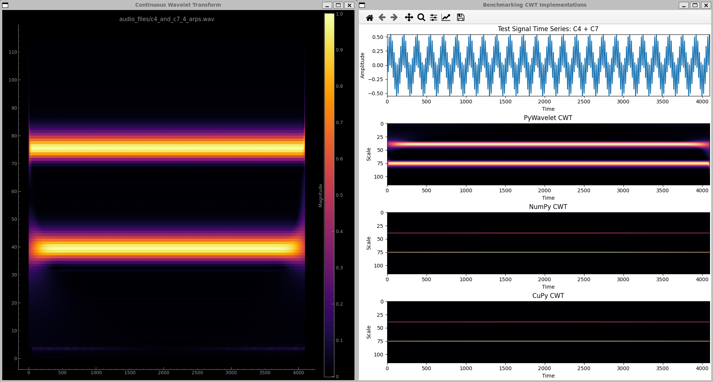
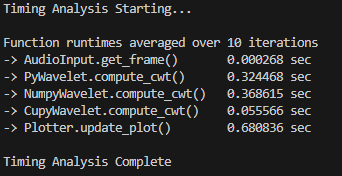

# Sub Shader
Sub Shader is a real-time audio analysis tool. It takes an audio file and 
analyzes it with time-frequency analysis techniques and visualizes it in a real
time plot. 

## Current State
I just got an implementation of the Continuous Wavelet Transform, which is a
modern a time-frequency analysis technique. It's a step further beyond the 
typical Fourier Transform, because the analyzing function in the CWT has been
localized in the time domain. 

I got a particular implementation written to run 
the parallelizable portions of the CWT on the GPU to speed things up. See
benchmark and static plot results below:

TODO SOMEDAY Explain why more, how and why it's being used and how I use the 
GPU to speed things up.

## Benchmark and Plots

### Discussion
Here we can see three different implementations of the CWT have been 
benchmarked. PyWavelet (probably the most popular Wavelet python package), and
then two implementations of the CWT from Analyzing Neural Time Series (by Mike
X Cohen) - one using NumPy (CPU) and one using CuPy (GPU). All three of them 
are analyzing the same signal which is equal magnitude C4 and C7 being played 
simultaneously.

### Accuracy
PyWavelets makes a nice plot, even though there is spectral leakage, it looks
cool and is pretty accurate. NumPy and CuPy make an identical plot (which is
expected) but it seems like one of the components is way stronger than the
other one, when they should be just about the same. I think there is a scale-
based normalization issue in both of their implementations. 

### Performace
CuPy is clearly the fastest. The biggest bottleneck when using the GPU is 
transferring data over the PCIe (CPU -> GPU and GPU -> CPU). I got some ideas
on how minimize that. Minimize the total number of transfers and reduce 
transfer sizes by downsampling and sending results straight to a shader which
is already on the GPU side anyways.

# Instructions
My setup is a Windows machine running WSL2 in VS Code. If you're running on a
different set up, replicate the instructions for your particular set up.

## Create Virtual Environment
To avoid cluttering your machine's environment, create a virtual environment
with:
`python3 -m venv venv`

## Activate Virtual Environment
On Windows running WSL run:
`source venv/bin/activate`

## Install Dependencies
Use pip to install all the necessary libraries and this package itself in 
editable mode (-e). We do this so the project is importable as a package to 
avoid reinstalling every time we modify the soruce code.
`pip install -e .`

## Run Main
Run the code using:
`py -m subshader` or `python -m subshader` or `python3 -m subshader`

## Run Benchmark
To run the benchmarking script, which times each stage of the main loop and 
compares the different implementations of the CWT, run this:
`py research/benchmark.py`

## Deactivate Virtual Environment
Deactivate when you're done with:
`deactivate`

## TODO Hierarchy
NOW > NEXT > SOON > LATER > SOMEDAY

# Questions
Questions that I would really like to keep in mind or figure out to really 
understand conceptually the best way to do this project

### DSP 
Q: Why is it useful or beneficial to perform the CWT with **Complex** Morlet 
Wavelets? Specifically, what is it about them being complex helps with time
frequency analysis?

Q: What about complex signals in general? What's so good about them in the 
context of time-frequency analysis? My initial hunch is that it is related to 
Euler's formula, the one that looks like this: cos(blah) = 0.5(e^blah + e^-blah)
and how every signal has complex component, it's just usually ones you measure
have that part 0'd out. Also there I see how you can retrieve phase information
but I don't really see the how that is useful.

Q: Why is it important to know the phase of the signal? What information is
actually usefully gained from it? I've heard of Phase Key Shifting (PSK), which
is used to encode information in the phase of signals, but I don't see how that
would play a useful part in this project. That seems more like an RF 
telecommunications thing. But maybe there are musical characteristics contained
in the Phase data that contributes to the audio

Q: How does the shape of the Gaussian used in creating the CMW affect the 
results of the wavelet based time-frequency analysis? How are the results 
affected if the Guassian rolls off steeper or shallower? 

Q: What is the significance of the Full-Width Half-Maximum and how does it 
relate to the previous question? In one of the ANTS lessons, there was an 
example where modifying it affected the steepness of the guassian and how 
'blurred' the results became, because the wider it was in the time domain, the 
more of an 'averaging' affect it had on the signal. But oppositely, the thinner 
it was in the time domain, the more energy it had in the frequency domain, so 
it was sharper at filtering things out (or maybe I have that backwards?). 
Relate this kind of intuition to the Complex Morlet Wavelet, which is a sine 
wave being manhandled by a Guassian, being used as a kernel during the CWT.

### Python

### GPU Acceleration / Parallel Programming
Q: Need to still make sense of the threads per block (TPB), blocks per grid 
(BPG), and block width (BW). What is an intuitive way of looking at it? Why does the position
flatten the indeces in that way? Conceptually, how is it analogous to 2D arrays?

Q: How do you decide what the values for the TPB, BPG, and BW are?

Q: VAO vs VBO Graphics Pipeline

Q: Why use Shared Memory? First of all, what exactly is it, and I thought 
accessing it is really slow and clunky and bottle necks the entire procedure?
Maybe we can access it up front and its not a big deal. 
"For objects created in shared memory, each thread will have access to the 
objects because each thread will receive a reference to this memory. Normally, 
kernel code gets replicated multiple times, however, using cuda.shared.array()
only the reference will be created, not instantiated." Hmm okay