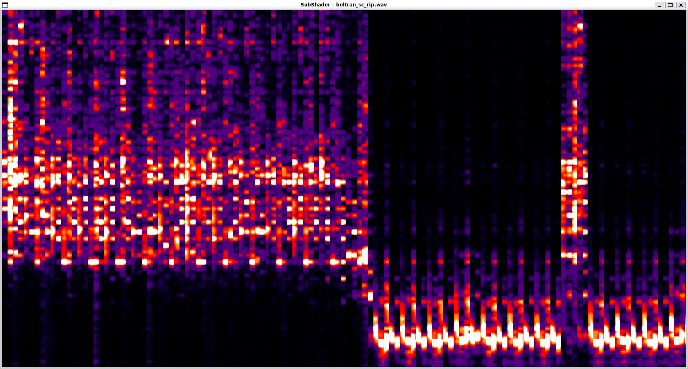

# SubShader

SubShader is a real-time audio visualizer. It reads in an audio file, performs the Continuous Wavelet Transform using CuPy, and plots the results in real-time with a 2D shader. Currently getting around 40 FPS.

## Overview

**Audio File → CWT Analysis → GPU Texture → Shader Rendering → Real-time Visualization**

### Current Status



**Source**: [Beltran Coachella Soundcloud Rip](https://soundcloud.com/listenbeltran/beltran-coachella-yuma-weekend-1-2025) ~(8:22 - 8:31)


**Source**: [Beltran Coachella Soundclou Rip](https://soundcloud.com/listenbeltran/beltran-coachella-yuma-weekend-1-2025) ~(10:19 - 10:27)

### What is the CWT and why use it?

The Continuous Wavelet Transform (CWT) overcomes the FFT’s fixed time-frequency tradeoff by proportionally adapting the number of samples per transform: less for high frequencies (capturing short-lived high-frequency transients like percussion), more for low frequencies (tracking basslines and sustained tones). This gets us precise timing for fast events and accurate frequency resolution for slow ones. 

Edit: Just did an audit of the code, I realized I'm not doin this ^ totally right so I created [this issue](https://github.com/users/eddie-water/projects/1/views/1?pane=issue&itemId=113509598&issue=eddie-water%7Csub-shader%7C36) to track fixing that. 

### Software Flow
- **Audio Input**: Retrieves chunks of audio from file.
- **CWT**: Performs time-frequency analysis on the audio, accelerated with CuPy.
- **Real-Time Plotting**: Using a 2D shader to visualize the CWT.

## Installation

### Setup
```bash
# Create virtual environment
python3 -m venv venv

# Activate (Linux/WSL)
source venv/bin/activate

# Install dependencies
pip install -e .
```

### Run
```bash
python -m subshader
```

### Requirements
- Python 3.8+
- CUDA-capable GPU (recommended)
- OpenGL 3.3+ support
