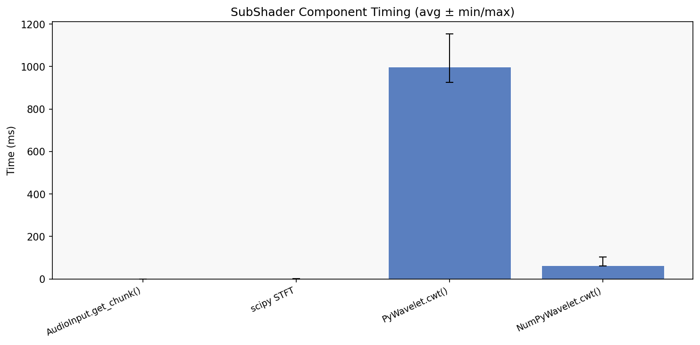

# Sub Shader

Sub Shader is a real-time audio visualizer written in Python. It's an audio-graphics pipeline that analyzes and converts audio into a visual representation using modern techniques in digital signal processing and parallel computing.

This project is a technical showcase of my skills and interests in DSP and GPU acceleration. It's given me a deeper understanding of the foundations of signal processing and how they can be generalized into other contexts beyond monitoring audio. It also serves as an exercise for off-loading parallel operations onto a GPU and optimizing pipeline bottlenecks.

The top-level design and performance of Sub Shader are detailed in this document.

[PLACEHOLDER: video — "Demo clip of real-time visualization"]

---

## Design

```
Audio Source → DSP Block → Renderer
```

Sub Shader splits the pipeline into three modules:

### Audio Source

Loads audio from file and delivers overlapping window frames of audio samples to the DSP Stage. The overlap reduces edge artifacts at window boundaries.

For more details → [Audio README](AUDIO.md)

### DSP Stage

Using CUDA, performs the Continuous Wavelet Transform ([CWT](link)) on the raw audio samples across the chromatic scale. Post-processing includes scale normalization, discarding of edge-contaminated results, and downsampling.

For design intuition and explanation → [DSP README](DSP.md)

### Renderer

Chronologically stores the processed results from the DSP Stage in a circular buffer, and uploads its entirety as a GPU texture. The renderer feeds the texture data to a fragment shader that colormaps the results into a 2D scale vs time plot.

For specifics → [Renderer README](RENDERER.md)

<!-- Placeholder: init flowchart -->

<!-- Placeholder: runtime flowchart -->

---

## Performance

[REWRITE: intent="explain STFT fixed resolution limitation and PyWavelet CWT advantage" placement="introductory paragraph before comparison grid"]

<!-- The Fast Fourier Transform is an inexpensive, effective, and widely popular signal processing algorithm for frequency analysis. The Short-Time Fourier Transform ([STFT](link)) is the typical approach for general signal processing. However, it was determined to be insufficient for this particular application because of its rigid time-frequency resolution - it measures signals either too finely or too broadly. -->

<!-- PyWavelet ([PyWt](link)) is the most prominent Python library for wavelet-based analysis. The CWT is able to produce more accurate* results because its time-frequency resolution adapts itself proportionally to the frequency being measured. However, this added overhead costs more to process. Also, the library requires a lot of effort to configure it for the specific signal properties we are interested in measuring. -->

[REWRITE: intent="introduce comparison methodology and signal selection rationale" placement="before grid figure"]

Here we compare the performance of Sub Shader to other commonly used signal analysis techniques. The benchmark is performed against accuracy and speed for each of the following methods:
- [Short-Time Fourier Transform](link) - the typical approach
- [PyWavelet](link) - the most prominent Python library for wavelet-based signal analysis
- [ANTS](link) - an implementation of the CWT based off the course Analyzing Neural Time-Series by Mike Cohen

The audio signals used have been hand-selected to emphasize the advantages of using Sub Shader.

[PLACEHOLDER: figure — "3x3 comparison grid (chirp/polyphonic/musical × STFT/PyWavelet/SubShader) — generated by benchmark.py --comparison-grid, saved to assets/images/benchmarks/comparison_grid.png"]

### Chirp Signal (Frequency Sweep)

[REWRITE: intent="brief caption for chirp column of comparison grid — non-stationary signal, frequency linearly swept 100–10kHz, clearest demo of time-frequency resolution advantages"]

### Polyphonic Signal (MIDI Audio)

[REWRITE: intent="brief caption for polyphonic column of comparison grid — MIDI composition, variety of frequencies and note lengths, sustained and abrupt frequency changes"]

### Musical Signal (percussion + sustained bass)

[REWRITE: intent="brief caption for musical column of comparison grid — four-on-the-floor pattern, link source, ~8 bars with and without bass"]

[REWRITE: intent="structured comparison of STFT vs PyWavelet vs SubShader for accuracy and speed — replace informal notes with organized analysis" placement="after comparison grid figure"]

STFT
- Accuracy
    - Fixed time-frequency resolution struggles to measure low-end frequencies
    - Produces jagged representation of the signal
    - Energy from neighboring frequencies are bucketed into nearby frequency bins smearing the result
    - Does an okay job of resembling the original signal
- Speed
    - TODO ms

PYWT CWT
- Accuracy
    - CWT's variable time-frequency resolution adapts proportionally to the scale of the frequency being measured
    - TODO untunable resolution?
- Speed
    - TODO Takes forever

Sub Shader CWT
- Accuracy
    - Fine-tuned variable time-frequency resolution
    - TODO
- Speed
    - TODO ms
    - The compute cost of the CWT is off-loaded to GPU

[REWRITE: intent="keep this analogy tone, rewrite into coherent paragraph about time-frequency resolution tradeoffs" placement="summary of Performance section"]

Comparing the Fourier Transform to the CWT is like comparing apples to oranges. The STFT is like an apple that colored itself orange. The main point of comparison is the time-frequency resolution in each method. The FFT has a fixed resolution, and can only be configured to efficiently

---

## Benchmark

<p align="center"></p>

[WRITE: "SubShader-only timing breakdown — runtime per pipeline stage"]

[MOVED: numpy_vs_cupy_diff.png now in DSP.md Section 6.4]

---

## Installation

[WRITE: "Installation instructions — fill from Phase 4 output (INST-01/INST-02)"]

```

### Requirements

- Python 3.9+
- CUDA-capable GPU
- OpenGL 3.3+

## Future Improvements

[REWRITE: intent="list of concrete future improvements — hosted demo, live audio capture, GPU benchmark panel, color controls" placement="final section"]

This project has given me a deeper understanding of the foundational concepts in real-time signal processing. There are DSP fundamentals that can be generalized, allowing for higher level pattern detection and feature extraction beyond audio contexts. Higher precision results require higher compute, so we explore why off-loading some of the work  This project goes into the details of the why I made these design decisions

*[List future improvements]*
