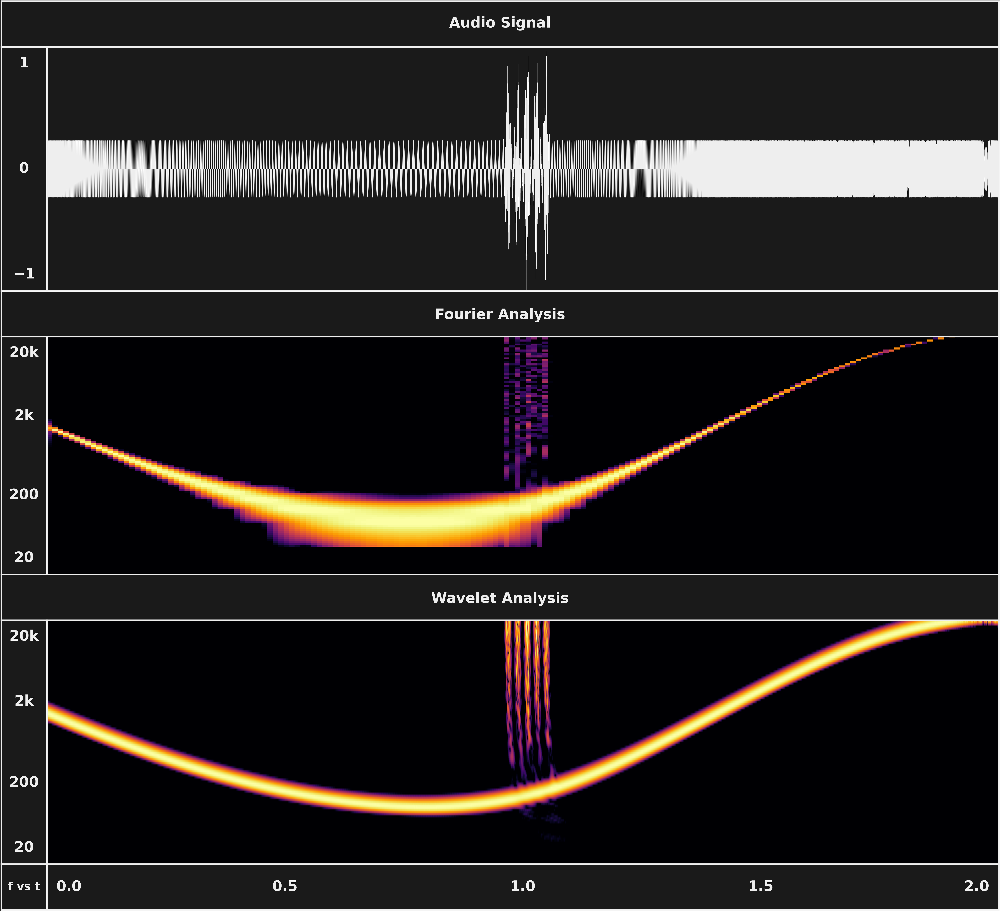

# SubShader

SubShader is a **real-time audio visualizer** written in Python - it is a low-latency, feature-extraction pipeline accelerated with parallel computing. It uses modern techniques in digital signal processsing (DSP) and parallel programming (GPU) to accurately  **visualize what an audio signal sounds like**.

Demonstrating my foundations in real-time DSP and hardware acceleration, I'm using this project to branch into DSP and ML-adjacent fields in computer engineering and data science. It took a lot of effort and care to make this, so thank you for taking the time to read! 

## Overview

This implementation monitors the time-frequency information present in audio signals using **Wavelet**-based analysis methods, as opposed to typical **Fourier**-based ones.

>ℹ️ For a comprehensive explanation of the design decisions and intuitions made in this project, especially in the DSP implementation, see → **[DSP.MD](src/subshader/dsp/DSP.md)** 


Fourier methods are not well-suited for signals whose **frequency content changes** over time. These signals are considered **non-stationary**, and almost all real-world signals behave this way - audio, images, sensor data, weather models, financial time-series, modern physics, etc. They are difficult to capture because their frequency content can change gradually, suddenly, or both at once. Fourier methods carry an inherent **time-frequency resolution tradeoff** when analyzing signals - sharpening the precision of its time resolution blurs its frequency resolution and vice-versa. The real problem for the Fourier method is that this tradeoff is **fixed**, while each end of the spectrum needs a different kind of precision. 

Low frequencies take a long time to complete cycles, so **when** they happen doesn't need fine precision in time - but a small change in frequency down there produces a proportionally big, a (relatively) wildly different pitch, so knowing **which** particular frequency matters a lot. High frequencies are the opposite - cycles complete almost instantly, so **when** they happen is everything, but that same small change in frequency is proportionally negligible and audibly unnoticeable. The Wavelet Transform trades this resolution *proportionally* across frequency, giving each end exactly the kind of precision it needs - capturing both slow drifts and sharp transients.

### Audio Signal Analysis - Fourier vs Wavelet 

<p align="left"></p>

**Audio Signal** 
- The non-stationary audio shown here is a chirp signal whose frequency sweeps continuously from mid to low to high
- At its halfway point, the signal is punctuated by a series of clicks (abrupt broad-band transients)

**Fourier Analysis** 
- The **STFT** (Short-Time Fourier Transform) resolves the audio signal with a somewhat smeared and jagged representation
- Notice how low frequency measurements bleed into neighboring rows, while high frequencies appear weak and formless
- In some cases, this is a more-than-adequate textbook approach for re-representing signals into a more visual format

**Wavelet Analysis** 
- The **CWT** (Continuous Wavelet Transform) follows the contour of the chirp's frequency sweep, tracing it with smooth, clean definition
- Resolves the onset of each "click" as distinct events in time
- The advantage is clear when analyzing signals non-stationary signals

## Design
<p align="left"></p>

- [AUDIO.MD](src/subshader/audio/AUDIO.md) - delivers audio samples to pipeline
- [DSP.MD](src/subshader/dsp/DSP.md) - parallelizes heavy DSP computations on a GPU using CUDA
- [RENDERER.MD](src/subshader/renderer/RENDERER.md) - plots the time-frequency results as a colormapped energy spectrum


### Init
To achieve real-time performance, the pipeline parallelizes all the heavy DSP computations and visual rendering to a dedicated GPU. While initially constructing the pipeline, all large and persistent memory blocks are allocated and instantiated up front to minimize unnecessary memory transfers during runtime.
<p align="left"></p>

### Runtime
During the runtime loop, the pipeline fetches audio samples, processes them, and renders the result as an energy spectrum colormap plot. The whole process is synchronized in real-time to the audio's playback and continuously plots until the end of the audio.
<p align="left"></p>

<!-- 
> **Audio** - Delivers overlapping windows of audio samples \
> **DSP** - Performs the Continuous Wavelet Transform ([CWT]()) using [CuPy](https://cupy.dev/) on the raw audio samples against the musical scale. Post-processing includes scale normalization, discarding of edge-contaminated results, and downsampling \
> **Renderer** - Stores the time-frequency results in a circular buffer and uploads it as a GPU texture. A fragment shader colormaps the results into a 2D frequency vs time plot -->

# Timing

✅ **Real-time** - the pipeline runs at ~75 FPS, 14× under its real-time deadline. Full report → [TIMING.md](assets/timing/TIMING.md)


### Measured Per-Stage Timing

<p align="center"></p>

# Why Wavelets

A comparison of the same signals analyzed three ways - the textbook Fourier approach (STFT), a popular wavelet library (PyWavelets), and Sub Shader's GPU CWT:

<p align="center"></p>

<p align="center"></p>

**STFT** - The [Short Time Fourier Transform](https://www.youtube.com/watch?v=T9x2rvdhaIE) is the textbook approach for this kind of task. It's very fast at under 1 ms per call, but its fixed time-frequency resolution struggles to capture low end frequencies, bleeding the signal's energy into neighboring frequency bands.

**PyWavelets CWT** - [PyWavelets](https://pywavelets.readthedocs.io/en/latest/ref/cwt.html) scales its time-frequency resolution proportionally to the frequency being measured, tracking the signal contour precisely - but at over 1 second per call it's unsuitable for real-time use.

**Sub Shader CWT** - Based on an implementation from [Analyzing Neural Time Series](https://www.youtube.com/playlist?list=PLn0OLiymPak2BYu--bR0ADNBJsC4kuRWs) (ANTS), parallelized on the GPU with CuPy. It keeps the CWT's tightly measured resolution while running fast enough for real-time performance.

[EDIT: closing line - sentiment: better feature extraction while still maintaining real-time performance; "a happy medium between performance and accuracy"]

# How to Install

Requirements:

- Python 3.9+
- NVIDIA CUDA-capable GPU
- OpenGL 3.3+

```bash
git clone https://github.com/eddie-water/sub-shader.git
cd sub-shader
python3 -m venv venv
source venv/bin/activate
pip install -e .
```

Run it:

```bash
python -m subshader
```

[VERIFY: repo URL, and whether cupy needs a CUDA-versioned wheel (e.g. pip install cupy-cuda12x) called out separately]

---

This project has given me a deeper understanding of the foundations of DSP and how they generalize to contexts beyond audio. It has also been an opportunity to learn how to use CUDA to minimize pipeline bottlenecks by off-loading parallel operations to a GPU.
