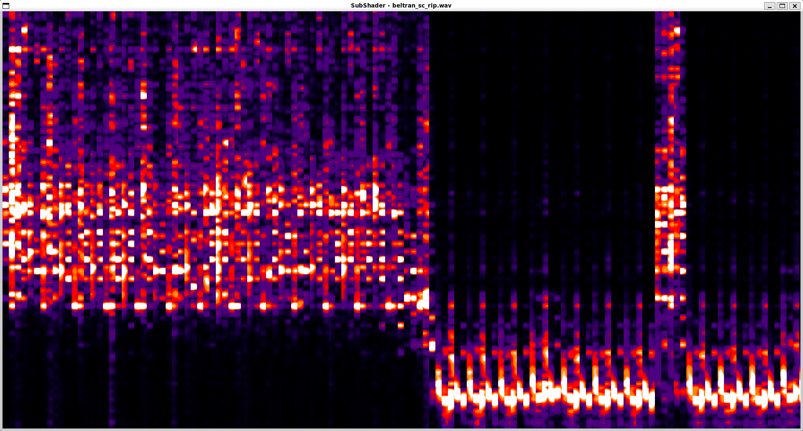

# Sub Shader
What is subshader? How does it work? Why is it designed this way?

# Overview
Sub Shader is a real-time audio visualizer written in Python. It's an audio-graphics pipeline designed to analyze and convert audio into a visual representation in real time. 

TODO Insert Demo Clip

# Design Goals
The goal is to create an accurate and highly responsive visualization that looks like what the audio sounds like. To acheive this, the overall processing needs to be accurate and fast enough to keep up with the audio playback. 

# Flowchart


# Software Modules

## Audio
The Audio module delivers raw audio samples to the DSP module using a simple overlap-add windowing scheme. On init, it determines the audio's metadata (sample rate, mono vs stereo, etc) and during runtime retrieves a consistent number of audio samples each call. The overlap mechanism ensures that each audio window overlaps a portion of its samples, smoothing continuity in the time axis by reducing artifacts at the window's edges.

TODO Insert example of audio overlap

Currently, the input stream of audio data comes from file IO, but will soon support a live source of audio.

## DSP
The purpose of the DSP module is to analyze the input audio signal for its time-frequency content - want to know when in time which frequencies are present. The Continuous Wavelet Transform (CWT) is used to convert the input audio from the time domain and transform it to the time-frequency domain, which allows us to see which frequencies are present at specific points in time. The result is a 2D scalogram where the value of every point at each time-frequency coordinate is the relative strength of that frequency's activity at that particular time.

After the computing the CWT, the results are normalized to account for energy bias introduced in the CWT. A small portion of the CWT results are discarded to reduce edge effects produced by the CWT and the overlapping audio scheme. Finally the output is downsampled to help performance, reducing the total number of samples being handled. 

To read an in-depth explanation of the CWT and its specific design decisions, click here: TODO Insert link

## Plot
The Plot is a 2D grid with two axes: frequency vs time. It displays the chronologically-ordered CWT results in a continuous reel. The values of each point are mapped to a color spectrum, visualizing the relative strength of each time-frequency coordinate. 

Real-time plotting is a little challenging, mainly because of the large quantity of points that need to be displayed and updated quickly. Most Python plotting libraries struggle to render very large quantities of points in real-time. To help speed things up, a GPU-based shader is used to plot the 2D data efficiently using graphics hardware. This alleviates a huge performance bottleneck in the pipeline but soon there will be an alternative method of plotting that is GPU-independent.

# Benchmark
Here is where we discuss the performance of Sub Shader



**Source**: [Beltran Coachella Soundcloud Rip](https://soundcloud.com/listenbeltran/beltran-coachella-yuma-weekend-1-2025) ~(8:22 - 8:31)


**Source**: [Beltran Coachella Soundcloud Rip](https://soundcloud.com/listenbeltran/beltran-coachella-yuma-weekend-1-2025) ~(10:19 - 10:27)

# Installation

## Setup
```bash
# Create virtual environment
python3 -m venv venv

# Activate (Linux/WSL)
source venv/bin/activate

# Install dependencies
pip install -e .
```

## Run
```bash
python -m subshader
```

## Requirements
- Python 3.8+
- CUDA-capable GPU 
- OpenGL 3.3+ support
