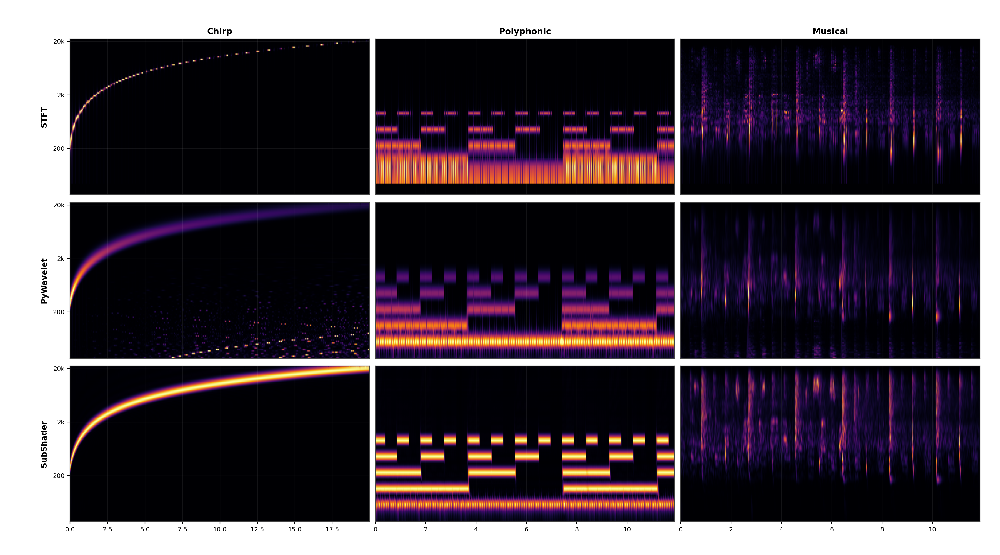

# Sub Shader

Sub Shader is a real-time audio visualizer written in Python. It's an audio-graphics pipeline that analyzes and converts audio into a visual representation using modern techniques in digital signal processing and parallel computing.

This project is a technical showcase of my skills and interests in DSP and GPU acceleration. It's given me a deeper understanding of the foundations of signal processing and how they can be generalized into other contexts beyond monitoring audio. It also serves as an exercise for off-loading parallel operations onto a GPU and optimizing pipeline bottlenecks.

The top-level design and performance of Sub Shader are detailed in this document.

[PLACEHOLDER: video — "Demo clip of real-time visualization"]

---

## Design

```
Audio Source → DSP Block → Renderer
```

Sub Shader splits the pipeline into three modules:

### Audio Source

Loads audio from file and delivers overlapping window frames of audio samples to the DSP Stage. The overlap reduces edge artifacts at window boundaries.

For more details → [Audio README](AUDIO.md)

### DSP Stage

Using CUDA, performs the Continuous Wavelet Transform ([CWT](link)) on the raw audio samples across the chromatic scale. Post-processing includes scale normalization, discarding of edge-contaminated results, and downsampling.

For design intuition and explanation → [DSP README](DSP.md)

### Renderer

Chronologically stores the processed results from the DSP Stage in a circular buffer, and uploads its entirety as a GPU texture. The renderer feeds the texture data to a fragment shader that colormaps the results into a 2D scale vs time plot.

For specifics → [Renderer README](RENDERER.md)

<!-- Placeholder: init flowchart -->

<!-- Placeholder: runtime flowchart -->

---

## Performance

[WRITE: "explain STFT fixed resolution limitation and PyWavelet CWT advantage — introductory paragraph before comparison grid"]

[WRITE: "introduce comparison methodology and signal selection rationale — before grid figure"]

<p align="center"></p>

### Bouncing Chirp

[WRITE: "Non-stationary test signal — frequency sweeps upward across three decades (20Hz to 20kHz) with periodic parabolic dips. Designed to stress-test time-frequency resolution: methods with fixed resolution blur the rapid frequency transitions, while adaptive resolution tracks the contour precisely."]

### Polyphonic Signal

[WRITE: "MIDI composition with overlapping notes at varying pitches and durations. Tests each method's ability to resolve simultaneous frequencies and distinguish sustained tones from transient attacks."]

### Musical Signal

[WRITE: "Eight bars of electronic music with four-on-the-floor percussion and sustained bass. Real-world audio that combines broadband transients (kicks, hats) with tonal content — the most demanding test for any time-frequency method."]

[WRITE: "Structured comparison of STFT vs PyWavelet vs SubShader — accuracy and computational cost for each method"]

[WRITE: "Summary of time-frequency resolution tradeoffs — keep the analogy tone from the original draft"]

---

## Benchmark

[WRITE: "Brief summary of SubShader pipeline timing — link to DSP.md for detailed breakdown"]

For detailed timing analysis, see [DSP: Computational Cost](DSP.md#6-implementation-deep-dive).

---

## Installation

[WRITE: "Installation instructions — fill from Phase 4 output (INST-01/INST-02)"]

```

### Requirements

- Python 3.9+
- CUDA-capable GPU
- OpenGL 3.3+

## Future Improvements

[REWRITE: intent="list of concrete future improvements — hosted demo, live audio capture, GPU benchmark panel, color controls" placement="final section"]

This project has given me a deeper understanding of the foundational concepts in real-time signal processing. There are DSP fundamentals that can be generalized, allowing for higher level pattern detection and feature extraction beyond audio contexts. Higher precision results require higher compute, so we explore why off-loading some of the work  This project goes into the details of the why I made these design decisions

*[List future improvements]*
