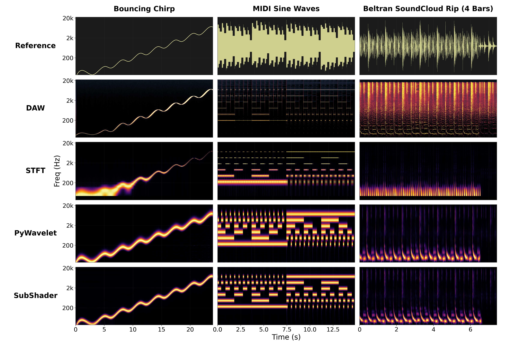

# Sub Shader 

> 🚧 Under Construction 🚧

There are symphonies everywhere for those with the eyes to see them

Sub Shader is a real-time audio visualizer written in Python. It's an audio-graphics pipeline that analyzes audio using modern techniques in digital signal processing and parallel computing to render a low-latency frequency vs time plot. 

This project has given me a deeper understanding of the foundations of DSP and how they generalize to contexts beyond audio. It has also been an opportunity to learn how to use CUDA to minimize pipeline bottlenecks by off-loading parallel operations to a GPU.

Details of the top-level design and its performance are outlined in this document.

# Design

```
Audio → DSP → Renderer
```

## Audio 

Loads audio from file and delivers overlapping window frames of audio samples to the DSP Stage. The overlap reduces edge artifacts at window boundaries. For more details → [Audio README](src/subshader/audio/AUDIO.md)

## DSP

Performs the Continuous Wavelet Transform ([CWT](https://www.mathworks.com/help/wavelet/ug/continuous-wavelet-analysis-of-modulated-signals.html)) using [CuPy](https://cupy.dev/) on the raw audio samples across the chromatic scale. Post-processing includes scale normalization, discarding of edge-contaminated results, and downsampling. For design intuition and explanation → [DSP README](src/subshader/dsp/DSP.md)

## Renderer

Chronologically stores the time-frequency results from the DSP module in a circular buffer, and uploads its entirety as a GPU texture. The renderer feeds the texture data to a fragment shader that colormaps the results to a 2D frequency vs time plot. For specifics → [Renderer README](src/subshader/renderer/RENDERER.md)

<!-- Placeholder: init flowchart -->

<!-- Placeholder: runtime flowchart -->

# Plot Comparison
Below is a performance comparison plot of different audio signals and analysis methods, highlighting the accuracy and timing tradeoffs between each method.

<p align="center"></p>

<!-- - STFT from [SciPy](https://docs.scipy.org/doc/scipy/reference/generated/scipy.signal.stft.html)  -->
<!-- - CWT from [PyWavelet](https://pywavelets.readthedocs.io/en/latest/ref/cwt.html) -->
<!-- - SubShader CWT from [ANTS](https://www.youtube.com/playlist?list=PLn0OLiymPak2BYu--bR0ADNBJsC4kuRWs).  -->

Bouncing Chirp 
- A signal whose frequency sweeps upward with periodic variation
- This stress-tests each method's time-frequency resolution
    - Methods like the STFT with fixed resolution smear signal measurements of rapid frequency transitions
    - Methods like the PyWavelet and Sub Shader CWT that adapt their resolution proportionally to the scaled frequency being measured track the signal contour more precisely

MIDI Sine Waves 
- A signal composed of multiple, overlapping sine waves played at different frequencies and varying durations
- Tests each method's ability to resolve multiple frequencies simultaneously and distinguish between long sustained tones and quick transient ones

Beltran Audio
- This audio is 4 bar measures ripped from [Beltran's SoundCloud](https://soundcloud.com/listenbeltran/beltran-coachella-yuma-weekend-1-2025) at about 8:00 minutes in the beat drops, the bass cuts out, then cuts back in.
- Tests the ability to measure more realistically recorded audio containing apparent and non-apparent audio patterns via vocal tones, sustained bass activity, and repetitive broadband transients like kicks, snares, and percussions


# Timing Comparison

```
Bouncing Chirp:
--------------------------------------------------------------------------------
Function                            Avg (ms)        Max (ms)        Min (ms)
--------------------------------------------------------------------------------
STFT                                 0.73 ms         1.13 ms         0.65 ms
PyWavelet                         1111.52 ms      2124.07 ms       991.35 ms
SubShader (CPU)                     75.20 ms        95.66 ms        62.12 ms
SubShader (GPU)                     78.94 ms        84.58 ms         6.22 ms

================================================================================

MIDI Sine Waves:
--------------------------------------------------------------------------------
Function                            Avg (ms)        Max (ms)        Min (ms)
--------------------------------------------------------------------------------
STFT                                 0.70 ms         0.89 ms         0.65 ms
PyWavelet                         1109.93 ms      1440.09 ms      1009.23 ms
SubShader (CPU)                     69.83 ms        83.48 ms        60.62 ms
SubShader (GPU)                     82.46 ms        88.53 ms        38.34 ms

================================================================================

Beltran SoundCloud Rip (4 Bars):
--------------------------------------------------------------------------------
Function                            Avg (ms)        Max (ms)        Min (ms)
--------------------------------------------------------------------------------
STFT                                 0.72 ms         1.02 ms         0.66 ms
PyWavelet                         1119.50 ms      1429.56 ms      1010.55 ms
SubShader (CPU)                     70.78 ms        80.53 ms        60.38 ms
SubShader (GPU)                     84.40 ms        88.11 ms        83.87 ms

================================================================================
```

STFT
- The [Short Time Fourier Transform](https://www.youtube.com/watch?v=T9x2rvdhaIE) we'll consider as the text-book approach for this kind of task
- It's very fast at < 1 ms per call, great for real-time applications
- Here we see the limitations of the STFT in the Plot Comparison - the fixed time-frequency resolution of the STFT struggles to capture low end frequencies, bleeding the signal's energy into neighboring frequency bands

PyWavelet CWT
- [PyWavelet](https://pywavelets.readthedocs.io/en/latest/ref/cwt.html) CWT is a popular python library module for wavelet-based analysis
- Unfortunately is very slow at almost 300 ms per call, unsuitable for real-time performance
- The CWT uses a time-frequency resolution that scales proportionally to the frequency being measured, producing an overcomplete representation of the input signal 

SubShader CWT
- The CWT is based off an implementation from this course: [Analyzing Neural Times Series](https://www.youtube.com/watch?v=7ahrcB5HL0k&list=PLn0OLiymPak2BYu--bR0ADNBJsC4kuRWs&index=1) (ANTS)
- Two implementations
    - Uses NumPy for running on CPU at about 20 ms per call
    - Uses CuPy for parallelizing on GPU at about 10 ms per call
- Near identical computation results, the time-frequency resolution in the ANTS CWT produces a tightly measured result

Seems like SubShader is a happy medium between performance and accuracy

---

## Benchmark

[WRITE: "Brief summary of SubShader pipeline timing — link to DSP.md for detailed breakdown"]

For detailed timing analysis, see [DSP: Computational Cost](src/subshader/dsp/DSP.md#6-implementation-deep-dive).

---

## Installation

[WRITE: "Installation instructions — fill from Phase 4 output (INST-01/INST-02)"]

```

### Requirements

- Python 3.9+
- CUDA-capable GPU
- OpenGL 3.3+

## Future Improvements

[REWRITE: intent="list of concrete future improvements — hosted demo, live audio capture, GPU benchmark panel, color controls" placement="final section"]

This project has given me a deeper understanding of the foundational concepts in real-time signal processing. There are DSP fundamentals that can be generalized, allowing for higher level pattern detection and feature extraction beyond audio contexts. Higher precision results require higher compute, so we explore why off-loading some of the work  This project goes into the details of the why I made these design decisions

*[List future improvements]*
