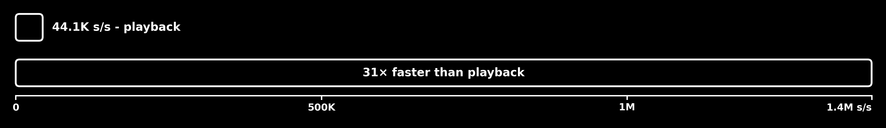
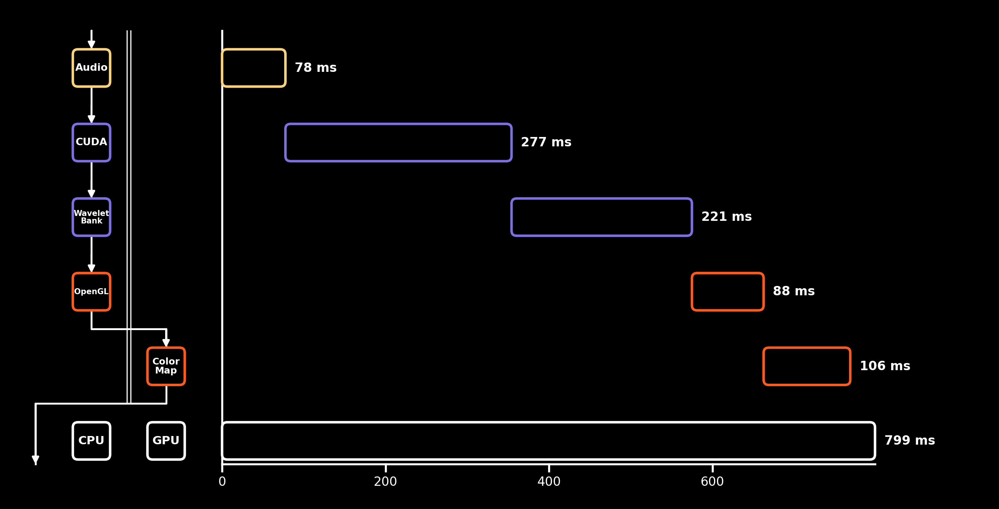
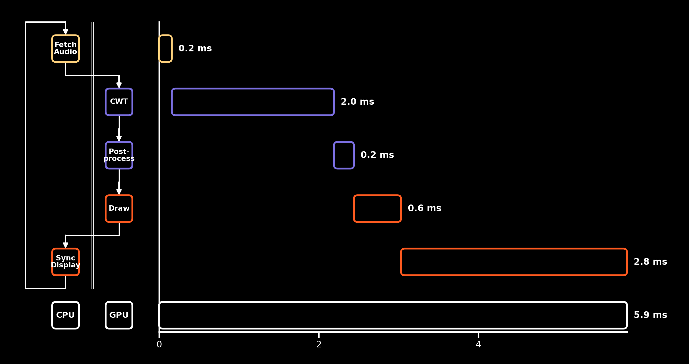

# SubShader

SubShader is a **real-time audio visualizer** written in Python. It uses modern techniques in digital signal processing (DSP) and parallel programming (GPU) to accurately **visualize what an audio signal sounds like**. But to call it just a visualizer would be a massive understatement. This project serves as the foundation of a GPU-accelerated pipeline custom-built for real-time signal processing and feature extraction.

This project uses **[wavelet](https://youtu.be/jnxqHcObNK4?si=x98elLTbz6QLe03g&t=1996)**-based signal processing methods - a modern adaptation of traditional **[Fourier](https://youtu.be/spUNpyF58BY?si=jXTsOaIHUwB8meoc)**-based DSP. It converts audio information into a **time-frequency** representation while adhering to real-time performance deadlines. The advantages and justification of using wavelets for real-world signal processing are discussed in this project.

> ℹ️ For design details and explanations → [DSP README](src/subshader/dsp/DSP.md)

<!-- HERO DEMO CLIP — GitHub attachment upload of assets/video/subshader_demo.mp4.
     Re-rendering the clip means re-uploading (drag into the github.com editor) and
     swapping this URL. -->
https://github.com/user-attachments/assets/16e7cd7a-0a5c-4d4e-8199-85d9140d2d12

Demonstrating my technical skills in real-time signal analysis and GPU acceleration, I'm using this project to branch into DSP, Machine Learning, Data Science, and Computer Engineering. **It took a lot of effort and care to make this, so thank you for taking the time to read!**

## Problem Overview

When we perceive sound, our ears can easily distinguish all the different kinds of noises we hear - the loud vs the quiet, the high vs the low, the sudden vs the gradual - but designing something that can analyze audio to this level of detail is not as trivial as it may seem. We need to know more than just **what frequencies** are present. We need to know **when in time** they start, how long they last, and when they stop, all relative to **how loud** they actually are.
<!-- fine resolution in time to pin down exactly when they happen, and fine resolution in frequency to detect slight variations of tone / pitch / frequency  -->

The difficulty of this stems from signal details that **coexist at vastly different scales** - high-frequency activity can be extremely brief and abrupt, demanding **fine resolution in time**, while low-frequency content develops slowly and gradually, demanding **fine resolution in frequency** instead. Simultaneously capturing both ends of the spectrum in a fully-detailed representation is the core problem this project confronts.

### Audio Example

The audio here is a **non-stationary** signal - an exaggeration of this resolution problem specifically. It **gently** sweeps a single frequency across 20-20k Hz, and at the halfway point the sweep is **abruptly** punctuated by a series of "clicks" (short-term broad-band transients).

<p align="left"></p>

### Fourier Analysis

The **Short-Time Fourier Transform** (STFT), the typical textbook approach for basic DSP, captures the *general* idea of the signal - but resolves its energy into a somewhat **smeared and jagged representation**. Low-end measurements of the sweep bleed and spread vertically into neighboring frequency bands, while the high-end appear as weak and chunky fragments in time.

<p align="left"></p>

### Wavelet Analysis

The **Continuous Wavelet Transform** (CWT) traces the sweep within a contained spread and has smoother definition. The burst of "clicks" are resolved as clean, distinct events in time. Arguably a more **representative** result, signal energy is captured at the moments in time and frequency bands they actually belong to.

<p align="left"></p>

### Discussion

Both methods produce technically valid representations of the same audio, but the difference in resolution quality comes from trying to **analyze signal properties that simultaneously exist at drastically different scales of magnitude**. This idea can be a little too abstract to immediately understand.

Think of it like trying to observe a group of trees. How exactly would you situate yourself to do this? It depends on what exactly you're observing and the range of detail are trying to achieve. To map out the entirety of the forest, you wouldn't stand up close with a microscope. To observe its plant cells, you wouldn't watch from a space-grade telescope. For any scale of detail in between these two extremes, there is a level of resolution appropriate for the detail being observed. You would use binoculars to record individual leaf shapes, or a magnifying glass to analyze the texture of a particular kind of bark.

In any of these cases, the observer always faces the same **resolution tradeoff - clearly observing fine details comes at the cost of knowing exactly where these details exist in the grand scheme of themselves**. Zoomed in, you could easily figure out the kind of tree you were looking at, but would have no idea **where** in the forest you were. Zoomed out, you could easily map the acreage of the forest, but would struggle to determine **which** kind of trees make it up.

### Comparison

The example above exhibits this resolution tradeoff directly. The STFT monitors the entirety of the audio using a **single lens** of resolution, so while one scale of frequency may come out looking fine, other scales of frequency experience a skewed perception. The STFT's distortions at each end of the spectrum are evidence of this limitation - **rigid resolution**.

The CWT is like an **array of lenses** spanning from microscopic to macroscopic resolution, using the appropriate lens depending on the scale of the frequency being measured. This achieves **multiscale resolution** for observing non-stationary, frequency-rich sound structures - simultaneously capturing the long-lasting low-ends, the short-lived high-ends, and everything in between.

> ℹ️ For design intuition and explanation → [DSP README](src/subshader/dsp/DSP.md)

## Design and Performance
<!-- 🚧 OPEN MARKERS — delete each line as you resolve it
1. Resolution receipt has no home: header promises "Resolution" but the section has no
   resolution numbers. Locked line, slot = Runtime Loop after the 186 ms sentence:
   "Each frame of audio is measured at the resolution appropriate for musical scales -
   one frequency bin per note in the chromatic piano scale (could easily be configured
   for any desired musical scale). The width of each bin is ±3% of its center frequency,
   spanning what is effectively the human-audible frequency range of 27.5 Hz - 21.1 kHz."
2. Grammar: "each frame of 8K samples are worth" -> "is worth" (Runtime Loop).
3. Grammar: "31× times faster" -> "×" already means times (Runtime Loop).
4. Dropped facts, confirm intentional: slowest frame ~11 ms (worst case still in deadline);
   "(live audio coming soon)" parenthetical from the pipeline intro.
-->

Composed of individual stages, the pipeline **fetches** audio samples from a file, **processes** the audio, and **renders** the visual as a rolling frequency-vs-time **energy spectrum plot** - all in sync with the system's audio playback device.

<p align="left"></p>

### Documentation  

🔊 **[AUDIO](src/subshader/audio/AUDIO.md)** \
〰️ **[DSP](src/subshader/dsp/DSP.md)** \
✴️ **[RENDERER](src/subshader/renderer/RENDERER.md)** 

<!-- 🟡 **[AUDIO](src/subshader/audio/AUDIO.md)** \ -->
<!-- 🟣 **[DSP](src/subshader/dsp/DSP.md)** \ -->
<!-- 🟠 **[RENDERER](src/subshader/renderer/RENDERER.md)** yellow purple orange, circles -->


### Deadline and Resolution

To update the visual in time with the audio, the pipeline needs to process audio **faster than it is being played**. Typical audio is sampled at 44.1 kHz, which means audio is streamed out to the speakers at **44,100 samples per second** while playing. 

**This is the rate our pipeline has to beat** - it needs to fetch, process, and render the audio faster than this, or else it falls behind, out of sync with the playing audio. Additionally, we need the signal resolution advantages of the CWT. However, **multiscale resolution** comes at the cost of more compute, so hitting this deadline needed some additional performance optimizations.

### Pipeline Optimizations

[NumPy](https://numpy.org/doc/stable/reference/routines.fft.html)'s STFT is extremely fast, but as seen above, its perception of signal energy is skewed at each end of the spectrum. [PyWavelets](https://pywavelets.readthedocs.io/en/latest/), a popular CWT library, produces a clean result but is too slow for real-time visualization. 

To get better resolution and performance, the DSP module uses a custom CWT adapted from [ANTS](https://www.youtube.com/playlist?list=PLn0OLiymPak2BYu--bR0ADNBJsC4kuRWs), rewritten in Python and CUDA ([CuPy](https://cupy.dev/)) to parallelize all the heavy computations onto a dedicated GPU. This was achieved by identifying the independent operations of the pipeline and running them in **parallel - computations that don't need to happen in a particular order can be parallelized to execute all at the same time**. 

The plot is rendered with a GPU shader for similar reasoning - [matplotlib](https://matplotlib.org/) cannot handle drawing this much signal information at these real-time rates.

<p align="center"></p>

✅ **Real-Time Performance** - aiming for **44.1K s/s** at a minimum, the pipeline achieves about **1.4M s/s** - **31× faster** than our audio playback deadline, measured per frame below.


### Start Up

To keep the runtime loop free of large allocations and memory transfers, every expensive setup cost is paid once up front - the CUDA context, kernel and FFT-plan compilation, generating and uploading the wavelet bank, and the OpenGL context. Constructing the pipeline takes about **800 ms**. Roughly 80% of this is GPU bring-up which makes sense since this was all developed in Python and WSL.

<p align="center"></p>

### Runtime Loop

During runtime, overlapping frames of audio samples are delivered to the DSP stages for parallel processing, and results are stored in a circular buffer for the renderer to color-map in chronological order.

In a single shot of the pipeline, one frame of **8K audio samples** is fetched, processed, and rendered in about **6 ms**. With a sampling rate of **44.1K s/s**, each frame of 8K samples are worth about **186 ms** of time which is our figurative deadline for this much audio. Meaning the pipeline completed its work **31×** times faster than it took to actually play out this much audio.

> ℹ️ For the full timing report → [TIMING.md](assets/timing/TIMING.md)

<p align="center"></p>

With **31× headroom** to spare, there is plenty of room for heavier processing and stricter deadlines. Since this is a proof of concept written in Python and developed in WSL, a robust C++ implementation could conservatively run another **2-3× faster**.

## Real-World Implications

Better mathematical representation doesn't just make for prettier pictures - it gives us a more representative observation and more trustworthy details. When a signal's energy is captured where it actually belongs, instead of bleeding or compressing into places it doesn't, it yields features that describe what the signal is actually doing. Pattern detection and feature extraction can only ever be as good as the representation underneath them - which is basically the whole point of this project.

This is where the fundamentals of DSP extend naturally into areas like Machine Learning (ML). Typically, the relationship between the short-term details of a dataset and the long-term trends they live in is left to the models to figure out for themselves. It has even been observed that the first few layers of a convolutional neural network naturally converge towards wavelet-like filters all on their own ([AlexNet, 2012](https://proceedings.neurips.cc/paper/2012/file/c399862d3b9d6b76c8436e924a68c45b-Paper.pdf)).

A representation that better reflects how a signal actually behaves does the job of these primitive feature layers up front, so the model wastes less effort trying to interpret data through a skewed perception and more on the real relationships and patterns in the data.

This resolution tradeoff isn't exclusive to audio - it's present in everything where details live at more than one size - image and video processing, heart monitoring, neurosignal analysis, financial modeling, weather forecasting, etc. Even our own senses achieve a similar multiscale resolution of their own - the biological filters in our eyes and ears have adapted to this organically over time.

Audio is a natural application for multiscale resolution - rich with harmony and clash, boom and crackle, irregular sound structures that form the patterns of speech and rhythms, dense with musical detail. There are symphonies everywhere, for those with the eyes to see them.

## Future Aspirations

- [Synchrosqueezing](https://dsp.stackexchange.com/questions/71398/synchrosqueezing-wavelet-transform-explanation) - sharpening energy spectrum, tighter energy localization, distinguish beating artifacts
- [Wavelet Scattering](https://www.youtube.com/watch?v=S6LcP7txu9E) - capture modulation envelopes (tremolo vs vibrato vs beats) 
- High-Level Feature Extraction - tempo, mood, vibe, etc
- [BPM Detection](https://www.youtube.com/watch?v=FmwpkdcAXl0&t=1264s) - soft and hard onsets
- Real-Time Classification
    - Genre mapping like [everynoise.com](https://everynoise.com/) - atmospheric to dense, bouncy to smooth 
    - Color mapping to mood - happy vs sad, stress vs relief
- Stem Separation - differentiate the symphonic layers - bass, melody, percussion, vocals, etc 

## How to Install
Python 3.9+ | NVIDIA CUDA-capable GPU | OpenGL 3.3+

```bash
git clone https://github.com/eddie-water/sub-shader.git
cd sub-shader
python3 -m venv venv
source venv/bin/activate
pip install -e .
```

Run it:

```bash
python -m subshader
```
