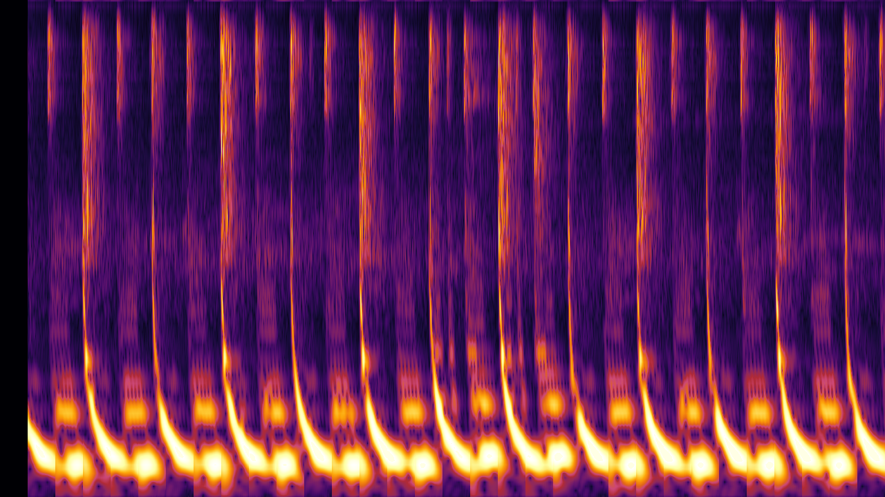
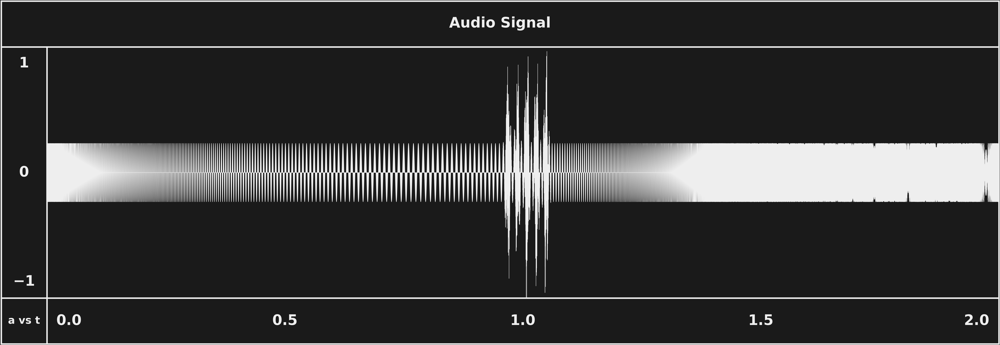
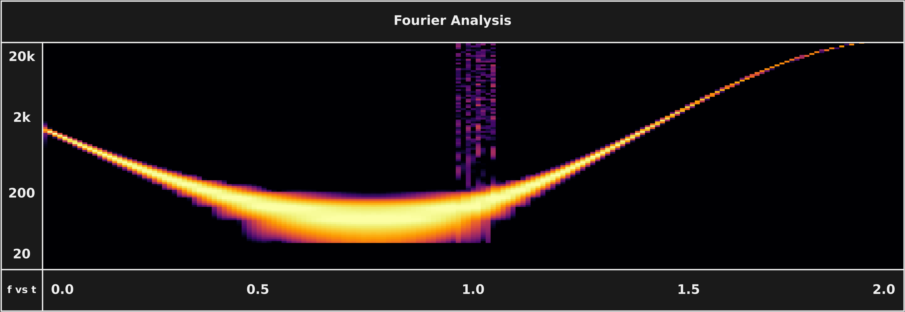
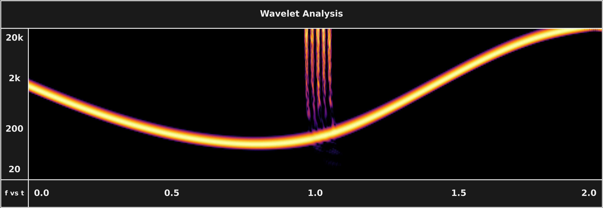
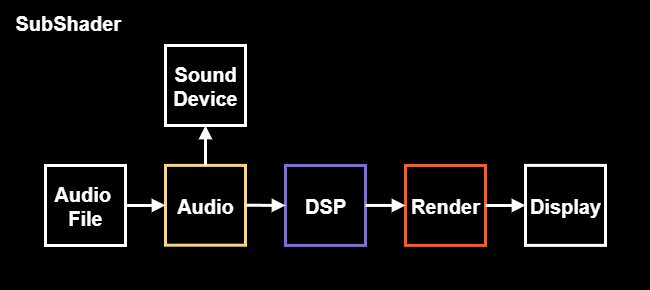
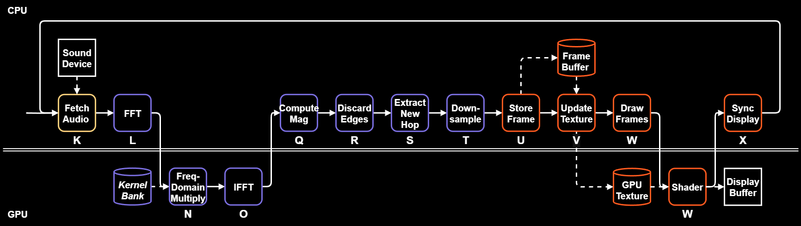
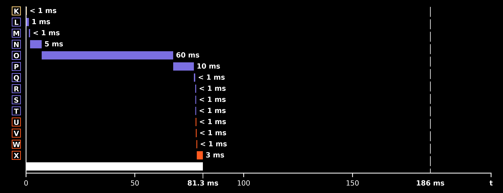
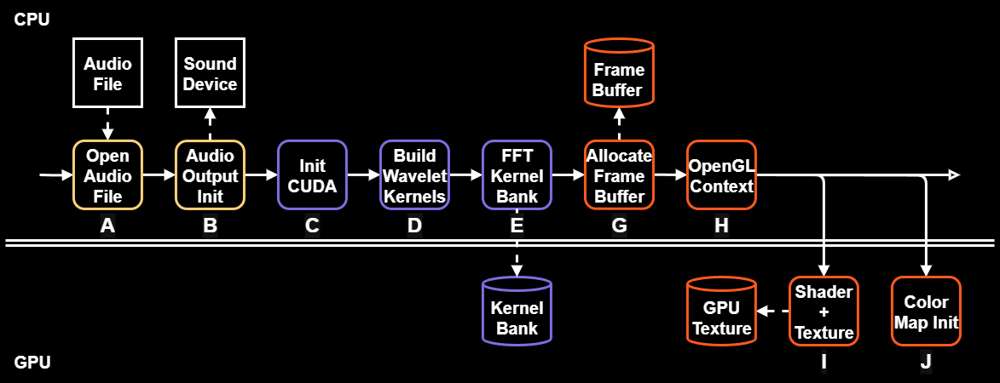
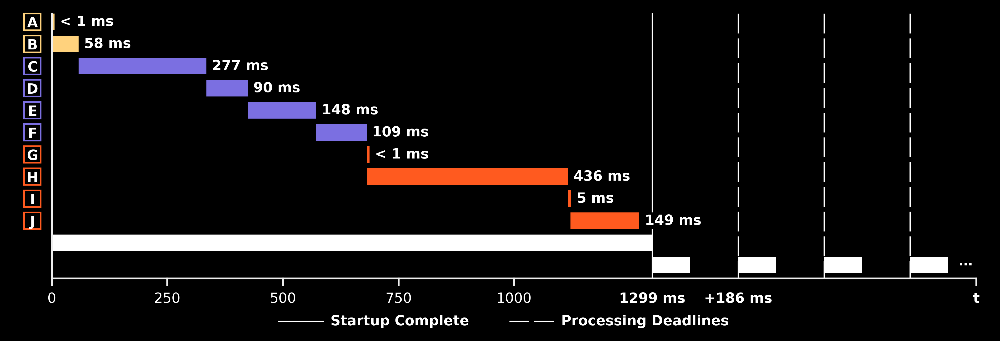

# SubShader

SubShader is a **real-time audio visualizer** written in Python. It uses modern techniques in digital signal processing (DSP) and parallel programming to accurately **visualize what an audio signal sounds like**.

To faithfully represent audio into a visual format, this project uses a modernized **Wavelet** analysis implementation, an extension of the traditional **Fourier** approach. This project holds these two methods in comparison, and discusses the advantages of using Wavelet-based processing techniques for real-world signals. All 

Demonstrating my foundations in real-time DSP and GPU progamming, I'm using this project to branch into more DSP and ML-adjacent fields in computer engineering and data science. It took a lot of effort and care to make this, so thank you for taking the time to read!

<!-- PLACEHOLDER: static scalogram frame (beltran 4-bar) — replace with demo mp4 (attachment URL) once the Veridis Quo clip is rendered via tools/render_demo.py -->
<p align="left"></p>

> ℹ️ For a comprehensive understanding of the design decisions and intuitions made in this project, especially in the DSP implementation, see → **[DSP.MD](src/subshader/dsp/DSP.md)** 

## Problem Statement

When we perceive sound, our ears can easily distinguish all the different kinds of noises we hear - the quiet vs the loud, the low vs the high, the gradual vs the sudden. However, designing something that can analyze audio to this level of detail is not as trivial as it may seem. To properly visualize an audio signal, we need to be able to detect more than just **what frequencies** are present. We also need to know **when in time** they start, how long they last, and when they stop. The main difficulty of this stems from trying to analyze sound structures and details that **coexist at vastly different scales**. 

Typical audio like music or speech is frequency-rich, containing both high and low-end frequencies that contribute to the long-term trends and short-term details of a signal's structure. The high-end details are brief and abrupt, demanding fine resolution in time to pin down when they happen. The long-term trends take long stretches of time to develop, shaping the grand scheme of the signal slowly and gradually - demanding fine frequency resolution instead, to detect slight changes in frequency. Simultaneously capturing both kinds of signal information in a fully-detailed representation is the core problem this project confronts.


### Audio Example

The audio displayed here is an exaggeration of the problem specifically. It is a signal that contains information that simultaneously exist at drastically different scales of frequency and time. The signal **gently** sweeps a single frequency across a range of 20-20k Hz - from the middle, down to the low-end, and back up to the high-end. At its halfway point, the sweep is **abruptly** punctuated by a series of "clicks" or "short-term broad-band transients".

<p align="left"></p>

### Fourier Analysis

The **Short-Time Fourier Transform** (STFT) is the typical, textbook-approach for basic DSP. It does a decent job of representing the *general* idea of what is happening in the signal. But for "non-stationary" frequency content like in this audio, notice how the signal's energy is resolved into a somewhat **smeared and jagged representation**. Notice how low-end frequency measurements of the sweep bleed and blob into neighboring frequency bands, while high-frequency impulses like the clicks appear as weakly represented fragments.

<p align="left"></p>

### Wavelet Analysis

The **Continuous Wavelet Transform** (CWT) is the more-recently popularized method for advanced signal analysis. It tracks the frequency sweep much more closely, tracing it with clean definition and without much smudging. It clearly resolves the onset of each "click" as a distinct event in time. Overall, the implementation produces an arguably **more representative result** by capturing signal energy at frequency bands and moments in time they actually belong.

<p align="left"></p>

### Intuition

These methods produce two technically valid, but slightly different representations of the same audio. We can clearly see the CWT excels at placing signal energy where it actually belongs, while the STFT produces a slightly skewed version. The CWT isn't measuring with *more* resolution - it is just proportionally adjusting its resolution to the scale of the frequency being measured. The STFT's main limitation is that it tries to use a single level of resolution to measure signal information that exists at vastly different scales in time and frequency. But this idea can be a little too abstract or vague to immediately understand. What we consider to be a detail vs noise, and the resolution it needs, depends entirely on the nature of the thing you are observing and the level of detail you wish to capture.

For a more relatable example, think of it like trying to observe a group of trees. What would be the best vantage point for this? If you were trying to map out the entirety of the forest, you wouldn't stand up close to the trees with a microscope. If you were trying to observe its plant cells, you wouldn't position yourself on a space-grade telescope in orbit. What about the scales of detail somewhere in between these two extremes? You might use binoculars to record the individual leaf shapes on a specific kind of tree, or a magnifying glass to analyze the texture of a particular kind of bark. 

In any of these cases, the observer is faced with the same tradeoff - being able to clearly observe fine details comes at the cost of knowing specifically where these details exist in the grand scheme of things. When zoomed in, you can easily figure out what kind of tree you are looking at, but you would have no idea **where** in the forest you were. Zoomed out, you can easily map the acreage of the forest, but would struggle to determine **which** types of trees make up the forest.

### Method Comparison

The audio example shown above exemplifies this resolution tradeoff directly. The STFT's main limitation is its rigid resolution - it uses a single lens of resolution to monitor the entire audio signal. This means only one scale of detail gets measured at the resolution it needs - every other scale, from microscopic to macroscopic, comes out skewed, smeared in either time or frequency.

Nothing is particularly wrong about this - you *could* map out a forest with a magnifying glass, you *could* use a satellite to identify the kinds of trees you are looking at - but in either case, you have to pick a single resolution - which is inefficient at representing all the **other** scales of detail. You can see this inefficiency in the figure directly: high-end frequencies are weakly detected, appearing like brittle fragments of energy, while low-end frequencies lack granularity - signal energy gets bucketed into spots on the grid that shouldn't have any frequency activity.

The CWT is like a hybrid microscope and telescope with an array of lenses all the way from the microscopic to the macroscopic level. Except in this case, we are not mapping out the acreage of a forest, and we're not recording leaf shapes or bark texture - we are observing detail-rich sound structures. We are measuring frequency information at a level of detail that allows us to distinguish the long-lasting, low-end frequencies from short-lived high-end ones, and everything in between. 

1)

> ℹ️ This tradeoff - and every design decision this project makes because of it - is explored in depth in **[DSP.md](src/subshader/dsp/DSP.md)**
<!-- SKELETON: depth link moved here from the old Overview top — §2's closing beat.
NOTE: casing — files are lowercase .md; "DSP.MD" vs "TIMING.md" — pick one style. -->

## Design
Better resolution comes at the cost of more compute. FFT libraries like [NumPy](https://numpy.org/doc/stable/reference/routines.fft.html) run exceptionally fast, but produce the smeared resolution shown above. [PyWavelets](https://pywavelets.readthedocs.io/en/latest/), a popular wavelet library, produces clean results but is too slow for live visualization. This project uses a custom CWT adapted from [ANTS](https://www.youtube.com/playlist?list=PLn0OLiymPak2BYu--bR0ADNBJsC4kuRWs), rewritten in Python and parallelized on a GPU with [CuPy](https://cupy.dev/). The renderer is a graphics shader for the same reason - [matplotlib](https://matplotlib.org/) cannot draw frames this large at this rate, and downsampling them would throw away detail the CWT strives to capture.
<!-- F2 fixed: "from from" → "from".
NOTE: name the source — "ANTS (*Analyzing Neural Time Series*, Mike X Cohen)". -->

### Pipeline
The pipeline processes and visualizes audio signals in sync with audio playback. It fetches audio samples from a file (live audio coming soon), processes them, and renders the results as an energy spectrum plot. The pipeline is composed of the following stages:
- [AUDIO.MD](src/subshader/audio/AUDIO.md)
- [DSP.MD](src/subshader/dsp/DSP.md)
- [RENDERER.MD](src/subshader/renderer/RENDERER.md)
<!-- SKELETON R4: stages become one-line descriptions + links (Audio / DSP / Renderer),
not bare filenames — Claude scaffolds candidates, user finalizes. Same casing note. -->

<p align="left"></p>

During runtime, overlapping frames of audio samples are delivered to the DSP stages for parallel processing. The CWT is performed on the audio frame and the results are post-processed. After storing the most recent frame into a circular buffer, the renderer uses a shader to color-map the results as a rolling energy spectrum plot. All of this is synced to the audio's playback device.
<!-- SKELETON: runtime walkthrough moved up from the old "### Runtime" — the outline
gives it no home of its own; likely folds into the pipeline one-liners (R4) or trims.
User decides. Its flowchart stays with it: -->
<p align="left"></p>

## Performance

✅ **Real-time** - each frame finishes in ~ 80 ms, well inside the 186 ms deadline. The slowest frame recorded was ~ 130 ms - still inside. Full timing report → [TIMING.md](assets/timing/TIMING.md)

<p align="center"></p>
<!-- SKELETON R3: takeaway line first, then the figure that proves it (runtime gantt
moved here from old Runtime section). Gantt/flowchart assets need a minimalism audit —
black-bg gantts + annotations may need a cleanup pass to match the shared style scale. -->

<!-- SKELETON R3 + F4 — numbers presentation, pick ONE form (don't do two):
  (a) compact 3-row stat block: deadline · work/frame · margin  (bullets below are close)
  (b) derivation as a small mono code block (hop → 186 ms, timing-section-plan reference)
  (c) deadline drawn directly on the gantt, never derived in prose
The old samples-per-second paragraph (below, marked OUT) is out per session decisions.
F4 correction — whatever form wins must state hop-not-window: chunk = 16384 samples
≈ 372 ms of sound; 0.5 overlap → a NEW batch every 186 ms — the hop is the deadline,
not the window. ("Each batch covers 186 ms" was wrong.) -->

- **Deadline** - 186 ms per frame
- **Work per frame** - 80 ms on average - a 2.3× margin
- **Resolution** - semitone bins - energy resolved at ±3% of every center frequency (116 chromatic tones · 27.5 Hz → 21.1 kHz)

<!-- OUT (raw material — replace per R3/F4 above, do not ship as-is):
To stay in time with the audio, the pipeline has to process audio faster than it is
played. Typical audio is sampled at 44.1 kHz, so the pipeline has to keep up with
44,100 new samples every second. SubShader takes those samples in overlapping batches.
Each batch covers 186 ms of sound, so each batch has 186 ms to be fetched, processed,
and rendered. That is the deadline. All of the timing data below is measured against it. -->

### Startup
To achieve real-time performance, all the heavy DSP computation and rendering are off-loaded to a dedicated GPU, and all of the expensive setup is paid once up front. Constructing the pipeline takes about 1.3 s where roughly 80% of it is GPU bring-up - creating the CUDA and OpenGL contexts, compiling kernels and FFT plans, and uploading the wavelet bank. This minimizes large memory allocations and transfers during runtime.
<!-- NOTE: "takes about 1.3 s where roughly 80%" → "of which roughly 80%".
SKELETON: startup beat lands here per outline — 1.3 s once, ~80% GPU bring-up, so every
frame stays lean. -->
<p align="left"></p>
<p align="center"></p>

This project is a proof of concept written in Python, running on WSL2. Most of the overhead is from my environment, not math. When the core stages were benchmarked in isolation, the same process was about 8× faster - for a potential 18× margin. Plenty of room for higher resolutions or stricter deadlines.
<!-- SKELETON R3: environment-vs-isolation is its own beat — WSL2 proof-of-concept
numbers vs isolated core-stage benchmark, framed as a deliberate contrast / headroom,
two numbers side by side, no hedging, not an apology. -->

## Implications
<!-- SKELETON R2: provisional — user wants variants in this register (quiet noun,
category-shaped). Shortlist: Overtones · Coda · Outlook · The Bigger Picture ·
Where This Goes. Swap header when one wins.
Beats: name the enemy — spectral bias — and land the F1 fragment as the payoff:
energy resolved where it belongs → features that represent the signal → higher
quality inputs for a model to learn from. Multiresolution beyond audio (cochlea,
CNN wavelet-like filters w/ AlexNet cite) as supporting evidence, then the post-v1
direction: hybrid DSP / custom-tuned feature front-end + learned model, built to
reduce spectral bias.
FRAMING TO VERIFY: in ML literature "spectral bias" specifically = nets learn
low-frequency structure first (Rahaman et al. 2019) — which strengthens the argument
(a wavelet front-end hands the model exactly the high-frequency detail it struggles
to learn). Decide: cite it in that sense, or use a plainer phrase like
"representation bias". (User's stray note "reducing spectral bias" folded in here.) -->

Better mathematical representation doesn't just make for prettier pictures. When a signal's energy is captured where it actually belongs, instead of bleeding into places it doesn't, you end up with more reliable features that are actually representative of the signal's properties. Pattern detection and feature extraction can only ever be as good as the representation underneath them, which is why the fundamentals of DSP explored in this project extend naturally into areas like machine learning.

<!-- F1 — THE PAYOFF, do not delete. Weave this phrasing into this section's prose
(it's the thesis, no longer floating in Conclusions):
"and can be delivered to a machine learning model as higher quality inputs for it
to learn and derive patterns from." -->

And none of this is exclusive to audio - almost every signal in the natural world is composed of both gradual trends and fine details. Multiresolution analysis applies to any domain where details live at more than one size, and this is the general problem this project confronts. We use wavelets in this context because they follow the same natural laws as the signals they are measuring.
<!-- NOTE: "wavelets follow the same natural laws" = poetry as claim; lean on the
cochlea / AlexNet evidence instead. -->

Typically this is left to the models to figure out - how the quickly-changing parts of a signal exist in the same context as the slow-moving ones and recent Wavelet methods address this relationship directly, and it has even been observed that while training convolutional neural networks, the first layers of these models tend to converge towards wavelet-like filters ([AlexNet, 2012](https://proceedings.neurips.cc/paper/2012/file/c399862d3b9d6b76c8436e924a68c45b-Paper.pdf)), evidence that even self-optimizing systems gravitate toward this innate time-frequency compromise. Even our own eyes and ears run a multiscale decomposition of the world.
<!-- Typo fixed: "networkss" → "networks". -->

The cochlea resolves low tones with narrow biological filters and high ones with wide ones - the same proportional trade the wavelet makes. Our eyes can take in the landscape trends of our view while simultaneously focusing on the finer details of an object in sight, and our ears can distinguish the texture of a sound as its frequency content changes with time. In all cases, it is valuable to accurately capture the short term details in the context in which they exist - it is happening around us constantly. This project takes this idea from ear to graphics card to eye - there are symphonies everywhere, for those with the eyes to see them.
<!-- NOTE: closer is one wall paragraph holding four ideas — split; let the closing
line land alone. -->
<!-- Biology got there first; the CWT just writes it down. -->
<!-- NOTE: line above is stuck in a comment — consider promoting it. -->

## How to Install
<!-- SKELETON R4: two additions land here —
1) cupy wheel caveat: pyproject lists bare `cupy` (source build, very slow) → tell
   readers to install the prebuilt wheel matching their CUDA toolkit, e.g.
   `pip install cupy-cuda12x`. (Verified: pyproject.toml line 12 lists bare "cupy".)
2) license line — NOTE: repo currently has NO LICENSE file; add one (or decide) before
   the line can exist.
F3 resolved: repo URL verified correct against git remote (eddie-water/sub-shader);
old [VERIFY] block removed. -->

Requirements:

- Python 3.9+
- NVIDIA CUDA-capable GPU
- OpenGL 3.3+

```bash
git clone https://github.com/eddie-water/sub-shader.git
cd sub-shader
python3 -m venv venv
source venv/bin/activate
pip install -e .
```

Run it:

```bash
python -m subshader
```
