# SubShader Architecture Flowchart

```mermaid
flowchart TB
    %% ── Entry Point ──────────────────────────────────────────────
    START(["python -m subshader [audio_file]"])
    START --> PARSE["Parse CLI args<br/><code>argparse</code>"]
    PARSE --> CONFIG["Load config<br/><code>get_default_config()</code>"]
    CONFIG --> VALIDATE["Validate config<br/>file, GPU mem, OpenGL limits"]

    %% ── Initialization ──────────────────────────────────────────
    VALIDATE --> INIT_AUDIO["<b>AudioInput</b><br/>Open WAV via soundfile<br/>Configure chunk_size & overlap"]
    VALIDATE --> INIT_PLAYER["<b>AudioPlayer</b><br/>Load entire file → float32<br/>Create sounddevice OutputStream"]
    VALIDATE --> GPU_CHECK{"GPU<br/>available?"}
    GPU_CHECK -- Yes --> INIT_CUWAVELET["<b>CuWavelet</b><br/>CuPy + CUDA FFT"]
    GPU_CHECK -- No --> INIT_NPWAVELET["<b>NpWavelet</b><br/>NumPy FFT fallback"]
    INIT_CUWAVELET --> INIT_WAVELET["Generate chromatic scale<br/>27.5 Hz (A0) → Nyquist<br/>12 notes/octave"]
    INIT_NPWAVELET --> INIT_WAVELET
    VALIDATE --> INIT_PLOTTER["<b>ShaderPlot</b>"]
    INIT_PLOTTER --> INIT_GL["<b>GLContext</b><br/>GLFW window + ModernGL ctx"]
    INIT_PLOTTER --> INIT_BUF["<b>CircularFrameBuffer</b><br/>Stores N frames chronologically"]
    INIT_PLOTTER --> INIT_RENDERER["<b>Renderer</b><br/>Compile GLSL shaders<br/>Create GPU texture"]

    %% ── Main Loop ────────────────────────────────────────────────
    INIT_AUDIO --> LOOP_START
    INIT_PLAYER --> LOOP_START
    INIT_WAVELET --> LOOP_START
    INIT_GL --> LOOP_START
    INIT_BUF --> LOOP_START
    INIT_RENDERER --> LOOP_START

    LOOP_START["Start audio playback<br/><code>AudioPlayer.start()</code>"]
    LOOP_START --> WINDOW_CHECK

    subgraph RENDER_LOOP ["Audio-Clock-Driven Render Loop"]
        direction TB
        WINDOW_CHECK{"Window<br/>closed?"}
        WINDOW_CHECK -- Yes --> CLEANUP
        WINDOW_CHECK -- No --> GET_POS["Get playback position<br/><code>AudioPlayer.get_playback_sample()</code><br/><i>Audio device clock = source of truth</i>"]
        GET_POS --> LOOP_CHECK{"Audio<br/>looped?"}
        LOOP_CHECK -- Yes --> RESET["Reset file_pos,<br/>next_expected_sample"]
        LOOP_CHECK -- No --> READY_CHECK
        RESET --> READY_CHECK
        READY_CHECK{"playback_pos<br/>≥ next chunk<br/>boundary?"}
        READY_CHECK -- "No (sleep 1ms)" --> WINDOW_CHECK
        READY_CHECK -- Yes --> SEEK["Seek AudioInput to<br/>audio clock position<br/><i>Skip if render behind</i>"]

        SEEK --> GET_CHUNK["<b>AudioInput.get_chunk()</b><br/>Read chunk_size samples<br/>with overlap window"]

        GET_CHUNK --> CWT_START

        subgraph CWT_PIPELINE ["CWT Pipeline  ·  wavelet.cwt()"]
            direction TB
            CWT_START["<b>class_specific_cwt()</b><br/>Convolution via FFT in frequency domain<br/><i>CuPy GPU or NumPy CPU</i>"]
            CWT_START --> NORM["<b>normalize_by_scale()</b><br/>Scale-dependent normalization<br/>Correct energy bias across octaves"]
            NORM --> MAG["<b>compute_mag()</b><br/>Complex → magnitude"]
            MAG --> RELIABLE["<b>discard_unreliable_coefs()</b><br/>Trim cone-of-influence edges"]
            RELIABLE --> HOP["<b>extract_hop_center()</b><br/>Keep non-overlapping center<br/>to avoid redundant wings"]
            HOP --> DOWNSAMPLE["<b>downsample()</b><br/>Resize to target_width"]
        end

        DOWNSAMPLE --> UPDATE_PLOT

        subgraph RENDER_PIPELINE ["Render Pipeline  ·  ShaderPlot.update_plot()"]
            direction TB
            UPDATE_PLOT["<b>CircularFrameBuffer.push_frame()</b><br/>Append frame + update IntensityTracker"]
            UPDATE_PLOT --> UPLOAD["<b>Renderer.update_texture()</b><br/>Upload buffer → GPU texture"]
            UPLOAD --> INTENSITY["<b>set_intensity_max()</b><br/>Pass global max for normalization"]
            INTENSITY --> CLEAR["<b>GLContext.clear_graphic()</b><br/>Clear back buffer"]
            CLEAR --> RENDER["<b>Renderer.render_graphic()</b><br/>Vertex shader → full-screen quad<br/>Fragment shader → colormap + gamma"]
            RENDER --> SWAP["<b>GLContext.display_graphic()</b><br/>Swap front/back buffers"]
        end

        SWAP --> ADV["Advance next_expected_sample<br/>by hop_size"]
        ADV --> WINDOW_CHECK
    end

    %% ── Cleanup ──────────────────────────────────────────────────
    CLEANUP["<b>SubShader.cleanup()</b>"]
    CLEANUP --> C1["Stop AudioPlayer stream"]
    CLEANUP --> C2["Terminate GLFW"]
    CLEANUP --> C3["Release CuPy GPU memory"]
    CLEANUP --> C4["Close soundfile handle"]
    C1 --> DONE(["Application shutdown"])
    C2 --> DONE
    C3 --> DONE
    C4 --> DONE

    %% ── Styling ──────────────────────────────────────────────────
    classDef gpu fill:#4a9eff,stroke:#2563eb,color:#fff
    classDef audio fill:#f59e0b,stroke:#d97706,color:#fff
    classDef viz fill:#10b981,stroke:#059669,color:#fff
    classDef config fill:#8b5cf6,stroke:#7c3aed,color:#fff
    classDef decision fill:#f472b6,stroke:#ec4899,color:#fff

    class INIT_CUWAVELET,INIT_NPWAVELET,CWT_START,NORM,MAG,RELIABLE,HOP,DOWNSAMPLE gpu
    class INIT_AUDIO,INIT_PLAYER,GET_CHUNK,GET_POS audio
    class INIT_GL,INIT_BUF,INIT_RENDERER,UPDATE_PLOT,UPLOAD,INTENSITY,CLEAR,RENDER,SWAP viz
    class CONFIG,VALIDATE config
    class GPU_CHECK,WINDOW_CHECK,LOOP_CHECK,READY_CHECK decision
```

## Color Legend

| Color | Component |
|-------|-----------|
| Purple | Configuration & validation |
| Orange | Audio input & playback |
| Blue | DSP / CWT pipeline (GPU or CPU) |
| Green | Visualization / OpenGL rendering |
| Pink | Decision points |

## Key Architecture Notes

- **Audio clock is the master**: The sounddevice OutputStream callback drives timing. The render loop polls `get_playback_sample()` and only computes CWT when audio has advanced past the next chunk boundary.
- **Skip-ahead on render lag**: If rendering falls behind audio, the loop seeks directly to the current audio position rather than processing every missed chunk.
- **Overlap windowing**: Consecutive audio chunks overlap (default 50%). The CWT trims to hop-center after transform to avoid redundant edge repetition.
- **Circular frame buffer**: Rendered frames accumulate in a fixed-size ring buffer. The full buffer is uploaded as a single GPU texture each frame, giving a scrolling spectrogram effect.
- **Intensity tracking**: `IntensityTracker` maintains a decaying global max across frames so the colormap adapts to signal dynamics without flickering.
