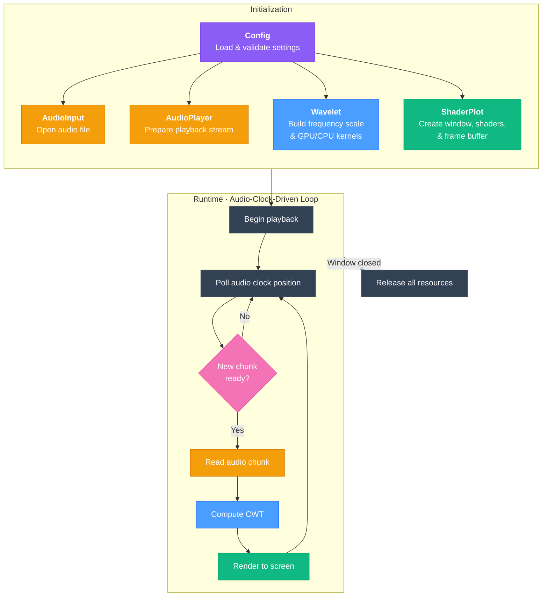

# SubShader High-Level Architecture

## Modules

| Module | Role |
|--------|------|
| **Config** | Centralized settings — audio, wavelet, and visualization parameters with validation |
| **AudioInput** | Reads overlapping chunks from a WAV file on demand |
| **AudioPlayer** | Plays audio via sounddevice; its device clock is the timing master |
| **Wavelet** | Continuous Wavelet Transform — GPU-accelerated (CuPy) with NumPy fallback |
| **ShaderPlot** | GLFW window + ModernGL renderer with circular frame buffer and GLSL shaders |
