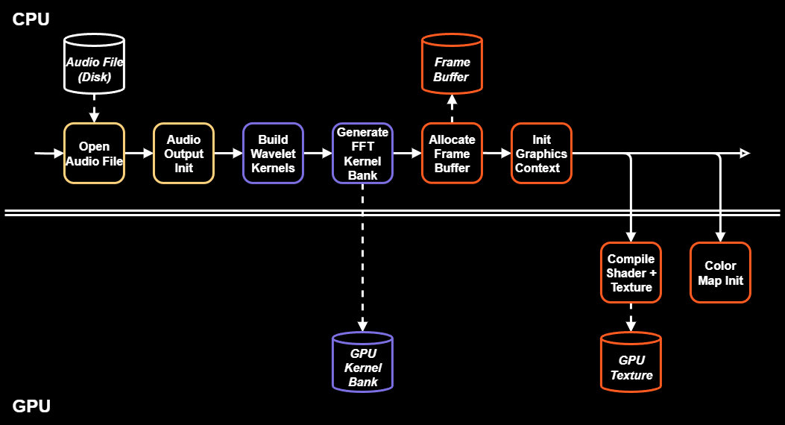
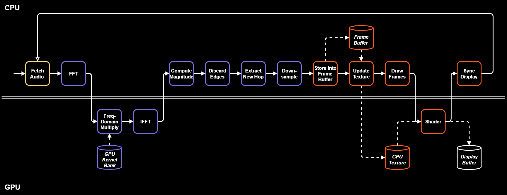
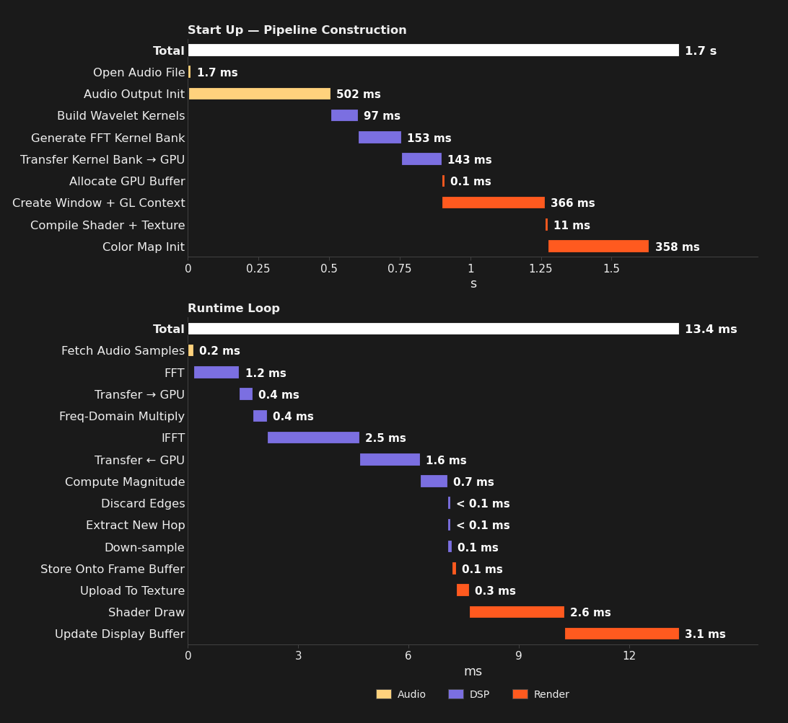
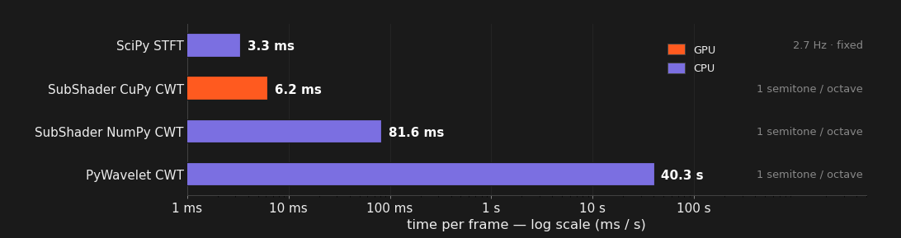
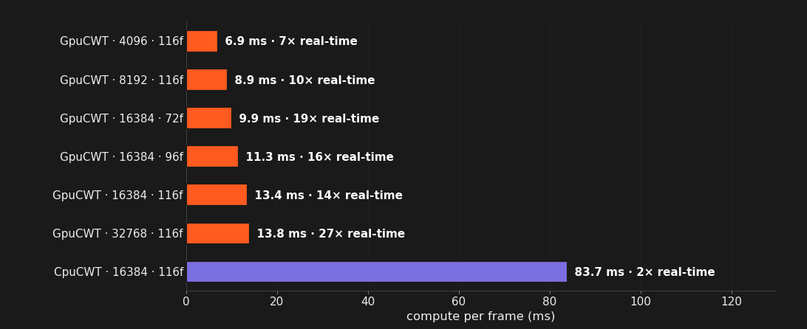

# SubShader Timing

## Overview

✅ **Real-Time Performance**

- **Processing Speed** — ~612,946 samples per second
- **FPS** — ~75 frames per second
- **Deadline** — 14× under the 186 ms deadline

## Pipeline Profiling

**Test parameters**

| Number of Samples | Sampling Rate | Lowest Frequency | Highest Frequency | Frequency Resolution | Number of Frequencies |
| --- | --- | --- | --- | --- | --- |
| 16,384 | 44.1 kHz | 27.5 Hz | 21.1 kHz | 12 per octave | 116 |

### Pipeline Structure

### Start Up vs Runtime — Measured Per-Stage Timing

## Fourier vs Wavelet Implementations

## Performance Across Settings

