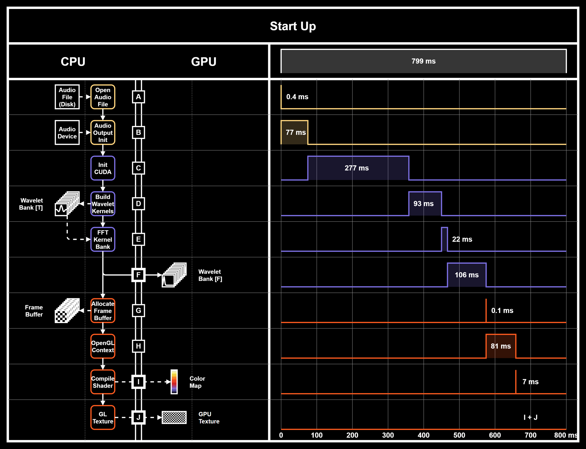
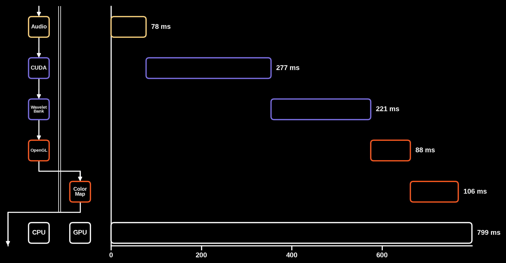
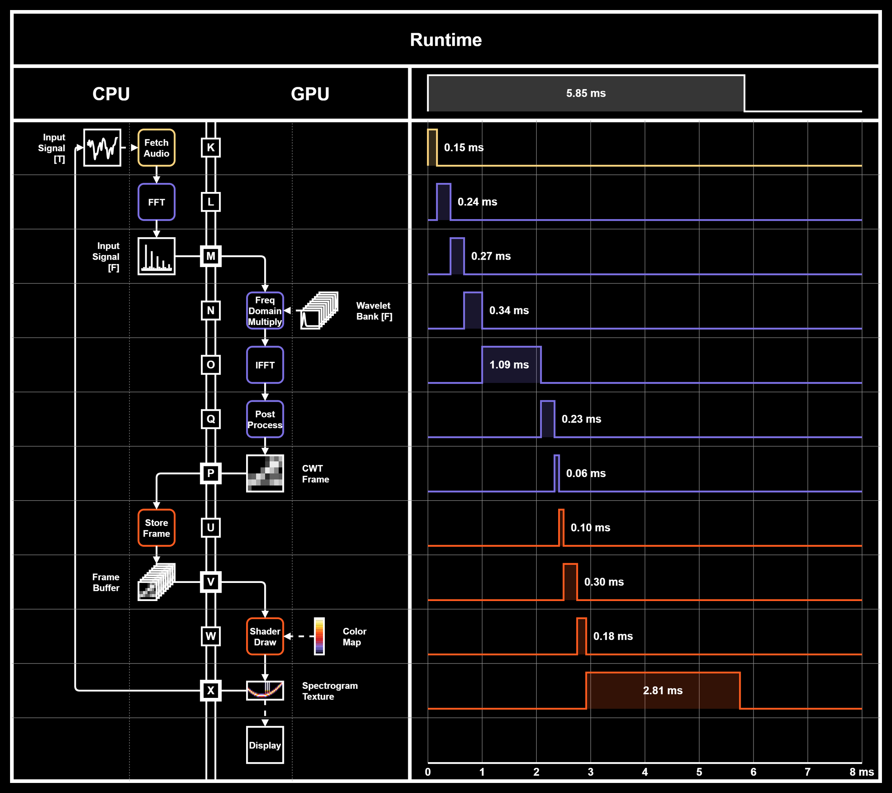
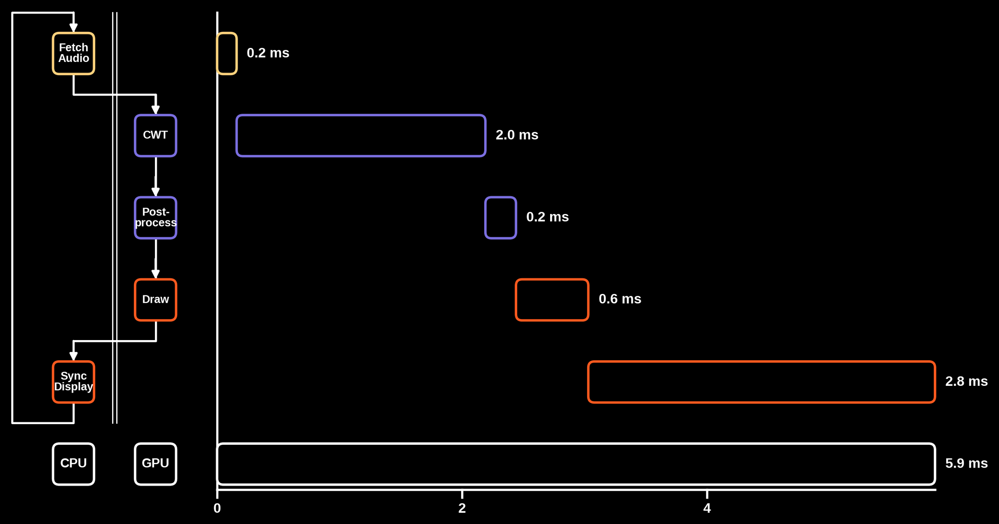
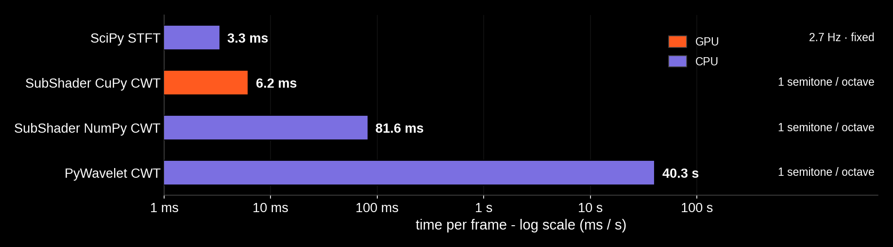
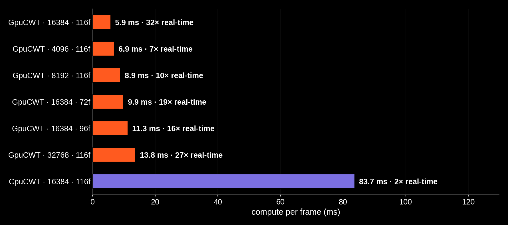

# SubShader Timing

✅ **Real-time** - 5.9 ms of work per 186 ms frame budget, a 32× margin. The worst frame observed took 11 ms - still 16.8× under the deadline.

## Start Up

**Start up pays 799 ms once - allocations, kernel builds, GPU warmup - so every frame of the Process Loop stays lean.**

## Process Loop

**One frame of audio propagates end to end in 5.9 ms, against a 186 ms deadline.**

## Why This Method

**The GPU CWT keeps wavelet accuracy at real-time speed - the textbook options give up one or the other.**

**Test parameters**

| Number of Samples | Sampling Rate | Lowest Frequency | Highest Frequency | Frequency Resolution | Number of Frequencies |
| --- | --- | --- | --- | --- | --- |
| 16,384 | 44.1 kHz | 27.5 Hz | 21.1 kHz | 12 per octave | 116 |
