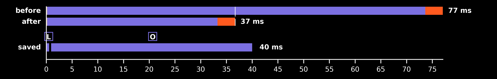

## Fix 1 — FFT convolution length padded to a fast size

**Date:** 2026-08-25 · **Patch:** [patches/fix1_fft_padding.patch](../patches/fix1_fft_padding.patch)
**Runs:** `20260825_212910_GpuCWT_c16384_f116` (before) → `20260825_213436_GpuCWT_c16384_f116` (after)

**Root cause.** The FFT convolution length was the exact linear-convolution
size: `chunk (16384) + widest wavelet support (9622) - 1 = 26005 = 5 × 7 × 743`.
The prime factor 743 forces cuFFT into its Bluestein fallback — measured 3.3×
slower per call in isolation, plus a ~100 ms one-time plan build. Fix: pad
`max_conv_n` to `scipy.fft.next_fast_len` → 26136 (= 2³·3³·11²), one change in
`src/subshader/dsp/cwt.py`. Zero padding never reaches the output (the
`[:input_n]` trim discards it) — parity proven by
`tests/test_cwt_conv_length.py` against direct convolution.

### Effect on the output

None by construction — the padding is trimmed before any coefficient leaves
`transform()`, so frames are the same values to float precision
(`test_transform_matches_direct_convolution`). No before/after image.

### Timing diff



Saved segments: L (Freq-Domain Multiply) and O (IFFT) — the two stages that
ran the Bluestein-length FFT. Generator:
`python -m research.dsplot.figures.gen_timing_ledger_diff <before> <after>`.

- **before**: 77.0 ms work per 186 ms frame → 2.4× headroom, ~106k samples/s (real time = 44.1k) [median 86.6, worst 88.1]
- **after**: 36.7 ms work per 186 ms frame → 5.1× headroom, ~223k samples/s (real time = 44.1k) [median 40.7, worst 41.6]

🟢 faster · 🔴 slower · ⚪ same-ish — one dot >5%, two >25%, three >60% change
Modules (diagram colors): 🟡 Audio · 🟣 DSP · 🟠 Render · ⚫ Setup

### Modules (per frame)

|  | Module | before mean | after mean | Δ mean ms (%) |
| --- | --- | --- | --- | --- |
| ⚪ | 🟡 Audio | 0.15 | 0.16 | +0.00 (+2%) |
| 🟢🟢 | 🟣 DSP | 73.49 | 33.12 | -40.37 (-55%) |
| ⚪ | 🟠 Render | 3.40 | 3.43 | +0.03 (+1%) |
| 🟢🟢 | **Whole frame** | 77.04 | 36.70 | -40.33 (-52%) |

### Process loop stages (per frame)

|  | Stage | before mean | after mean | Δ mean ms (%) | before median | after median |
| --- | --- | --- | --- | --- | --- | --- |
| ⚪ | 🟡 Fetch Audio Samples | 0.15 | 0.16 | +0.00 (+2%) | 0.14 | 0.15 |
| 🟢🟢🟢 | 🟣 FFT | 1.21 | 0.27 | -0.94 (-78%) | 1.18 | 0.25 |
| ⚪ | 🟣 Transfer → GPU | 0.60 | 0.59 | -0.01 (-2%) | 0.64 | 0.63 |
| ⚪ | 🟣 Freq-Domain Multiply | 4.93 | 4.97 | +0.04 (+1%) | 5.58 | 5.60 |
| 🟢🟢🟢 | 🟣 IFFT | 56.32 | 16.88 | -39.44 (-70%) | 64.13 | 19.14 |
| ⚪ | 🟣 Transfer ← GPU | 9.65 | 9.67 | +0.02 (+0%) | 10.80 | 10.79 |
| ⚪ | 🟣 Compute Magnitude | 0.63 | 0.61 | -0.02 (-3%) | 0.62 | 0.60 |
| ⚪ | 🟣 Discard Edges | 0.01 | 0.00 | -0.00 (-19%) | 0.01 | 0.00 |
| ⚪ | 🟣 Extract New Hop | 0.01 | 0.01 | -0.00 (-10%) | 0.01 | 0.01 |
| ⚪ | 🟣 Down-sample | 0.13 | 0.11 | -0.01 (-11%) | 0.12 | 0.11 |
| ⚪ | 🟠 Store Into Frame Buffer | 0.10 | 0.09 | -0.01 (-6%) | 0.09 | 0.09 |
| ⚪ | 🟠 Upload To Texture | 0.30 | 0.31 | +0.01 (+3%) | 0.30 | 0.31 |
| ⚪ | 🟠 Clear Previous Display Buffer | 0.14 | 0.13 | -0.00 (-1%) | 0.13 | 0.13 |
| ⚪ | 🟠 Shader Draw | 0.06 | 0.05 | -0.00 (-6%) | 0.06 | 0.05 |
| ⚪ | 🟠 Update Display Buffer | 2.80 | 2.84 | +0.04 (+1%) | 2.78 | 2.82 |
| 🟢🟢 | **Whole frame** | 77.04 | 36.70 | -40.33 (-52%) | 86.64 | 40.71 |

### Start-up (one time)

|  | Start-up stage | before mean | after mean | Δ mean ms (%) |
| --- | --- | --- | --- | --- |
| 🟢 | 🟡 audio | 73.75 | 64.01 | -9.74 (-13%) |
| 🟢 | 🟡 audio_player | 73.59 | 63.85 | -9.74 (-13%) |
| ⚪ | 🟡 audio_reader | 0.14 | 0.14 | +0.00 (+2%) |
| ⚪ | 🟣 cuda | 277.56 | 269.87 | -7.69 (-3%) |
| 🟢🟢 | 🟣 dsp | 345.52 | 217.89 | -127.63 (-37%) |
| 🟢🟢🟢 | 🟣 dsp_fft | 147.96 | 20.05 | -127.91 (-86%) |
| ⚪ | 🟣 dsp_kernels | 89.77 | 93.59 | +3.82 (+4%) |
| ⚪ | 🟣 dsp_upload | 107.58 | 104.04 | -3.54 (-3%) |
| ⚪ | ⚫ other | 27.91 | 28.45 | +0.54 (+2%) |
| 🟢 | 🟠 prescan | 134.15 | 101.00 | -33.15 (-25%) |
| 🟢 | ⚫ prime | 14.42 | 11.83 | -2.59 (-18%) |
| ⚪ | 🟠 render_buffer | 0.09 | 0.16 | +0.06 (+67%) |
| 🔴 | 🟠 render_glcontext | 55.04 | 63.10 | +8.07 (+15%) |
| 🟢 | 🟠 render_shader | 5.50 | 4.92 | -0.57 (-10%) |
| 🔴 | 🟠 renderer | 60.66 | 68.21 | +7.55 (+12%) |

**Notes.** Both runs software-paced (no audio output device present in WSL at
run time — playback pacing simulated, identical mode both sides). The
remaining ~17 ms IFFT mean is dominated by the GPU idle-downclock tax (hot
steady-state for this size measures 0.7 ms in isolation) — that is Fix 2's
target (GPU clock lock). The test suite was modernized in the same pass:
stale pre-refactor imports (`subshader.dsp.wavelet`, `subshader.viz.plotter`,
`subshader.audio.audio_input/audio_player`) updated to the phase-08 layout;
42/42 passing.

### Tests

```
$ python -m pytest tests/test_cwt_conv_length.py -v
tests/test_cwt_conv_length.py::TestConvolutionLength::test_conv_length_is_fast_fft_size PASSED
tests/test_cwt_conv_length.py::TestConvolutionLength::test_conv_length_covers_linear_convolution PASSED
tests/test_cwt_conv_length.py::TestConvolutionLength::test_transform_matches_direct_convolution PASSED
tests/test_cwt_conv_length.py::TestConvolutionLength::test_output_shape_unchanged_by_padding PASSED
============================== 4 passed in 0.04s ===============================
```

(Re-run 2026-08-30 on the working tree.)

## Code diff

```diff
diff --git a/src/subshader/dsp/cwt.py b/src/subshader/dsp/cwt.py
index 42b09c6..c277a1c 100644
--- a/src/subshader/dsp/cwt.py
+++ b/src/subshader/dsp/cwt.py
@@ -23,6 +23,7 @@ except Exception:
 
 import numpy as np
 from numpy.fft import fft, ifft
+from scipy.fft import next_fast_len
 
 from subshader.config import CWTConfig
 from subshader.dsp.dsp import DSP
@@ -81,7 +82,14 @@ class CWT(DSP):
             ]
 
             self.num_wavelets: int = len(self.wavelets)
-            self.max_conv_n: int = max(w.get_conv_n() for w in self.wavelets)
+
+            # Pad to the next fast FFT length: the exact convolution length can
+            # carry a large prime factor (26005 = 5*7*743 at default config),
+            # forcing cuFFT into its slow Bluestein fallback. The extra zero
+            # padding never reaches the output - transform() trims to input_n.
+            self.max_conv_n: int = next_fast_len(
+                max(w.get_conv_n() for w in self.wavelets)
+            )
 
         # Pre-compute frequency-domain kernel bank (zero-padded to max_conv_n)
         with timed_block(self, "dsp_fft"):
@@ -122,7 +130,7 @@ class CWT(DSP):
         """Post-process raw complex CWT coefficients into a visualization-ready array.
 
         Steps:
-            1. Normalize by scale (no-op — L1 kernel normalization handles energy bias)
+            1. Normalize by scale (no-op - L1 kernel normalization handles energy bias)
             2. Convert to magnitude
             3. Discard edge-artifact region
             4. Extract non-overlapping hop center
@@ -154,7 +162,7 @@ class CWT(DSP):
         return self.output_shape
 
     # -------------------------------------------------------------------------
-    # Private helpers — chromatic scale and reliable-region construction
+    # Private helpers - chromatic scale and reliable-region construction
     # -------------------------------------------------------------------------
 
     def _generate_chromatic_scale(
@@ -338,7 +346,7 @@ class GpuCWT(CWT):
     def __init__(self, config: CWTConfig) -> None:
         if not _CUPY_AVAILABLE:
             raise RuntimeError(
-                "CuPy is not available — cannot create GpuCWT. "
+                "CuPy is not available - cannot create GpuCWT. "
                 "Use CpuCWT for CPU-only execution."
             )
         super().__init__(config)
@@ -351,7 +359,7 @@ class GpuCWT(CWT):
 
         # TODO: free the CPU-side kernel bank once it's on the GPU. The base
         # CWT builds self.kernel_f_bank for CpuCWT, but GpuCWT only reads it
-        # here to upload — after this it's dead weight in host RAM (the runtime
+        # here to upload - after this it's dead weight in host RAM (the runtime
         # multiply uses kernel_f_bank_gpu). Drop it with `del self.kernel_f_bank`
         # (or skip building it for the GPU path) to reclaim the memory.
```
