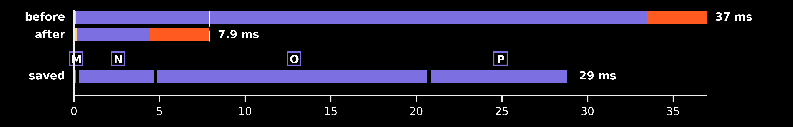

## Fix 2 — GPU clock floors locked (SM + memory)

**Date:** 2026-08-25 · **Patch:** [patches/fix2_gpu_clock_lock.patch](../patches/fix2_gpu_clock_lock.patch)
**Runs:** `20260825_221454_GpuCWT_c16384_f116` (before) → `20260825_221713_GpuCWT_c16384_f116` (after)

**Root cause.** The loop works ~37 ms out of every 186 ms frame — a duty cycle
the NVIDIA driver's DVFS reads as idle. After its post-burst boost window
(~6.5 s, measured), it parks the **memory clock** at 810 MHz (max 9001) and
steps the SM clock down through 645 → 315 MHz tiers, and the loop's own
periodic work never re-arms the boost. Every bandwidth-bound DSP stage then
runs against ~1/11th memory bandwidth: the IFFT takes 19 ms instead of its
hot-clock 2.8 ms, and multiply/download inflate the same way. The fix pins
clock floors for the app's lifetime via `nvidia-smi -lgc 2610,3105` +
`-lmc 5001,9001` — new module `src/subshader/utils/gpu_clock.py`, called from
`__main__.main()` before any CUDA work (`--no-clock-lock` to skip). On WSL
the lock must be applied by the Windows-host nvidia-smi through one elevated
PowerShell call (single UAC prompt); the module verifies by re-querying
clocks and the app continues unlocked on any failure. Behavior proven by
`tests/test_gpu_clock.py` (17 mocked cases) plus a live `applied-elevated`
lock/release round-trip.

### Effect on the output

None — no DSP or render code path changes; only the clock the same work runs
at. No before/after image.

### Timing diff



Saved segments: M (Transfer → GPU), N (Freq-Domain Multiply), O (IFFT),
P (Transfer ← GPU) — every bandwidth-bound GPU stage, recovered together when
the memory clock stops parking. Generator:
`python -m research.dsplot.figures.gen_timing_ledger_diff <before> <after>`.

- **before**: 37.0 ms work per 186 ms frame → 5.0× headroom, ~222k samples/s (real time = 44.1k) [median 40.8, worst 41.7]
- **after**: 7.9 ms work per 186 ms frame → 23.5× headroom, ~1035k samples/s (real time = 44.1k) [median 7.8, worst 13.6]

🟢 faster · 🔴 slower · ⚪ same-ish — one dot >5%, two >25%, three >60% change
Modules (diagram colors): 🟡 Audio · 🟣 DSP · 🟠 Render · ⚫ Setup

### Modules (per frame)

|  | Module | before mean | after mean | Δ mean ms (%) |
| --- | --- | --- | --- | --- |
| ⚪ | 🟡 Audio | 0.16 | 0.16 | +0.00 (+3%) |
| 🟢🟢🟢 | 🟣 DSP | 33.35 | 4.31 | -29.03 (-87%) |
| ⚪ | 🟠 Render | 3.45 | 3.44 | -0.01 (-0%) |
| 🟢🟢🟢 | **Whole frame** | 36.95 | 7.91 | -29.04 (-79%) |

### Process loop stages (per frame)

|  | Stage | before mean | after mean | Δ mean ms (%) | before median | after median |
| --- | --- | --- | --- | --- | --- | --- |
| ⚪ | 🟡 Fetch Audio Samples | 0.16 | 0.16 | +0.00 (+3%) | 0.15 | 0.15 |
| ⚪ | 🟣 FFT | 0.27 | 0.28 | +0.01 (+3%) | 0.25 | 0.25 |
| 🟢🟢 | 🟣 Transfer → GPU | 0.59 | 0.30 | -0.29 (-50%) | 0.64 | 0.27 |
| 🟢🟢🟢 | 🟣 Freq-Domain Multiply | 4.99 | 0.40 | -4.59 (-92%) | 5.59 | 0.40 |
| 🟢🟢🟢 | 🟣 IFFT | 17.02 | 1.06 | -15.96 (-94%) | 19.15 | 1.09 |
| 🟢🟢🟢 | 🟣 Transfer ← GPU | 9.73 | 1.56 | -8.17 (-84%) | 10.80 | 1.43 |
| ⚪ | 🟣 Compute Magnitude | 0.63 | 0.61 | -0.02 (-2%) | 0.62 | 0.60 |
| ⚪ | 🟣 Discard Edges | 0.00 | 0.00 | -0.00 (-34%) | 0.00 | 0.00 |
| ⚪ | 🟣 Extract New Hop | 0.01 | 0.01 | -0.00 (-26%) | 0.01 | 0.01 |
| ⚪ | 🟣 Down-sample | 0.12 | 0.10 | -0.02 (-13%) | 0.11 | 0.10 |
| ⚪ | 🟠 Store Into Frame Buffer | 0.09 | 0.10 | +0.00 (+2%) | 0.09 | 0.09 |
| ⚪ | 🟠 Upload To Texture | 0.32 | 0.30 | -0.01 (-4%) | 0.32 | 0.30 |
| ⚪ | 🟠 Clear Previous Display Buffer | 0.14 | 0.14 | +0.00 (+0%) | 0.13 | 0.13 |
| ⚪ | 🟠 Shader Draw | 0.06 | 0.05 | -0.00 (-3%) | 0.05 | 0.05 |
| ⚪ | 🟠 Update Display Buffer | 2.84 | 2.85 | +0.00 (+0%) | 2.83 | 2.83 |
| 🟢🟢🟢 | **Whole frame** | 36.95 | 7.91 | -29.04 (-79%) | 40.77 | 7.81 |

### Start-up (one time)

|  | Start-up stage | before mean | after mean | Δ mean ms (%) |
| --- | --- | --- | --- | --- |
| 🔴 | 🟡 audio | 58.63 | 65.70 | +7.07 (+12%) |
| 🔴 | 🟡 audio_player | 58.31 | 65.55 | +7.24 (+12%) |
| ⚪ | 🟡 audio_reader | 0.30 | 0.13 | -0.17 (-56%) |
| ⚪ | 🟣 cuda | 281.08 | 271.25 | -9.83 (-3%) |
| 🟢 | 🟣 dsp | 221.28 | 209.22 | -12.07 (-5%) |
| ⚪ | 🟣 dsp_fft | 22.18 | 21.48 | -0.70 (-3%) |
| 🟢 | 🟣 dsp_kernels | 94.71 | 89.94 | -4.77 (-5%) |
| 🟢 | 🟣 dsp_upload | 104.19 | 97.59 | -6.60 (-6%) |
| 🟢 | ⚫ other | 29.57 | 27.18 | -2.39 (-8%) |
| ⚪ | 🟠 prescan | 103.36 | 99.37 | -3.99 (-4%) |
| 🟢 | ⚫ prime | 14.46 | 11.48 | -2.98 (-21%) |
| ⚪ | 🟠 render_buffer | 0.16 | 0.08 | -0.08 (-52%) |
| 🟢🟢 | 🟠 render_glcontext | 80.04 | 52.73 | -27.31 (-34%) |
| 🟢🟢 | 🟠 render_shader | 5.67 | 3.41 | -2.26 (-40%) |
| 🟢🟢 | 🟠 renderer | 85.90 | 56.24 | -29.66 (-35%) |

**Notes.** Both runs software-paced (no audio device in WSL), recorded
minutes apart under identical conditions; only the lock state differs (the
campaign itself never calls the lock — it was applied via the CLI before the
after-run). Alternatives measured and rejected first: tiny-kernel heartbeats
(20/50/100 ms), small-matmul heartbeats, and periodic boost-refresh bursts
all failed to prevent the downclock — DVFS follows utilization, not recency,
so only the hard floor is reliable. Unelevated `-lgc`/`-lmc` is
permission-denied on WSL (both the Windows binary and the native
`/usr/lib/wsl/lib/nvidia-smi`); elevation is one UAC prompt, and since the
lock is machine-state that survives exit, subsequent runs detect it and skip
the prompt entirely. Deliberate deviation from the planned design: no
context-manager/atexit auto-release — that would cost a second UAC prompt
every run; instead `python -m subshader.utils.gpu_clock release` (or reboot)
clears it. Cost of a locked idle GPU: ~31 W. Floors are measured 4060 Ti
values: 2610 MHz = sustained-boost SM tier, 5001 MHz = lowest full-FFT-rate
memory P-state (driver snaps it to 5000 — verification tolerates that). This
fix also shrank Fix 3's target: Transfer ← GPU fell 9.7 → 1.6 ms, so
GPU-side post-processing is now a ~2 ms opportunity, not ~10 ms.

### Tests

```
$ python -m pytest tests/test_gpu_clock.py -v
tests/test_gpu_clock.py::TestQueryClocks::test_parses_clock_pair PASSED
tests/test_gpu_clock.py::TestQueryClocks::test_no_nvidia_smi_returns_none PASSED
tests/test_gpu_clock.py::TestQueryClocks::test_unparseable_output_returns_none PASSED
tests/test_gpu_clock.py::TestQueryClocks::test_failed_command_returns_none PASSED
tests/test_gpu_clock.py::TestIsLocked::test_clocks_at_floor_is_locked PASSED
tests/test_gpu_clock.py::TestIsLocked::test_driver_snapped_floor_within_tolerance_is_locked PASSED
tests/test_gpu_clock.py::TestIsLocked::test_idle_clocks_are_unlocked PASSED
tests/test_gpu_clock.py::TestIsLocked::test_memory_parked_is_unlocked PASSED
tests/test_gpu_clock.py::TestIsLocked::test_unqueryable_is_unlocked PASSED
tests/test_gpu_clock.py::TestEnsureLocked::test_already_locked_short_circuits PASSED
tests/test_gpu_clock.py::TestEnsureLocked::test_no_nvidia_smi_is_unavailable PASSED
tests/test_gpu_clock.py::TestEnsureLocked::test_direct_lock_success PASSED
tests/test_gpu_clock.py::TestEnsureLocked::test_permission_denied_falls_back_to_elevation PASSED
tests/test_gpu_clock.py::TestEnsureLocked::test_declined_elevation_fails_gracefully PASSED
tests/test_gpu_clock.py::TestEnsureLocked::test_no_windows_host_fails_without_elevation_attempt PASSED
tests/test_gpu_clock.py::TestRelease::test_direct_release_success PASSED
tests/test_gpu_clock.py::TestRelease::test_release_uses_reset_flags PASSED
============================== 17 passed in 0.02s ==============================
```

(Re-run 2026-08-30 on the working tree.)

## Code diff

```diff
--- a/src/subshader/__main__.py
+++ b/src/subshader/__main__.py
@@ -3,6 +3,7 @@
 
 import argparse
 from subshader.utils.logging import logger_init
+from subshader.utils.gpu_clock import ensure_locked
 from subshader.config import CWTConfig
 from subshader.pipeline import SubShader
 from subshader.exceptions import GRACEFUL_EXCEPTIONS, reporter
@@ -14,6 +15,8 @@
                                      description="SubShader real-time audio visualizer")
     parser.add_argument("audio_file", nargs="?", default=None,
                         help="Path to WAV audio file (uses default if not provided)")
+    parser.add_argument("--no-clock-lock", action="store_true",
+                        help="Skip locking GPU clock floors at startup")
     return parser.parse_args()
 
 
@@ -22,6 +25,13 @@
     logger_init(log_level="INFO", console_output=True, file_output=True)
     args = parse_args()
 
+    # Pin GPU clock floors before any CUDA work: the loop's duty cycle is low
+    # enough that driver DVFS otherwise parks the memory clock mid-playback,
+    # multiplying DSP kernel times. Machine-state, not process-state: survives
+    # exit; release with `python -m subshader.utils.gpu_clock release`.
+    if not args.no_clock_lock:
+        ensure_locked()
+
     config = CWTConfig()
     if args.audio_file:
         config.file_path = args.audio_file
diff --git a/src/subshader/utils/gpu_clock.py b/src/subshader/utils/gpu_clock.py
new file mode 100644
index 0000000..c0756f4
--- /dev/null
+++ b/src/subshader/utils/gpu_clock.py
@@ -0,0 +1,207 @@
+"""GPU clock lock - pins SM and memory clock floors for the pipeline's lifetime.
+
+The render loop works ~35 ms out of every 186 ms frame, which the NVIDIA
+driver's DVFS reads as an idle GPU: after its post-burst boost window
+(~6.5 s) it steps the memory clock down to 810 MHz and the SM clock toward
+idle, and the loop's own periodic work never re-arms the boost. The
+memory-bound IFFT then runs ~19 ms instead of its hot-clock ~2.8 ms.
+
+Locking clock floors (nvidia-smi -lgc / -lmc) removes that tax
+deterministically. On WSL the lock must be applied by the Windows-host
+nvidia-smi.exe, which requires elevation - handled here by a single UAC
+prompt via PowerShell Start-Process -Verb RunAs. The lock is machine-state:
+it survives process exit and is only cleared by `release()` (elevated),
+`nvidia-smi -rgc -rmc`, or a reboot. The app therefore locks at startup if
+needed and intentionally does NOT auto-release on exit - releasing would
+cost a second UAC prompt every run, and a still-locked GPU is merely warm
+idle (~30 W), never unreachable.
+
+Floors are hardware-specific, measured on the RTX 4060 Ti dev/demo GPU:
+2610 MHz SM is the sustained-boost tier; 5001 MHz memory is the lowest
+P-state with full-rate FFT throughput.
+
+CLI: python -m subshader.utils.gpu_clock [status|lock|release]
+"""
+
+import shutil
+import subprocess
+
+from subshader.utils.logging import get_logger
+
+log = get_logger(__name__)
+
+SM_FLOOR_MHZ = 2610
+SM_MAX_MHZ = 3105
+MEM_FLOOR_MHZ = 5001
+MEM_MAX_MHZ = 9001
+
+# The driver snaps requested floors to real P-states (e.g. 5001 -> 5000 MHz),
+# so verification must allow a small shortfall from the requested value.
+FLOOR_TOLERANCE_MHZ = 15
+
+# UAC prompt wait: long enough to find the mouse, short enough that an
+# unattended launch fails into the unlocked path instead of hanging startup.
+ELEVATION_TIMEOUT_S = 60
+
+
+def _find_nvidia_smi() -> str | None:
+    """Locate nvidia-smi: native first, then the Windows-host binary (WSL)."""
+    return shutil.which("nvidia-smi") or shutil.which("nvidia-smi.exe")
+
+
+def _run(cmd: list[str], timeout: float = 15) -> subprocess.CompletedProcess | None:
+    try:
+        return subprocess.run(cmd, capture_output=True, text=True, timeout=timeout)
+    except (OSError, subprocess.TimeoutExpired) as e:
+        log.warning(f"GPU clock command failed to run: {' '.join(cmd)} ({e})")
+        return None
+
+
+def query_clocks() -> tuple[int, int] | None:
+    """Return current (sm_mhz, mem_mhz), or None if unqueryable."""
+    smi = _find_nvidia_smi()
+    if smi is None:
+        return None
+    result = _run([smi, "--query-gpu=clocks.sm,clocks.mem",
+                   "--format=csv,noheader,nounits"])
+    if result is None or result.returncode != 0:
+        return None
+    try:
+        sm, mem = (int(v) for v in result.stdout.strip().split(","))
+    except ValueError:
+        return None
+    return sm, mem
+
+
+def is_locked() -> bool:
+    """Heuristic lock check: with floors locked, even an idle GPU reads at or
+    above them. (nvidia-smi exposes no direct lock-state field.) A busy GPU
+    at boost can read as locked, but re-locking is then harmless anyway."""
+    clocks = query_clocks()
+    if clocks is None:
+        return False
+    sm, mem = clocks
+    return (sm >= SM_FLOOR_MHZ - FLOOR_TOLERANCE_MHZ
+            and mem >= MEM_FLOOR_MHZ - FLOOR_TOLERANCE_MHZ)
+
+
+def _lock_args() -> list[list[str]]:
+    return [
+        ["-lgc", f"{SM_FLOOR_MHZ},{SM_MAX_MHZ}"],
+        ["-lmc", f"{MEM_FLOOR_MHZ},{MEM_MAX_MHZ}"],
+    ]
+
+
+def _release_args() -> list[list[str]]:
+    return [["-rgc"], ["-rmc"]]
+
+
+def _apply_direct(smi: str, arg_sets: list[list[str]]) -> bool:
+    """Run each nvidia-smi invocation unelevated. True only if all succeed."""
+    for args in arg_sets:
+        result = _run([smi, *args])
+        if result is None or result.returncode != 0:
+            return False
+    return True
+
+
+def _apply_elevated_windows(arg_sets: list[list[str]]) -> bool:
+    """Apply all invocations through one Windows UAC prompt (WSL path).
+
+    A single elevated PowerShell runs every nvidia-smi call, so locking both
+    clock domains costs one prompt. Declining or ignoring the prompt leaves
+    the clocks untouched.
+    """
+    powershell = shutil.which("powershell.exe")
+    if powershell is None:
+        return False
+    inner = "; ".join("nvidia-smi " + " ".join(args) for args in arg_sets)
+    result = _run(
+        [powershell, "-Command",
+         "Start-Process -FilePath 'powershell' "
+         f"-ArgumentList '-WindowStyle','Hidden','-Command','{inner}' "
+         "-Verb RunAs -Wait"],
+        timeout=ELEVATION_TIMEOUT_S,
+    )
+    # Start-Process only reports whether the prompt was serviced; the
+    # caller verifies the result by re-querying clocks.
+    return result is not None and result.returncode == 0
+
+
+def _apply(arg_sets: list[list[str]], verify) -> str:
+    """Shared lock/release flow: direct attempt, elevated fallback, verify.
+
+    Returns one of: "applied", "applied-elevated", "unavailable", "failed".
+    """
+    smi = _find_nvidia_smi()
+    if smi is None:
+        log.info("nvidia-smi not found - GPU clock control unavailable")
+        return "unavailable"
+
+    if _apply_direct(smi, arg_sets) and verify():
+        return "applied"
+
+    # WSL: even the native /usr/lib/wsl/lib/nvidia-smi cannot change clocks -
+    # only the Windows-host nvidia-smi run elevated can. PowerShell being
+    # reachable is the "there is a Windows host" signal.
+    if shutil.which("powershell.exe"):
+        log.info("GPU clock change needs elevation - requesting UAC approval "
+                 "on the Windows host...")
+        if _apply_elevated_windows(arg_sets) and verify():
+            return "applied-elevated"
+
+    log.warning("Could not change GPU clocks (permission denied or prompt "
+                "declined)")
+    return "failed"
+
+
+def ensure_locked() -> str:
+    """Lock clock floors if not already locked. Never raises; the pipeline
+    runs unlocked (with the downclock tax) on any failure.
+
+    Returns: "already-locked", "applied", "applied-elevated", "unavailable",
+    or "failed".
+    """
+    if is_locked():
+        log.info("GPU clock floors already locked "
+                 f"(>= {SM_FLOOR_MHZ}/{MEM_FLOOR_MHZ} MHz)")
+        return "already-locked"
+    status = _apply(_lock_args(), is_locked)
+    if status.startswith("applied"):
+        log.info(f"GPU clock floors locked: SM >= {SM_FLOOR_MHZ} MHz, "
+                 f"memory >= {MEM_FLOOR_MHZ} MHz ({status})")
+    return status
+
+
+def release() -> str:
+    """Reset both clock domains to driver-managed (undoes ensure_locked).
+
+    Returns: "applied", "applied-elevated", "unavailable", or "failed".
+    """
+    status = _apply(_release_args(), lambda: not is_locked())
+    if status.startswith("applied"):
+        log.info(f"GPU clocks returned to driver control ({status})")
+    return status
+
+
+def _main() -> None:
+    import sys
+    verb = sys.argv[1] if len(sys.argv) > 1 else "status"
+    if verb == "status":
+        clocks = query_clocks()
+        if clocks is None:
+            print("nvidia-smi unavailable")
+        else:
+            state = "locked" if is_locked() else "unlocked"
+            print(f"SM {clocks[0]} MHz, memory {clocks[1]} MHz ({state})")
+    elif verb == "lock":
+        print(ensure_locked())
+    elif verb == "release":
+        print(release())
+    else:
+        print(f"unknown verb '{verb}' - use status|lock|release")
+        sys.exit(2)
+
+
+if __name__ == "__main__":
+    _main()
diff --git a/tests/test_gpu_clock.py b/tests/test_gpu_clock.py
new file mode 100644
index 0000000..e0f1c52
--- /dev/null
+++ b/tests/test_gpu_clock.py
@@ -0,0 +1,142 @@
+"""Tests for the GPU clock lock helper (all nvidia-smi calls mocked)."""
+
+import subprocess
+from unittest.mock import patch
+
+import pytest
+
+from subshader.utils import gpu_clock
+
+
+def completed(stdout: str = "", returncode: int = 0) -> subprocess.CompletedProcess:
+    return subprocess.CompletedProcess(args=[], returncode=returncode,
+                                       stdout=stdout, stderr="")
+
+
+class TestQueryClocks:
+    def test_parses_clock_pair(self):
+        with patch.object(gpu_clock, "_find_nvidia_smi", return_value="nvidia-smi"), \
+             patch.object(gpu_clock, "_run", return_value=completed("2610, 5000\n")):
+            assert gpu_clock.query_clocks() == (2610, 5000)
+
+    def test_no_nvidia_smi_returns_none(self):
+        with patch.object(gpu_clock, "_find_nvidia_smi", return_value=None):
+            assert gpu_clock.query_clocks() is None
+
+    def test_unparseable_output_returns_none(self):
+        with patch.object(gpu_clock, "_find_nvidia_smi", return_value="nvidia-smi"), \
+             patch.object(gpu_clock, "_run", return_value=completed("[N/A], [N/A]\n")):
+            assert gpu_clock.query_clocks() is None
+
+    def test_failed_command_returns_none(self):
+        with patch.object(gpu_clock, "_find_nvidia_smi", return_value="nvidia-smi"), \
+             patch.object(gpu_clock, "_run", return_value=completed(returncode=4)):
+            assert gpu_clock.query_clocks() is None
+
+
+class TestIsLocked:
+    def test_clocks_at_floor_is_locked(self):
+        with patch.object(gpu_clock, "query_clocks", return_value=(2610, 5001)):
+            assert gpu_clock.is_locked()
+
+    def test_driver_snapped_floor_within_tolerance_is_locked(self):
+        # Driver snaps a requested 5001 MHz memory floor to the real 5000 MHz
+        # P-state; verification must not read that as unlocked.
+        with patch.object(gpu_clock, "query_clocks", return_value=(2610, 5000)):
+            assert gpu_clock.is_locked()
+
+    def test_idle_clocks_are_unlocked(self):
+        with patch.object(gpu_clock, "query_clocks", return_value=(210, 405)):
+            assert not gpu_clock.is_locked()
+
+    def test_memory_parked_is_unlocked(self):
+        with patch.object(gpu_clock, "query_clocks", return_value=(2610, 810)):
+            assert not gpu_clock.is_locked()
+
+    def test_unqueryable_is_unlocked(self):
+        with patch.object(gpu_clock, "query_clocks", return_value=None):
+            assert not gpu_clock.is_locked()
+
+
+class TestEnsureLocked:
+    def test_already_locked_short_circuits(self):
+        with patch.object(gpu_clock, "is_locked", return_value=True), \
+             patch.object(gpu_clock, "_run") as run:
+            assert gpu_clock.ensure_locked() == "already-locked"
+            run.assert_not_called()
+
+    def test_no_nvidia_smi_is_unavailable(self):
+        with patch.object(gpu_clock, "is_locked", return_value=False), \
+             patch.object(gpu_clock, "_find_nvidia_smi", return_value=None):
+            assert gpu_clock.ensure_locked() == "unavailable"
+
+    def test_direct_lock_success(self):
+        locked = {"value": False}
+
+        def run_and_lock(cmd, timeout=15):
+            locked["value"] = True
+            return completed()
+
+        with patch.object(gpu_clock, "_find_nvidia_smi", return_value="nvidia-smi"), \
+             patch.object(gpu_clock, "is_locked", side_effect=lambda: locked["value"]), \
+             patch.object(gpu_clock, "_run", side_effect=run_and_lock):
+            assert gpu_clock.ensure_locked() == "applied"
+
+    def test_permission_denied_falls_back_to_elevation(self):
+        locked = {"value": False}
+
+        def elevate(arg_sets):
+            locked["value"] = True
+            return True
+
+        with patch.object(gpu_clock, "_find_nvidia_smi", return_value="nvidia-smi"), \
+             patch.object(gpu_clock, "is_locked", side_effect=lambda: locked["value"]), \
+             patch.object(gpu_clock, "_run", return_value=completed(returncode=4)), \
+             patch.object(gpu_clock.shutil, "which", return_value="powershell.exe"), \
+             patch.object(gpu_clock, "_apply_elevated_windows", side_effect=elevate):
+            assert gpu_clock.ensure_locked() == "applied-elevated"
+
+    def test_declined_elevation_fails_gracefully(self):
+        with patch.object(gpu_clock, "_find_nvidia_smi", return_value="nvidia-smi"), \
+             patch.object(gpu_clock, "is_locked", return_value=False), \
+             patch.object(gpu_clock, "_run", return_value=completed(returncode=4)), \
+             patch.object(gpu_clock.shutil, "which", return_value="powershell.exe"), \
+             patch.object(gpu_clock, "_apply_elevated_windows", return_value=False):
+            assert gpu_clock.ensure_locked() == "failed"
+
+    def test_no_windows_host_fails_without_elevation_attempt(self):
+        with patch.object(gpu_clock, "_find_nvidia_smi", return_value="nvidia-smi"), \
+             patch.object(gpu_clock, "is_locked", return_value=False), \
+             patch.object(gpu_clock, "_run", return_value=completed(returncode=4)), \
+             patch.object(gpu_clock.shutil, "which", return_value=None), \
+             patch.object(gpu_clock, "_apply_elevated_windows") as elevated:
+            assert gpu_clock.ensure_locked() == "failed"
+            elevated.assert_not_called()
+
+
+class TestRelease:
+    def test_direct_release_success(self):
+        unlocked = {"value": False}
+
+        def run_and_release(cmd, timeout=15):
+            unlocked["value"] = True
+            return completed()
+
+        with patch.object(gpu_clock, "_find_nvidia_smi", return_value="nvidia-smi"), \
+             patch.object(gpu_clock, "is_locked", side_effect=lambda: not unlocked["value"]), \
+             patch.object(gpu_clock, "_run", side_effect=run_and_release):
+            assert gpu_clock.release() == "applied"
+
+    def test_release_uses_reset_flags(self):
+        recorded = []
+
+        def record(cmd, timeout=15):
+            recorded.append(cmd)
+            return completed()
+
+        with patch.object(gpu_clock, "_find_nvidia_smi", return_value="nvidia-smi"), \
+             patch.object(gpu_clock, "is_locked", return_value=False), \
+             patch.object(gpu_clock, "_run", side_effect=record):
+            gpu_clock.release()
+        flags = [arg for cmd in recorded for arg in cmd if arg.startswith("-r")]
+        assert flags == ["-rgc", "-rmc"]
```
