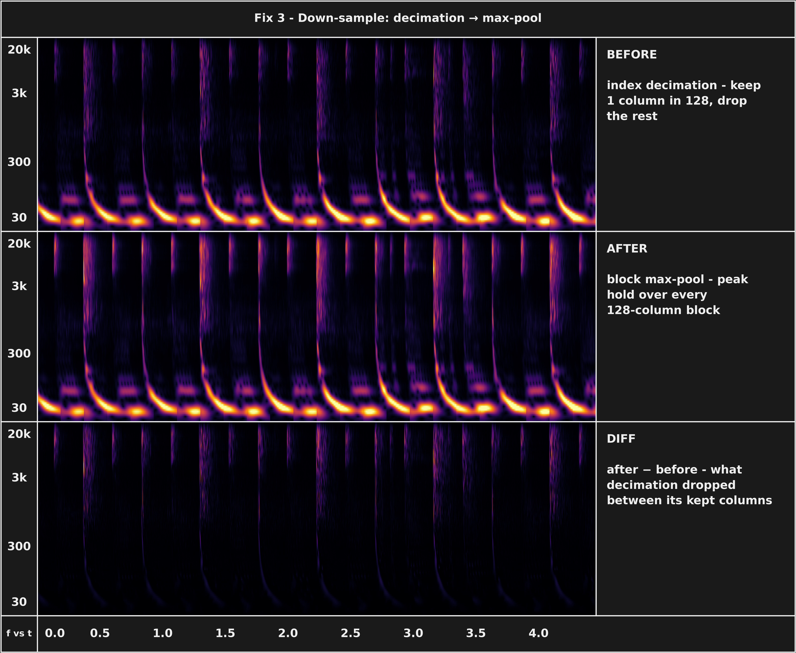
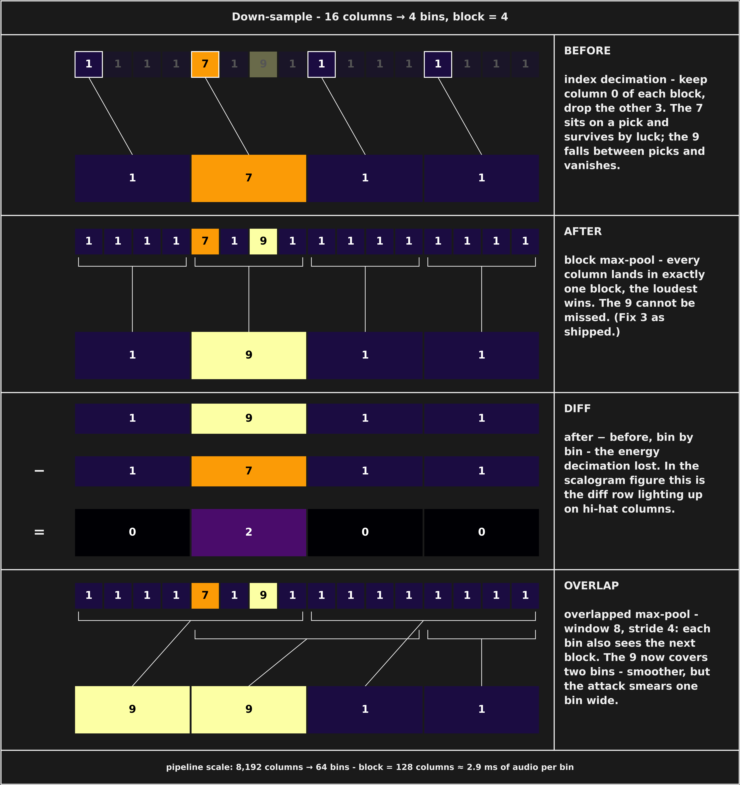
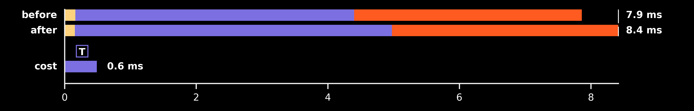

## Fix 3 — down-sample aliasing: index decimation → block max-pool

**Date:** 2026-08-27 · **Patch:** [patches/fix3_downsample_max_pool.patch](../patches/fix3_downsample_max_pool.patch)
**Runs:** `20260827_004123_GpuCWT_c16384_f116` (before) → `20260827_004350_GpuCWT_c16384_f116` (after)

**Root cause.** Not a speedup — this entry *spends* headroom on visual
correctness. The Down-sample stage reduced each hop's 8,192 magnitude columns
to 64 display bins by uniform index selection: keep 1 column of every 128,
discard the other 127. A short high-frequency transient (a hi-hat click's CWT
response is only a few ms wide) could fall entirely between kept columns and
vanish from the rendered frame — classic stride aliasing, visible as patchy,
flickering high-band streaks. The fix max-pools each contiguous 128-column
block instead (peak-hold envelope, the same display detector spectrum
analyzers use), so every column lands in exactly one block and no event can
disappear. Divisible widths take a `reshape(...).max(axis=2)` fast path;
ragged widths fall back to `np.maximum.reduceat` over block edges. Correctness
proven by `tests/test_cwt_downsample.py` (7 cases: spike-survival at
between-column positions, block placement, constant/ramp invariance, shapes).

### Effect on the output



24 consecutive hop-center frames (≈4.5 s of `beltran_sc_rip_4_bar.wav`) run
through the real `CpuCWT`, reduced to the 64-bin display width both ways and
laid side by side as the renderer scrolls them; one shared color scale.
**before** = index decimation (the removed lines, verbatim), **after** =
block max-pool, **diff** = after − before (never negative). The diff row is
the hi-hat/high-band transients that fell between decimation's kept columns —
the flicker the fix removes. Generator:
`python -m research.dsplot.figures.gen_ledger_evidence_downsample`.



The same change on a toy array: 16 columns → 4 bins, block = 4, one input
with a 7 on a decimation pick and a 9 between picks. Decimation keeps the 7
by luck and drops the 9; max-pool cannot miss it; the diff row is the lost
energy. (Bottom row: the overlapped-pool variant considered and rejected —
smoother, but the attack smears a bin wide.) Generator:
`python -m research.dsplot.figures.gen_ledger_downsample_arrays`.

### Timing diff



Third row is **cost** (after − before) because the whole frame got slower:
the one segment is T, Down-sample. Generator:
`python -m research.dsplot.figures.gen_timing_ledger_diff <before> <after>`.

- **before**: 7.9 ms work per 186 ms frame → 23.6× headroom, ~1042k samples/s (real time = 44.1k) [median 7.8, worst 14.0]
- **after**: 8.4 ms work per 186 ms frame → 22.1× headroom, ~973k samples/s (real time = 44.1k) [median 8.3, worst 14.4]

🟢 faster · 🔴 slower · ⚪ same-ish — one dot >5%, two >25%, three >60% change
Modules (diagram colors): 🟡 Audio · 🟣 DSP · 🟠 Render · ⚫ Setup

### Modules (per frame)

|  | Module | before mean | after mean | Δ mean ms (%) |
| --- | --- | --- | --- | --- |
| ⚪ | 🟡 Audio | 0.16 | 0.16 | -0.01 (-4%) |
| 🔴 | 🟣 DSP | 4.24 | 4.82 | +0.58 (+14%) |
| ⚪ | 🟠 Render | 3.46 | 3.44 | -0.02 (-1%) |
| 🔴 | **Whole frame** | 7.86 | 8.42 | +0.56 (+7%) |

### Process loop stages (per frame)

|  | Stage | before mean | after mean | Δ mean ms (%) | before median | after median |
| --- | --- | --- | --- | --- | --- | --- |
| ⚪ | 🟡 Fetch Audio Samples | 0.16 | 0.16 | -0.01 (-4%) | 0.15 | 0.15 |
| ⚪ | 🟣 FFT | 0.26 | 0.26 | +0.00 (+1%) | 0.24 | 0.24 |
| ⚪ | 🟣 Transfer → GPU | 0.29 | 0.29 | +0.00 (+1%) | 0.27 | 0.27 |
| ⚪ | 🟣 Freq-Domain Multiply | 0.38 | 0.38 | -0.00 (-1%) | 0.38 | 0.38 |
| ⚪ | 🟣 IFFT | 1.06 | 1.07 | +0.00 (+0%) | 1.09 | 1.09 |
| ⚪ | 🟣 Transfer ← GPU | 1.51 | 1.54 | +0.04 (+2%) | 1.42 | 1.42 |
| ⚪ | 🟣 Compute Magnitude | 0.62 | 0.63 | +0.01 (+1%) | 0.60 | 0.60 |
| ⚪ | 🟣 Discard Edges | 0.00 | 0.00 | +0.00 (+9%) | 0.00 | 0.00 |
| ⚪ | 🟣 Extract New Hop | 0.01 | 0.01 | +0.00 (+6%) | 0.01 | 0.01 |
| 🔴🔴🔴 | 🟣 Down-sample | 0.11 | 0.64 | +0.53 (+478%) | 0.11 | 0.62 |
| ⚪ | 🟠 Store Into Frame Buffer | 0.10 | 0.09 | -0.01 (-10%) | 0.10 | 0.09 |
| ⚪ | 🟠 Upload To Texture | 0.31 | 0.32 | +0.01 (+3%) | 0.30 | 0.32 |
| ⚪ | 🟠 Clear Previous Display Buffer | 0.14 | 0.14 | +0.00 (+0%) | 0.13 | 0.13 |
| ⚪ | 🟠 Shader Draw | 0.05 | 0.05 | -0.00 (-0%) | 0.05 | 0.05 |
| ⚪ | 🟠 Update Display Buffer | 2.86 | 2.84 | -0.02 (-1%) | 2.84 | 2.82 |
| 🔴 | **Whole frame** | 7.86 | 8.42 | +0.56 (+7%) | 7.75 | 8.32 |

### Start-up (one time)

|  | Start-up stage | before mean | after mean | Δ mean ms (%) |
| --- | --- | --- | --- | --- |
| ⚪ | 🟡 audio | 68.74 | 66.16 | -2.57 (-4%) |
| ⚪ | 🟡 audio_player | 68.41 | 65.99 | -2.42 (-4%) |
| ⚪ | 🟡 audio_reader | 0.30 | 0.16 | -0.15 (-48%) |
| ⚪ | 🟣 cuda | 280.17 | 282.59 | +2.42 (+1%) |
| ⚪ | 🟣 dsp | 224.88 | 217.53 | -7.35 (-3%) |
| ⚪ | 🟣 dsp_fft | 22.25 | 21.53 | -0.72 (-3%) |
| ⚪ | 🟣 dsp_kernels | 93.94 | 92.48 | -1.46 (-2%) |
| ⚪ | 🟣 dsp_upload | 108.47 | 103.30 | -5.18 (-5%) |
| ⚪ | ⚫ other | 29.55 | 28.76 | -0.79 (-3%) |
| ⚪ | 🟠 prescan | 101.67 | 106.22 | +4.55 (+4%) |
| 🟢 | ⚫ prime | 14.58 | 12.35 | -2.24 (-15%) |
| ⚪ | 🟠 render_buffer | 0.12 | 0.13 | +0.01 (+8%) |
| 🟢 | 🟠 render_glcontext | 79.68 | 63.05 | -16.63 (-21%) |
| 🟢 | 🟠 render_shader | 6.65 | 5.43 | -1.21 (-18%) |
| 🟢 | 🟠 renderer | 86.48 | 68.65 | -17.83 (-21%) |

**Notes.** GPU clock floors locked (Fix 2 state) for both runs; real-time
paced, no audio device. The whole cost lands in one stage: Down-sample
0.11 → 0.64 ms (+478%), whole frame 7.86 → 8.42 ms, headroom 23.6× → 22.1× —
~0.5 ms of the Fix 2 budget converted into non-flickering transients. Both
runs share the working tree's uncommitted Fix 1 + Fix 2 patches; this patch
is the only delta between them. Visual proof: before/after frame pair from
`tools/render_demo.py --frames-only` on `beltran_sc_rip_4_bar.wav` — decimated
frames show speckled, partially-missing hi-hat columns; pooled frames show
solid full-brightness streaks. If this output ever feeds feature extraction,
that branch should pool with mean/RMS instead — max is an order statistic and
biases energy estimates upward.

### Tests

```
$ python -m pytest tests/test_cwt_downsample.py -v
tests/test_cwt_downsample.py::TestDownsampleShape::test_output_shape_divisible PASSED
tests/test_cwt_downsample.py::TestDownsampleShape::test_output_shape_non_divisible PASSED
tests/test_cwt_downsample.py::TestDownsampleShape::test_invalid_target_width_raises PASSED
tests/test_cwt_downsample.py::TestDownsamplePreservesTransients::test_narrow_spike_survives_at_any_position PASSED
tests/test_cwt_downsample.py::TestDownsamplePreservesTransients::test_spike_lands_in_correct_block PASSED
tests/test_cwt_downsample.py::TestDownsampleSustainedContent::test_constant_input_unchanged PASSED
tests/test_cwt_downsample.py::TestDownsampleSustainedContent::test_slow_ramp_tracks_envelope PASSED
============================== 7 passed in 0.69s ===============================
```

(Re-run 2026-08-30 on the working tree.)

## Code diff

```diff
--- a/src/subshader/dsp/cwt.py
+++ b/src/subshader/dsp/cwt.py
@@ -134,7 +134,7 @@
             2. Convert to magnitude
             3. Discard edge-artifact region
             4. Extract non-overlapping hop center
-            5. Downsample to target_width
+            5. Max-pool down to target_width
 
         Args:
             raw: Complex coefficients from transform(), shape (num_freqs, input_n).
@@ -267,10 +267,19 @@
         coefs: np.ndarray,
         target_width: Optional[int] = None,
     ) -> np.ndarray:
-        """Downsample the time dimension to target_width by uniform index selection.
+        """Downsample the time dimension to target_width by block max-pooling.
+
+        Each output bin is the maximum over its contiguous block of input
+        columns (peak-hold envelope, the display detector used by spectrum
+        analyzers). Uniform index selection was used previously, but keeping
+        1 of every ~128 columns aliased short transients: a high-frequency
+        click whose CWT response fell between kept columns vanished from the
+        frame entirely. Max-pooling guarantees every column lands in exactly
+        one block, so no event can disappear. Runs on magnitudes at the very
+        end of the visualization path - nothing downstream requires linearity.
 
         Args:
-            coefs: Input coefficients, shape (freq_bins, num_samples).
+            coefs: Magnitude coefficients, shape (freq_bins, num_samples).
             target_width: Target number of time bins.
 
         Returns:
@@ -282,7 +291,7 @@
         if target_width is None:
             target_width = self.output_n
 
-        _, num_samples = coefs.shape
+        num_freqs, num_samples = coefs.shape
 
         if target_width <= 0 or target_width > num_samples:
             raise ValueError(
@@ -290,10 +299,12 @@
                 f"(must be between 1 and {num_samples})"
             )
 
-        hop = num_samples / target_width
-        indices = np.floor(np.arange(target_width) * hop).astype(int)
-        indices = np.clip(indices, 0, num_samples - 1)
-        downsampled = coefs[:, indices]
+        if num_samples % target_width == 0:
+            block = num_samples // target_width
+            downsampled = coefs.reshape(num_freqs, target_width, block).max(axis=2)
+        else:
+            edges = np.linspace(0, num_samples, target_width + 1).astype(int)
+            downsampled = np.maximum.reduceat(coefs, edges[:-1], axis=1)
 
         log.debug(f"Downsampled: {coefs.shape} -> {downsampled.shape}")
         return downsampled
```
