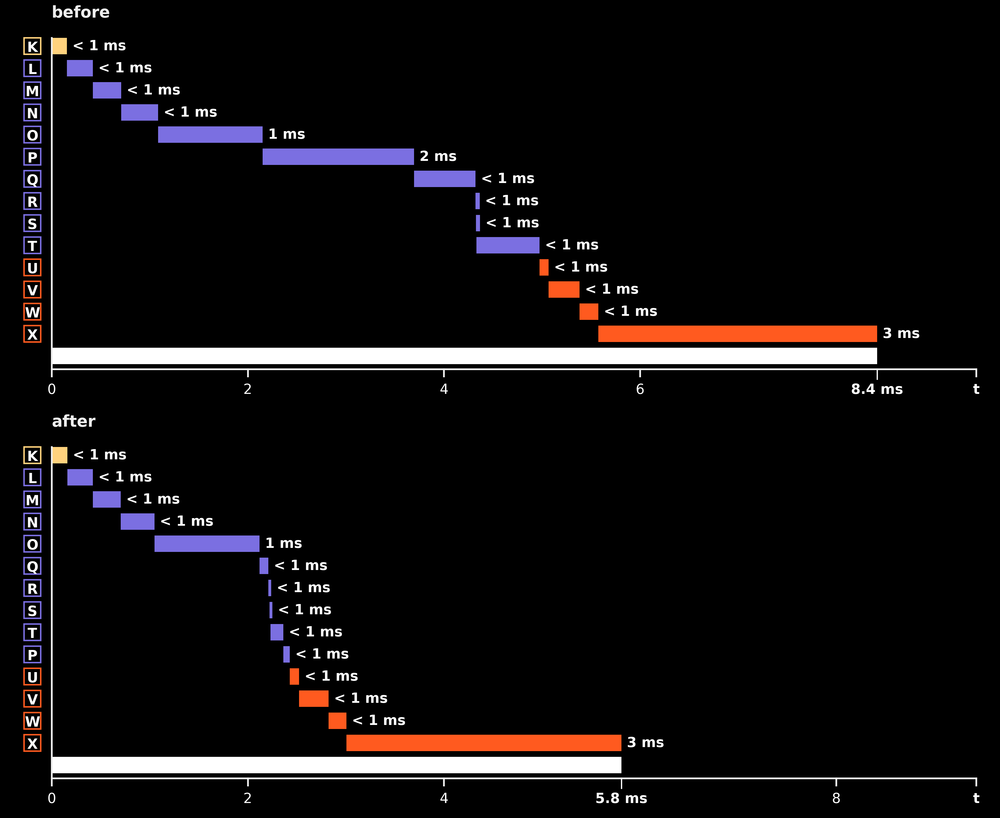
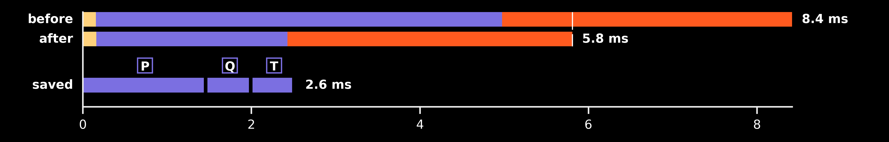

## Fix 4 — CWT post-processing moved to the GPU (download only the finished frame)

**Date:** 2026-08-28 · **Patch:** [patches/fix4_gpu_post.patch](../patches/fix4_gpu_post.patch)
**Runs:** `20260827_004350_GpuCWT_c16384_f116` (before) → `20260828_213901_GpuCWT_c16384_f116` (after)

**Root cause.** `GpuCWT.transform()` ended with `cp.asnumpy()` of the full
trimmed coefficient matrix — 116 × 16,384 complex64, ~15 MB — every frame,
and the four post-processing stages (magnitude, edge discard, hop extract,
max-pool down-sample) then ran in NumPy on the host. The transfer was the
single largest DSP stage after Fix 2 (1.5 ms) and the CPU post added another
1.3 ms. The fix keeps the matrix device-resident through `post()`: each stage
resolves its array namespace from its input (NumPy or CuPy, same template
body), and a final `_download()` hook brings back only the finished
116 × 64 float32 frame (~30 KB). The ragged max-pool path no longer relies on
`np.maximum.reduceat` (absent in CuPy) — it gathers each block through a
cached index matrix padded by repeating the block's last column (a duplicate
never changes a max) and reduces with a dense `max(axis=2)`, identical values
to the reduceat reference. CuPy launches are asynchronous, so the GPU path
syncs its stream at the end of every kernel-launching stage — per-stage
timings stay honest instead of collapsing into the download. `CpuCWT` output
is byte-identical. Correctness proven by `tests/test_cwt_gpu_post.py`
(19 cases: CPU-vs-GPU `process()` equivalence, device residency, host-input
path, float32/shape contract, exact reduceat equivalence on six ragged
widths on both devices, spike survival); full suite 85 passed.

### Effect on the output

None by construction — the GPU post stages compute the same values the CPU
path did, and `test_process_matches_cpu` asserts CPU-vs-GPU `process()`
equivalence frame-for-frame (the ragged max-pool's index-gather path is
additionally proven exactly equal to the `reduceat` reference on six ragged
widths, both devices). No before/after image.

### Timing diff



The whole pipeline, stage by stage (same letters as the flowcharts), both
runs on one work-scale axis. The fix is visible as structure, not just size:
**P (Transfer ← GPU) moves from after O (IFFT) to after T (Down-sample)** —
post now runs GPU-resident and only the finished 116 × 64 frame crosses to
host, so the ~2 ms P bar collapses to a sliver and everything downstream
slides left. Render (U–X) is untouched; it just starts 2.6 ms earlier.
Generator: `python -m research.dsplot.figures.gen_ledger_pipeline_cascade
<before> <after>`.



Saved segments: P (Transfer ← GPU — only the finished 116 × 64 frame crosses
now), Q (Compute Magnitude), T (Down-sample) — the post stages that moved to
the device. Generator:
`python -m research.dsplot.figures.gen_timing_ledger_diff <before> <after>`.

- **before**: 8.4 ms work per 186 ms frame → 22.1× headroom, ~973k samples/s (real time = 44.1k) [median 8.3, worst 14.4]
- **after**: 5.8 ms work per 186 ms frame → 32.0× headroom, ~1410k samples/s (real time = 44.1k) [median 5.8, worst 10.8]

🟢 faster · 🔴 slower · ⚪ same-ish — one dot >5%, two >25%, three >60% change
Modules (diagram colors): 🟡 Audio · 🟣 DSP · 🟠 Render · ⚫ Setup

### Modules (per frame)

|  | Module | before mean | after mean | Δ mean ms (%) |
| --- | --- | --- | --- | --- |
| ⚪ | 🟡 Audio | 0.16 | 0.16 | +0.00 (+3%) |
| 🟢🟢 | 🟣 DSP | 4.82 | 2.27 | -2.55 (-53%) |
| ⚪ | 🟠 Render | 3.44 | 3.38 | -0.06 (-2%) |
| 🟢🟢 | **Whole frame** | 8.42 | 5.81 | -2.61 (-31%) |

### Process loop stages (per frame)

|  | Stage | before mean | after mean | Δ mean ms (%) | before median | after median |
| --- | --- | --- | --- | --- | --- | --- |
| ⚪ | 🟡 Fetch Audio Samples | 0.16 | 0.16 | +0.00 (+3%) | 0.15 | 0.15 |
| ⚪ | 🟣 FFT | 0.26 | 0.26 | -0.00 (-2%) | 0.24 | 0.24 |
| ⚪ | 🟣 Transfer → GPU | 0.29 | 0.28 | -0.01 (-2%) | 0.27 | 0.27 |
| ⚪ | 🟣 Freq-Domain Multiply | 0.38 | 0.34 | -0.03 (-9%) | 0.38 | 0.34 |
| ⚪ | 🟣 IFFT | 1.07 | 1.07 | +0.01 (+1%) | 1.09 | 1.09 |
| 🟢🟢🟢 | 🟣 Transfer ← GPU | 1.54 | 0.07 | -1.48 (-96%) | 1.42 | 0.05 |
| 🟢🟢🟢 | 🟣 Compute Magnitude | 0.63 | 0.09 | -0.54 (-86%) | 0.60 | 0.09 |
| ⚪ | 🟣 Discard Edges | 0.00 | 0.01 | +0.01 (+229%) | 0.00 | 0.01 |
| ⚪ | 🟣 Extract New Hop | 0.01 | 0.01 | +0.00 (+31%) | 0.01 | 0.01 |
| 🟢🟢🟢 | 🟣 Down-sample | 0.64 | 0.13 | -0.51 (-80%) | 0.62 | 0.12 |
| ⚪ | 🟠 Store Into Frame Buffer | 0.09 | 0.09 | +0.00 (+2%) | 0.09 | 0.09 |
| ⚪ | 🟠 Upload To Texture | 0.32 | 0.30 | -0.01 (-4%) | 0.32 | 0.30 |
| ⚪ | 🟠 Clear Previous Display Buffer | 0.14 | 0.13 | -0.01 (-8%) | 0.13 | 0.12 |
| ⚪ | 🟠 Shader Draw | 0.05 | 0.06 | +0.00 (+2%) | 0.05 | 0.05 |
| ⚪ | 🟠 Update Display Buffer | 2.84 | 2.80 | -0.04 (-1%) | 2.82 | 2.79 |
| 🟢🟢 | **Whole frame** | 8.42 | 5.81 | -2.61 (-31%) | 8.32 | 5.77 |

### Start-up (one time)

|  | Start-up stage | before mean | after mean | Δ mean ms (%) |
| --- | --- | --- | --- | --- |
| 🔴🔴 | 🟡 audio | 66.16 | 86.33 | +20.17 (+30%) |
| 🔴🔴 | 🟡 audio_player | 65.99 | 86.17 | +20.18 (+31%) |
| ⚪ | 🟡 audio_reader | 0.16 | 0.15 | -0.01 (-6%) |
| ⚪ | 🟣 cuda | 282.59 | 279.69 | -2.90 (-1%) |
| ⚪ | 🟣 dsp | 217.53 | 222.99 | +5.46 (+3%) |
| 🟢 | 🟣 dsp_fft | 21.53 | 20.07 | -1.47 (-7%) |
| ⚪ | 🟣 dsp_kernels | 92.48 | 96.61 | +4.13 (+4%) |
| ⚪ | 🟣 dsp_upload | 103.30 | 106.10 | +2.80 (+3%) |
| ⚪ | ⚫ other | 28.76 | 28.45 | -0.30 (-1%) |
| 🟢🟢 | 🟠 prescan | 106.22 | 72.97 | -33.25 (-31%) |
| 🟢 | ⚫ prime | 12.35 | 11.01 | -1.33 (-11%) |
| ⚪ | 🟠 render_buffer | 0.13 | 0.15 | +0.02 (+14%) |
| 🔴🔴🔴 | 🟠 render_glcontext | 63.05 | 650.20 | +587.14 (+931%) |
| 🔴 | 🟠 render_shader | 5.43 | 6.05 | +0.62 (+11%) |
| 🔴🔴🔴 | 🟠 renderer | 68.65 | 656.43 | +587.78 (+856%) |


**Notes.** Same locked clocks as the before-run (SM 2610 / mem 5000 MHz),
software-paced loop (no audio output device on the box), 323 frames, 12 fresh
init samples. The research harness needed a matching change:
`research/timing_gpu.py::InstrumentedGpuCWT` used to download inside its
per-leg `transform()`, which silently kept the OLD path alive under the
profiler — its first run measured 8.6 ms and proved nothing. The instrumented
class now returns the device array and times the download inside
`_download()`, where it actually happens. **Stage order caveat:** the
"Transfer ← GPU" row is still listed in its pre-fix position (after IFFT)
by `_PIPE_ORDER`; the true order is now magnitude → edges → hop → down-sample
→ download, all but the last on the GPU. TIMING.md, both flowcharts and the
K–X letter sequence need a follow-up pass. **Start-up anomaly:** the
`render_glcontext` +587 ms is not this fix — `cwt.py` never touches OpenGL —
and is almost certainly display-server state on the box after two aborted
campaign launches minutes earlier (all 12 fresh-process samples were slow,
so it was environmental for the whole run); the DSP start-up stages the patch
does touch moved ≤ 5 ms. Re-sample start-up on a clean session before quoting
its number. What this points at next: the frame is now ~half display-buffer
swap (2.8 of 5.8 ms), i.e. waiting on vsync, not computing — the remaining
compute is the 1.1 ms IFFT.

### Tests

```
$ python -m pytest tests/test_cwt_gpu_post.py -v
tests/test_cwt_gpu_post.py::TestGpuPostEquivalence::test_process_matches_cpu PASSED
tests/test_cwt_gpu_post.py::TestGpuPostEquivalence::test_transform_stays_on_device PASSED
tests/test_cwt_gpu_post.py::TestGpuPostEquivalence::test_post_accepts_host_input PASSED
tests/test_cwt_gpu_post.py::TestGpuPostOutputContract::test_output_is_host_float32_with_output_shape PASSED
tests/test_cwt_gpu_post.py::TestGpuPostOutputContract::test_timing_stages_recorded PASSED
tests/test_cwt_gpu_post.py::TestMaxPoolMatchesReduceat::test_cpu_non_divisible[1000-64] PASSED
tests/test_cwt_gpu_post.py::TestMaxPoolMatchesReduceat::test_cpu_non_divisible[8191-64] PASSED
tests/test_cwt_gpu_post.py::TestMaxPoolMatchesReduceat::test_cpu_non_divisible[130-64] PASSED
tests/test_cwt_gpu_post.py::TestMaxPoolMatchesReduceat::test_cpu_non_divisible[100-7] PASSED
tests/test_cwt_gpu_post.py::TestMaxPoolMatchesReduceat::test_cpu_non_divisible[65-64] PASSED
tests/test_cwt_gpu_post.py::TestMaxPoolMatchesReduceat::test_cpu_non_divisible[4097-64] PASSED
tests/test_cwt_gpu_post.py::TestMaxPoolMatchesReduceat::test_gpu_non_divisible[1000-64] PASSED
tests/test_cwt_gpu_post.py::TestMaxPoolMatchesReduceat::test_gpu_non_divisible[8191-64] PASSED
tests/test_cwt_gpu_post.py::TestMaxPoolMatchesReduceat::test_gpu_non_divisible[130-64] PASSED
tests/test_cwt_gpu_post.py::TestMaxPoolMatchesReduceat::test_gpu_non_divisible[100-7] PASSED
tests/test_cwt_gpu_post.py::TestMaxPoolMatchesReduceat::test_gpu_non_divisible[65-64] PASSED
tests/test_cwt_gpu_post.py::TestMaxPoolMatchesReduceat::test_gpu_non_divisible[4097-64] PASSED
tests/test_cwt_gpu_post.py::TestMaxPoolMatchesReduceat::test_gpu_divisible PASSED
tests/test_cwt_gpu_post.py::TestMaxPoolMatchesReduceat::test_gpu_spike_survives_non_divisible PASSED
============================== 19 passed in 0.92s ==============================
```

(Run 2026-08-30 in main immediately after landing; full suite 85 passed.)

## Code diff

```diff
--- a/src/subshader/dsp/cwt.py
+++ b/src/subshader/dsp/cwt.py
@@ -36,6 +36,13 @@
 PI: Final[float] = float(np.pi)
 
 
+def _array_module(array):
+    """Return the array namespace (numpy or cupy) that owns `array`."""
+    if _CUPY_AVAILABLE and isinstance(array, cp.ndarray):
+        return cp
+    return np
+
+
 class CWT(DSP):
     """
     CWT base class implementing the ANTS wavelet convolution algorithm.
@@ -102,6 +109,9 @@
         # Reliable center slice (discards edge artifacts from widest wavelet)
         self.reliable_slice: slice = self._create_reliable_slice(self.wavelets)
 
+        # Max-pool gather indices, built lazily per (num_samples, target_width)
+        self._block_gather_cache: dict = {}
+
     # -------------------------------------------------------------------------
     # DSP pipeline stages
     # -------------------------------------------------------------------------
@@ -126,21 +136,27 @@
             )
         return np.asarray(chunk, dtype=np.float64)
 
-    def post(self, raw: np.ndarray) -> np.ndarray:
+    def post(self, raw) -> np.ndarray:
         """Post-process raw complex CWT coefficients into a visualization-ready array.
 
+        Every step is written against the array namespace that owns `raw`, so
+        the same code runs on a NumPy matrix (CpuCWT) or a CuPy matrix that
+        never left the device (GpuCWT). Only the final frame crosses back to
+        host memory.
+
         Steps:
             1. Normalize by scale (no-op - L1 kernel normalization handles energy bias)
             2. Convert to magnitude
             3. Discard edge-artifact region
             4. Extract non-overlapping hop center
             5. Max-pool down to target_width
+            6. Download to host (identity on CPU)
 
         Args:
             raw: Complex coefficients from transform(), shape (num_freqs, input_n).
 
         Returns:
-            Float32 array of shape (num_freqs, target_width).
+            Host array of shape (num_freqs, target_width).
         """
         # Energy bias correction is handled at WaveletKernel construction (L1 normalization);
         # normalize_by_scale is a no-op kept for API symmetry.
@@ -148,15 +164,24 @@
         mag = self._compute_mag(normed)
         reliable = self.discard_unreliable_coefs(mag)
         hop_center = self.extract_hop_center(reliable)
-        return self.downsample(hop_center, self.output_n)
+        downsampled = self.downsample(hop_center, self.output_n)
+        return self._download(downsampled)
 
     # -------------------------------------------------------------------------
     # Abstract: implemented by CpuCWT / GpuCWT
     # -------------------------------------------------------------------------
 
-    def transform(self, data: np.ndarray) -> np.ndarray:
+    def transform(self, data: np.ndarray):
         raise NotImplementedError("Subclasses must implement transform()")
 
+    def _sync_stage(self) -> None:
+        """Block until the current stage's work has finished. No-op on CPU."""
+        return None
+
+    def _download(self, frame) -> np.ndarray:
+        """Bring the finished frame into host memory. Identity on CPU."""
+        return frame
+
     def get_output_shape(self) -> tuple:
         """Return the shape of the processed output."""
         return self.output_shape
@@ -218,9 +243,11 @@
         return cwt_coefs
 
     @timed
-    def _compute_mag(self, cwt_coefs: np.ndarray) -> np.ndarray:
+    def _compute_mag(self, cwt_coefs):
         """Convert complex CWT coefficients to real magnitudes."""
-        return np.abs(cwt_coefs)
+        mag = _array_module(cwt_coefs).abs(cwt_coefs)
+        self._sync_stage()
+        return mag
 
     @timed
     def discard_unreliable_coefs(self, coefs: np.ndarray) -> np.ndarray:
@@ -303,12 +330,38 @@
             block = num_samples // target_width
             downsampled = coefs.reshape(num_freqs, target_width, block).max(axis=2)
         else:
-            edges = np.linspace(0, num_samples, target_width + 1).astype(int)
-            downsampled = np.maximum.reduceat(coefs, edges[:-1], axis=1)
+            gather = self._block_gather_indices(num_samples, target_width, _array_module(coefs))
+            downsampled = coefs[:, gather].max(axis=2)
+        self._sync_stage()
 
         log.debug(f"Downsampled: {coefs.shape} -> {downsampled.shape}")
         return downsampled
 
+    def _block_gather_indices(self, num_samples: int, target_width: int, xp):
+        """Column indices grouping num_samples into target_width contiguous blocks.
+
+        Block edges follow np.linspace(0, num_samples, target_width + 1), the
+        same partition np.maximum.reduceat would use, so block widths differ by
+        at most one column. Each row of the (target_width, widest_block) index
+        matrix is padded by repeating its last column - a duplicated element
+        never changes a max - which turns the ragged reduction into one gather
+        followed by a dense max over the last axis. CuPy has no reduceat, and
+        this formulation runs identically on either array namespace.
+
+        Returns:
+            Integer index matrix on `xp`, cached per (num_samples, target_width).
+        """
+        key = (num_samples, target_width, xp.__name__)
+        indices = self._block_gather_cache.get(key)
+        if indices is None:
+            edges = np.linspace(0, num_samples, target_width + 1).astype(int)
+            widths = np.diff(edges)
+            offsets = np.arange(widths.max())
+            host_indices = edges[:-1, None] + np.minimum(offsets[None, :], widths[:, None] - 1)
+            indices = xp.asarray(host_indices)
+            self._block_gather_cache[key] = indices
+        return indices
+
     def cleanup(self) -> None:
         """Release resources. Subclasses override for GPU memory cleanup."""
         pass
@@ -348,9 +401,12 @@
     """CuPy-based CWT using FFT convolution on GPU.
 
     Uploads the kernel bank to GPU at init. Each transform() call uploads
-    the input, performs the full convolution on-device, and downloads only
-    the trimmed result (num_freqs × input_n) to avoid a large intermediate
-    transfer of shape (num_freqs × max_conv_n).
+    the input and performs the full convolution on-device; the complex
+    result stays resident through every post() stage, and only the finished
+    float32 frame (num_freqs × target_width) is downloaded. CuPy launches
+    kernels asynchronously, so each timed stage synchronizes the stream
+    before returning - otherwise the stopwatch would measure launch cost and
+    the final download would absorb everything upstream.
     """
 
     @timed
@@ -375,14 +431,14 @@
         # (or skip building it for the GPU path) to reclaim the memory.
 
     @timed
-    def transform(self, data: np.ndarray) -> np.ndarray:
+    def transform(self, data: np.ndarray):
         """Perform CWT via CuPy FFT convolution (GPU).
 
         Args:
             data: 1D float64 audio samples of length input_n (CPU array).
 
         Returns:
-            Complex TF matrix (num_freqs, input_n) as NumPy array (CPU).
+            Complex TF matrix (num_freqs, input_n) as a CuPy array (GPU resident).
         """
         log.info(f"CPU→GPU: Uploading input data of size {data.shape[0]}")
         input_f_gpu = cp.asarray(
@@ -392,15 +448,24 @@
         conv_f_gpu = input_f_gpu * self.kernel_f_bank_gpu
         conv_tf_gpu = cp_fft.ifft(conv_f_gpu, axis=1)
         conv_tf_trimmed = conv_tf_gpu[:, : self.input_n]
+        self._sync_stage()
+        return conv_tf_trimmed
 
-        log.info(f"GPU→CPU: Transferring trimmed result {conv_tf_trimmed.shape}")
-        return cp.asnumpy(conv_tf_trimmed)
+    def _sync_stage(self) -> None:
+        cp.cuda.get_current_stream().synchronize()
+
+    @timed
+    def _download(self, frame) -> np.ndarray:
+        """Transfer the finished frame to host. Passes host arrays through untouched."""
+        log.info(f"GPU→CPU: Transferring frame {frame.shape}")
+        return cp.asnumpy(frame)
 
     def cleanup(self) -> None:
         """Free GPU memory pool allocations."""
         try:
             if hasattr(self, "kernel_f_bank_gpu") and self.kernel_f_bank_gpu is not None:
                 del self.kernel_f_bank_gpu
+            self._block_gather_cache.clear()
             if _CUPY_AVAILABLE:
                 cp.get_default_memory_pool().free_all_blocks()
                 cp.get_default_pinned_memory_pool().free_all_blocks()
```
