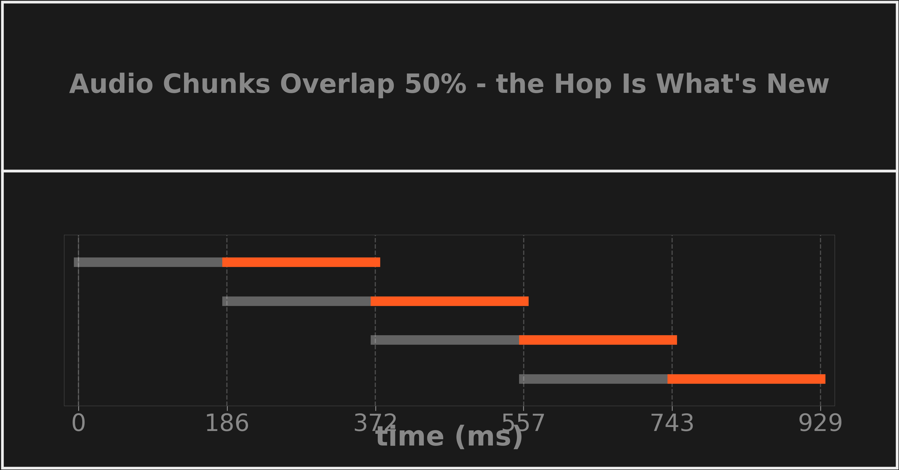

# Audio Overlap and Hop Size

Consecutive analysis chunks overlap by design: each `get_chunk()` reads a full `chunk_size` window, but the read position only advances by a smaller `hop_size`, so neighboring chunks share samples. This reduces edge discontinuities and spectral leakage at window boundaries at the cost of more DSP frames processed per second of audio.

*Each 16,384-sample chunk (371.5 ms) re-reads the second half of the previous one; only the trailing 8,192-sample hop (orange) is audio the pipeline hasn't seen. Rendered by `research/dsplot/figures/concept_cards.py`.*

**Key numbers** (defaults from [`config.py`](../../src/subshader/config.py))

- `hop_size = int(chunk_size × (1 − overlap_factor))` = 16,384 × 0.5 = **8,192 samples = 185.8 ms** — this hop, not the chunk length, sets the [real-time deadline](real-time-frame-budget.md)
- The overlapped half isn't wasted: it gives every sample a chance to sit in the *center* of some window, where [wavelet coefficients are reliable](cone-of-influence.md), instead of only ever appearing at contaminated edges

## In SubShader

`hop_size` is a derived property on [`PipelineConfig`](../../src/subshader/config.py), consumed by [`AudioReader`](../../src/subshader/audio/reader.py) (`file_pos += hop_size` per `get_chunk()`). The CWT's `extract_hop_center()` in [`cwt.py`](../../src/subshader/dsp/cwt.py) pulls the matching trailing hop-width of each frame's reliable region, so displayed frames tile without redundancy. Documented in [AUDIO.md](../../src/subshader/audio/AUDIO.md#the-overlap-strategy).

---

**Related:** [Real-Time Frame Budget](real-time-frame-budget.md) · [Cone of Influence](cone-of-influence.md) · [AUDIO](../../src/subshader/audio/AUDIO.md) · [MAP](../../MAP.md)
