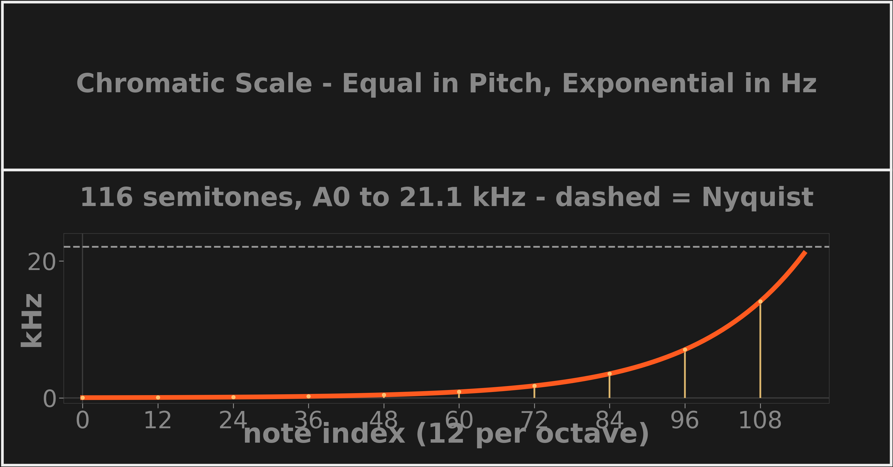

# Chromatic Frequency Scale

Rather than spacing analysis frequencies linearly, SubShader spaces them exponentially to match the musical chromatic scale (12 semitone steps per octave), starting from a root note. This matches how music is structured and how humans perceive pitch — equal steps in pitch, not equal steps in Hz — so the visualization's frequency axis lines up with musical intuition.

*Each semitone step multiplies frequency by 2^(1/12) ≈ 1.0595; octave notes (markers) double. The top of the 10-octave range clips against Nyquist (dashed). Rendered by `research/dsplot/figures/concept_cards.py`.*

**Key numbers** (defaults from [`config.py`](../../src/subshader/config.py))

- Formula: `freq = 27.5 Hz × (2^(1/12))^i` — root A0, the lowest piano key
- 10 octaves × 12 notes = 120 candidates; the top 4 exceed Nyquist (22.05 kHz), leaving **116 frequencies**, A0 → ~21.1 kHz
- Semitone bins put every measurement within **±2.9%** of its center frequency (a quarter-tone) — constant *relative* precision across the spectrum, which is what pitch perception cares about

## In SubShader

Built by `CWT._generate_chromatic_scale()` in [`cwt.py`](../../src/subshader/dsp/cwt.py), controlled by `root_note_hz`, `num_octaves`, and `notes_per_octave` in [`CWTConfig`](../../src/subshader/config.py). Rationale in [DSP §4.3](../../src/subshader/dsp/DSP.md#43-why-this-works-for-audio).

---

**Related:** [Sampling and Nyquist Limit](sampling-and-nyquist-limit.md) · [Mother Wavelet and Scaling](mother-wavelet-and-scaling.md) · [DSP](../../src/subshader/dsp/DSP.md) · [MAP](../../MAP.md)
