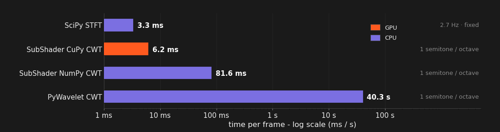
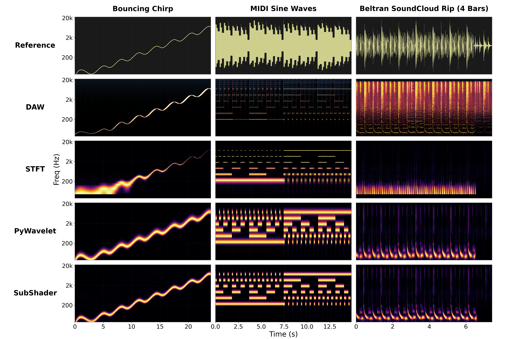

# GPU-Accelerated FFT Convolution

Running the full wavelet bank's FFT convolution against every audio chunk is the CWT's most expensive step; SubShader offloads it to the GPU via CuPy, keeping the kernel bank on-device and running the bank multiply and inverse FFT there. This is what makes wavelet-accurate analysis (vs. the much faster but less accurate STFT) fast enough for real time.

*The three-way tradeoff measured: STFT is fastest but resolution-poor, PyWavelets is accurate but takes over 1 s per call, SubShader's GPU CWT keeps wavelet accuracy at real-time speed.*

*Accuracy side of the tradeoff: the same signals through a DAW spectrogram, STFT, PyWavelets, and SubShader — the GPU CWT matches PyWavelets' quality at a fraction of its cost.*

**How the work is split** (from [`cwt.py`](../../src/subshader/dsp/cwt.py))

- At startup: the 116-kernel frequency-domain bank (~24 MB complex64) uploads to the GPU **once** via `cp.asarray`
- Per frame: the chunk's forward FFT runs on CPU (NumPy), uploads, then the 116-row broadcast multiply and inverse FFT run on GPU (`cupyx.scipy.fft.ifft`)
- Only the trimmed result (116 × 16,384) downloads — avoiding a transfer of the full 116 × 26,006 convolution intermediate

## In SubShader

`GpuCWT` in [`cwt.py`](../../src/subshader/dsp/cwt.py), falling back to `CpuCWT` (same math, NumPy) when CuPy is unavailable. Measured per-stage cost in [TIMING.md](../../assets/timing/TIMING.md#process-loop).

---

**Related:** [Convolution and Kernel](convolution-and-kernel.md) · [Continuous Wavelet Transform](continuous-wavelet-transform.md) · [Real-Time Frame Budget](real-time-frame-budget.md) · [TIMING](../../assets/timing/TIMING.md) · [MAP](../../MAP.md)
