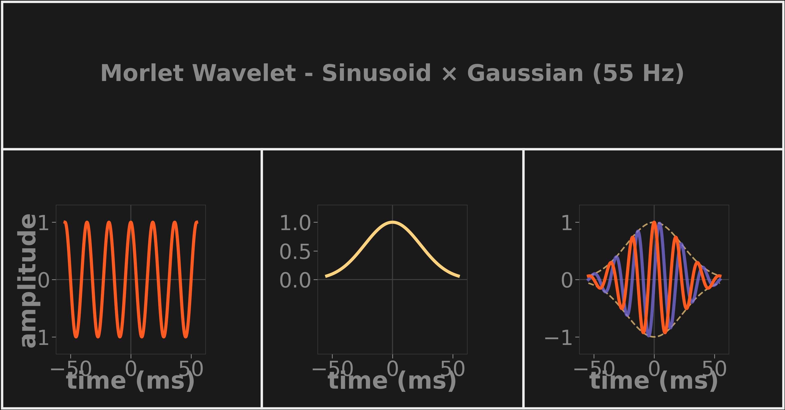

# Morlet Wavelet

A complex Morlet wavelet is a sinusoid shaped by a Gaussian envelope: the oscillation gives it a center frequency, the Gaussian tapers it to zero so it has finite time support instead of ringing forever. Because the carrier is a *complex* exponential (`e^(i·2πft)`), each coefficient carries both magnitude and phase — taking `|coefficient|` yields a smooth energy envelope instead of an oscillating one.

*The actual construction from `WaveletKernel`: carrier sinusoid (left) × Gaussian envelope (middle) = complex Morlet (right; orange real, purple imaginary, dashed envelope). Rendered by `research/dsplot/figures/concept_cards.py`.*

**Key numbers** (defaults from [`config.py`](../../src/subshader/config.py))

- Time support: **6 cycles** of the center frequency (`num_cycles`)
- Gaussian FWHM: **3 cycles** (`num_fwhm_cycles`) — the width where the envelope falls to half its peak, controlling how much carrier energy is retained vs. how sharply it rolls off
- Envelope formula: `exp(-4·ln(2)·t² / fwhm²)` in [`gaussian.py`](../../src/subshader/dsp/gaussian.py)

## In SubShader

Constructed in [`WaveletKernel`](../../src/subshader/dsp/wavelet_kernel.py) as `sin_t * gauss_t`, then L1-normalized (see [Wavelet Magnitude Normalization](wavelet-magnitude-normalization.md)) and FFT'd once at startup so runtime convolution is a pure frequency-domain multiply.

---

**Related:** [Mother Wavelet and Scaling](mother-wavelet-and-scaling.md) · [Wavelet Magnitude Normalization](wavelet-magnitude-normalization.md) · [Convolution and Kernel](convolution-and-kernel.md) · [DSP](../../src/subshader/dsp/DSP.md) · [MAP](../MAP.md)
