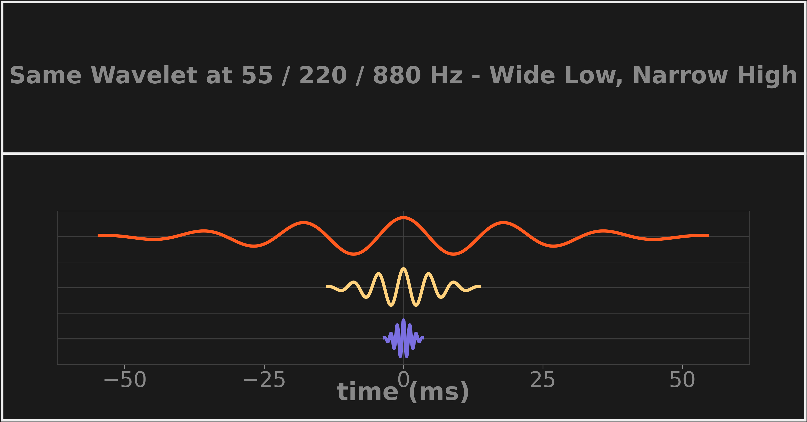

# Mother Wavelet and Scaling

The mother wavelet is the prototype waveform shape at a reference scale; every frequency the CWT measures is analyzed with a scaled ("daughter") copy of that same shape — stretched for low frequencies, compressed for high. Unlike a sine wave, a wavelet is localized in time (it naturally tapers to zero), which is what lets it carry both a frequency and a time position.

*The actual pipeline kernels at A1 (55 Hz), A3 (220 Hz), and A5 (880 Hz) on a shared time axis — one shape, three widths. Rendered from the real `WaveletKernel` code by `research/dsplot/figures/concept_cards.py`.*

**Key numbers**

- Scaling law in code: `time_support_s = num_cycles / f` with `num_cycles = 6` ([`wavelet_kernel.py`](../../src/subshader/dsp/wavelet_kernel.py))
- Widest kernel: A0 (27.5 Hz) → **218 ms / 9,623 samples**; narrowest: ~21.1 kHz → **284 µs / 13 samples** — a ~750× spread from one rule
- This per-frequency width is precisely the adaptive resolution: wide kernels pin down *which* low note, narrow kernels pin down *when* a high transient hit

## In SubShader

One [`WaveletKernel`](../../src/subshader/dsp/wavelet_kernel.py) is built per frequency in the [chromatic scale](chromatic-frequency-scale.md) at startup; each is a differently-scaled complex [Morlet wavelet](morlet-wavelet.md). Conceptual background: [DSP §4.2](../../src/subshader/dsp/DSP.md#42-wavelets-as-basis-functions).

---

**Related:** [Continuous Wavelet Transform](continuous-wavelet-transform.md) · [Morlet Wavelet](morlet-wavelet.md) · [Chromatic Frequency Scale](chromatic-frequency-scale.md) · [Time-Frequency Resolution Tradeoff](time-frequency-resolution-tradeoff.md) · [DSP](../../src/subshader/dsp/DSP.md) · [MAP](../MAP.md)
