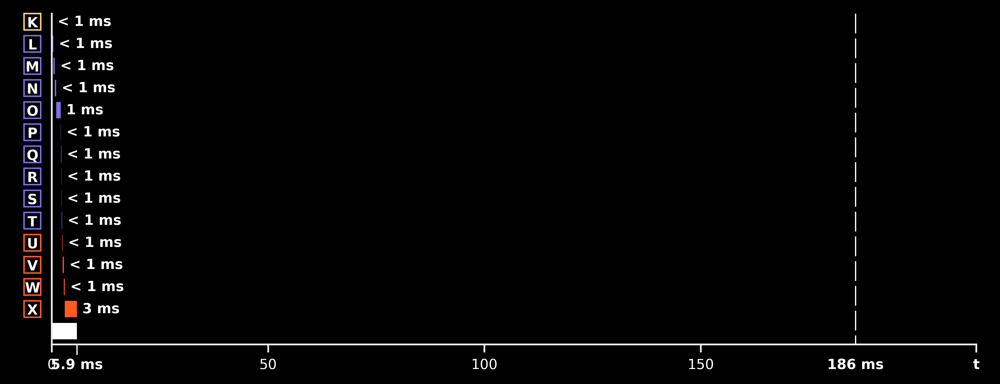

# Real-Time Frame Budget

For a visualization to feel synced to the audio, every stage of the pipeline (audio read, CWT, render) must finish one chunk's worth of work before the next chunk is due — the deadline set by the hop between chunks. SubShader measures this explicitly: one frame of audio must propagate end-to-end within its deadline window, with margin to spare, or the visualization visibly lags behind playback.

*One Process Loop frame, stage by stage, against the deadline window.*

**Key numbers** (from [TIMING.md](../../assets/timing/TIMING.md))

- Deadline: an 8,192-sample hop at 44.1 kHz = **185.8 ms** between frames
- Measured work: **81.3 ms** per frame on average — a ~2× margin; the worst observed frame (129 ms) still lands 1.4× under
- Startup pays **1.3 s once** (CUDA/OpenGL contexts, kernel builds, FFT plans, wavelet-bank upload) so the loop allocates nothing large at runtime
- Most of the 81 ms is environment overhead (Python, WSL2, blocking GPU syncs), not math — the core stages benchmark at **~10 ms** in isolation, so an optimized build has far more headroom

## In SubShader

Measured in [TIMING.md](../../assets/timing/TIMING.md#process-loop); per-stage timing is collected via `@timed` / `timed_block` in [`utils/timing.py`](../../src/subshader/utils/timing.py), used throughout [`cwt.py`](../../src/subshader/dsp/cwt.py) and [`audio_stream.py`](../../src/subshader/audio/audio_stream.py). Root-caused during the pipeline-latency profiling debug sessions.

---

**Related:** [GPU-Accelerated FFT Convolution](gpu-accelerated-fft-convolution.md) · [Circular Frame Buffer](circular-frame-buffer.md) · [Audio Overlap and Hop Size](audio-overlap-and-hop-size.md) · [TIMING](../../assets/timing/TIMING.md) · [MAP](../MAP.md)
