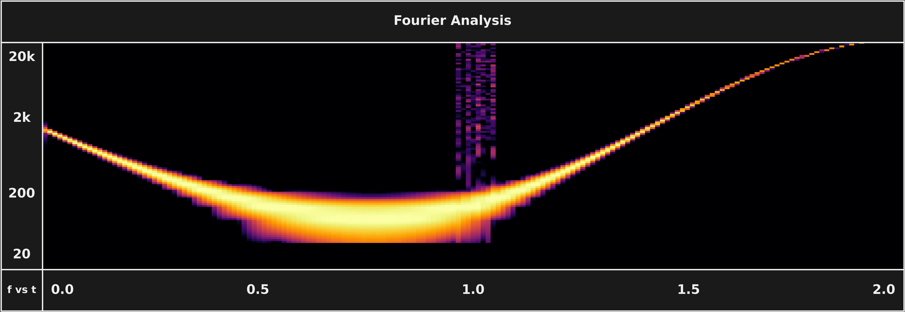

# Short-Time Fourier Transform (STFT)

The STFT recovers time localization by taking the Fourier transform repeatedly over short, often overlapping windows instead of once over the whole signal, producing a spectrogram. Windowing introduces its own artifacts — non-zero edges accumulate false evidence, so a taper like a Hanning window is applied — and the window size is fixed for the whole analysis, which is the root of the time-frequency resolution tradeoff.

*The STFT on SubShader's test signal: low-end frequency measurements bleed and blob into neighboring bands, while high-end content appears weak and fragmented — one fixed window can't serve both ends.*

**Key numbers**

- Speed: **under 1 ms per call** in SubShader's benchmark — orders of magnitude faster than any CWT ([TIMING.md](../../assets/timing/TIMING.md#why-this-method))
- The catch: one window length must serve all frequencies from 27.5 Hz to 21 kHz, so it's ideal for none

## In SubShader

Covered in [DSP §3.4](../../src/subshader/dsp/DSP.md#34-stft-and-the-resolution-tradeoff) as the textbook baseline, with a reference implementation in [`stft.py`](../../src/subshader/dsp/stft.py) used for benchmarking. It's the fast-but-fixed-resolution comparison point throughout [TIMING.md](../../assets/timing/TIMING.md#why-this-method).

---

**Related:** [Stationarity Assumption](stationarity-assumption.md) · [Time-Frequency Resolution Tradeoff](time-frequency-resolution-tradeoff.md) · [Continuous Wavelet Transform](continuous-wavelet-transform.md) · [TIMING](../../assets/timing/TIMING.md) · [MAP](../MAP.md)
