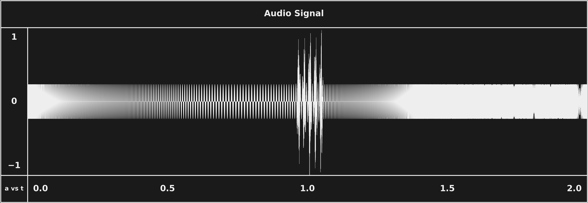

# Stationarity Assumption

The Fourier transform assumes a frequency exists for the entire analysis window — it reports *what* frequencies are present but not *when* they occurred. Real audio violates this constantly: a frequency that appears for only part of a window gets smeared into a weaker, time-averaged reading instead of a strong, time-localized one. Two very different signals — four tones played together vs. the same four played one after another — can produce identical spectrums.

*SubShader's motivating signal is maximally non-stationary: a chirp whose frequency never stops moving, punctuated by broadband clicks. A plain Fourier transform of this window would report "all frequencies present" and say nothing about the sweep.*

## In SubShader

Covered in [DSP §3.3](../../src/subshader/dsp/DSP.md#33-the-stationarity-assumption) as the motivating gap between plain Fourier analysis and the windowed/wavelet approaches that follow: a half-window frequency gets reconstructed as a half-strength tone spanning the whole window — wrong in both dimensions. This is the direct motivation for the [STFT](short-time-fourier-transform.md) and, ultimately, the [CWT](continuous-wavelet-transform.md).

---

**Related:** [Short-Time Fourier Transform](short-time-fourier-transform.md) · [Time-Frequency Resolution Tradeoff](time-frequency-resolution-tradeoff.md) · [Continuous Wavelet Transform](continuous-wavelet-transform.md) · [DSP](../../src/subshader/dsp/DSP.md) · [MAP](../../MAP.md)
