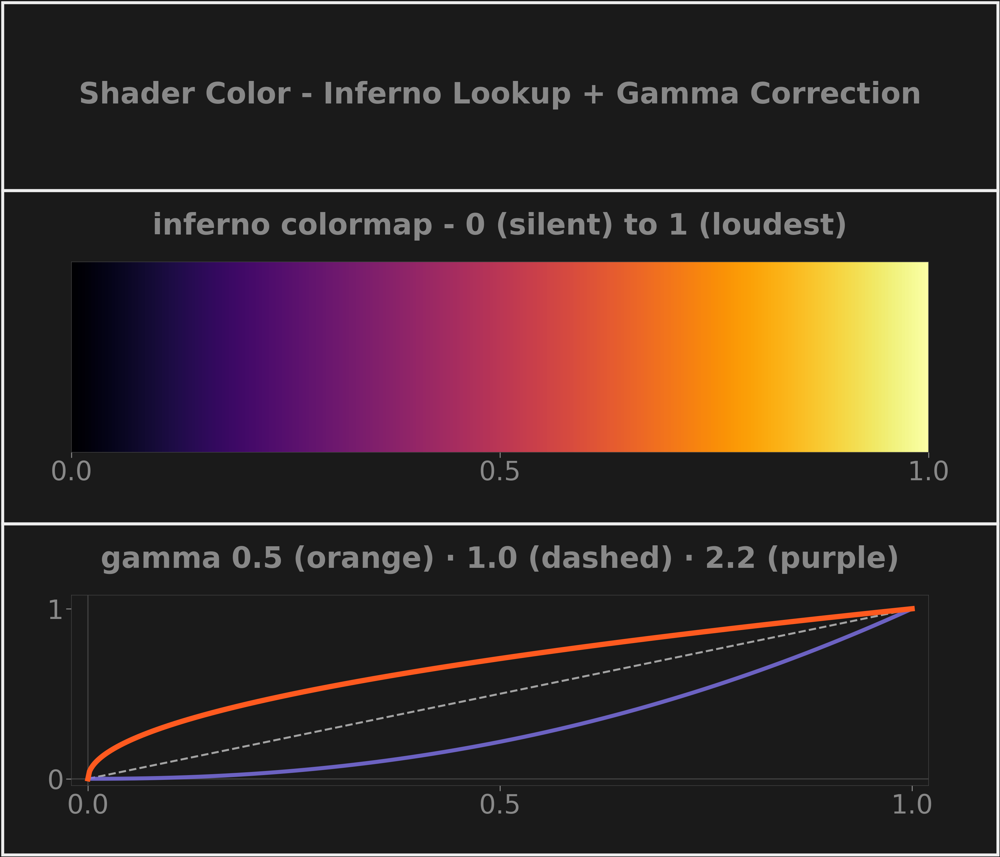

# Colormap and Gamma Correction

Turning a normalized coefficient magnitude into an on-screen pixel color takes two steps: a colormap lookup (magnitude → color) and a gamma curve (a non-linear brightness remap so quiet, mid-magnitude detail stays visible alongside loud peaks instead of being crushed to black). Both run per-pixel, per-frame, entirely on the GPU.

*Top: the shader's inferno lookup from silent (black) to loudest (white). Bottom: gamma curves — the default 0.5 (orange) lifts midtones above the linear diagonal; 2.2 (purple) would crush them. Rendered by `research/dsplot/figures/concept_cards.py`.*

**Key facts** (from [`fragment.glsl`](../../../src/subshader/renderer/shaders/fragment.glsl))

- Pipeline per pixel: sample texture → divide by `intensity_max` → clamp to [0, 1] → `pow(value, gamma)` → colormap lookup
- The colormap is matplotlib's **inferno**, baked into the GLSL as a 16-point lookup table with linear interpolation between control points — perceptually uniform, so equal magnitude steps read as equal brightness steps
- Default `gamma = 0.5` (a square root) from `ColorNormalizationConfig` in [`config.py`](../../../src/subshader/config.py): a coefficient at 25% intensity renders at 50% brightness

## In SubShader

The fragment shader runs once per screen pixel per frame with the flattened frame history bound as a single texture; `intensity_max` and `gamma` are the only uniforms updated at runtime. Documented in [RENDERER.md](../../../src/subshader/renderer/RENDERER.md#color-mapping).

---

**Related:** [Intensity Normalization](intensity-normalization.md) · [Circular Frame Buffer](circular-frame-buffer.md) · [RENDERER](../../../src/subshader/renderer/RENDERER.md) · [MAP](../MAP.md)
