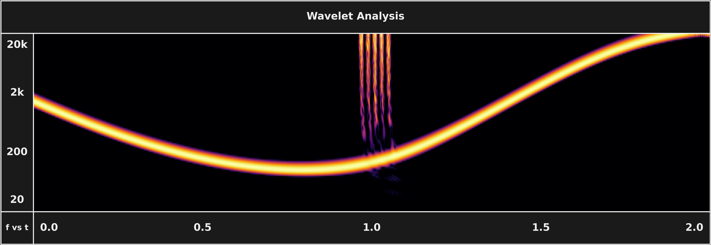

# Continuous Wavelet Transform (CWT)

The CWT decomposes a signal into a time-frequency map by convolving it against a bank of scaled wavelets instead of fixed-length sine windows, giving each frequency its own adapted window length — wide for low frequencies, narrow for high. SubShader uses the ANTS (Analyzing Neural Time Series) formulation: complex Morlet wavelets convolved with audio in the frequency domain via FFT, parallelized on GPU.

*The CWT on SubShader's test signal — the frequency sweep is traced with smooth, clean definition and each click resolves as a distinct onset.*

**Key numbers** (defaults from [`config.py`](../../../src/subshader/config.py))

- Wavelet bank: **116 kernels**, one per semitone from A0 (27.5 Hz) to ~21.1 kHz
- Input: 16,384-sample chunk → raw output 116 × 16,384 complex coefficients per frame
- After post-processing (magnitude → edge discard → hop extract → downsample): **116 × 64 float32** per frame

## In SubShader

Implemented in [`CWT`](../../../src/subshader/dsp/cwt.py) (base class builds the kernel bank and reliable-region slice; `pre()`/`post()` handle validation and post-processing) with `CpuCWT`/`GpuCWT` backends. Conceptual build-up in [DSP §4](../../../src/subshader/dsp/DSP.md#4-wavelet-transform-adaptive-resolution). Compared against STFT and PyWavelets in [TIMING.md](../../../assets/timing/TIMING.md#why-this-method): PyWavelets takes over 1 s per call for the same accuracy SubShader delivers in real time.

---

**Related:** [Mother Wavelet and Scaling](mother-wavelet-and-scaling.md) · [Morlet Wavelet](morlet-wavelet.md) · [Convolution and Kernel](convolution-and-kernel.md) · [GPU-Accelerated FFT Convolution](gpu-accelerated-fft-convolution.md) · [DSP](../../../src/subshader/dsp/DSP.md) · [MAP](../MAP.md)
