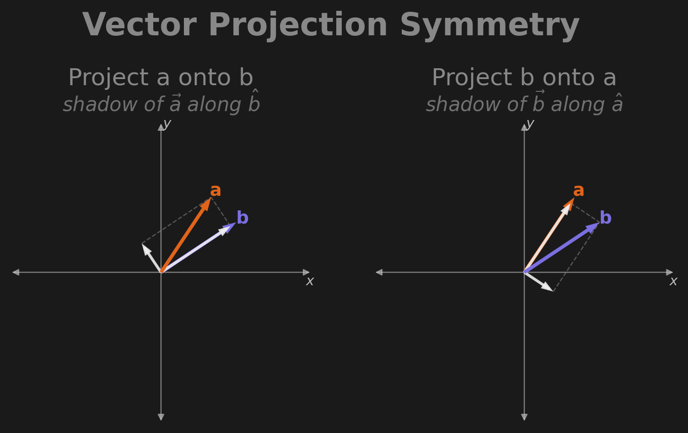
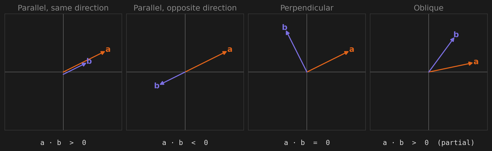
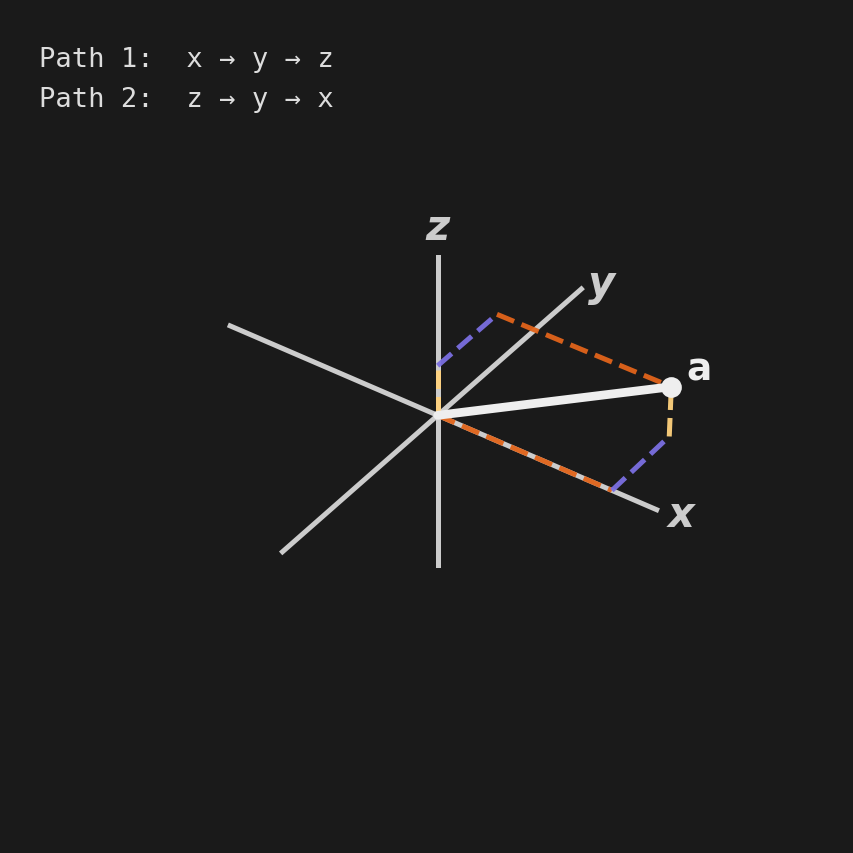
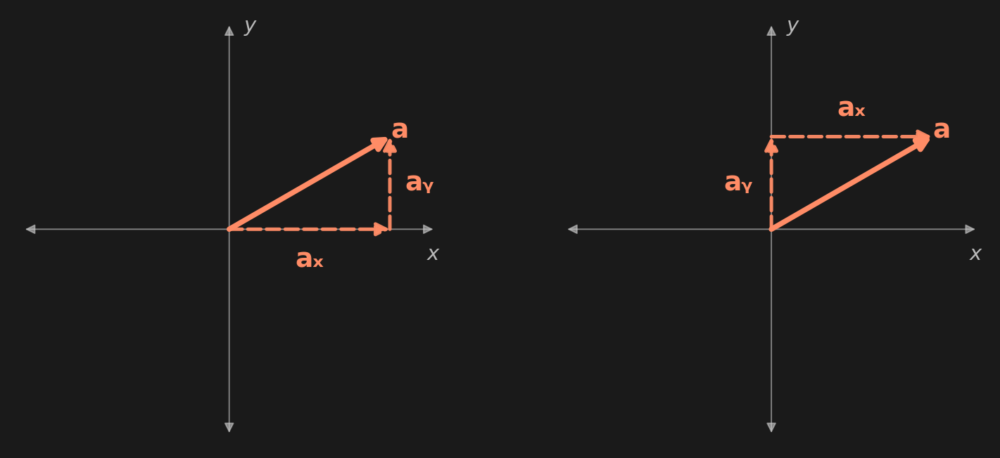

# Signal Decomposition

## 1. Motivations

- To visualize an audio signal effectively, we need an extremely precise method for representing it's behavior
- Specifically, we want to know **what** frequencies are present and **when** they occur in the signal - this is the primary motivation for finding a highly accurate **time-frequency** analysis method 
  - The standard approach is to use the **Fourier Transform**, but in this context it has limitations
<<<<<<< Updated upstream
  - The more recent **Wavelet Transform** was basically designed for this kind of task
=======
  - The more recently  **Wavelet Transform** was basically designed for this kind of task
>>>>>>> Stashed changes

  *[TODO Insert CWT vs STFT Figure]*
- Both are built on the same foundation - **signal decomposition** 
- Beginning with simple examples, we will build up to a comprehensive and intuitive understanding of how these methods actually work, and explore the different areas where they excel and fall short

---

## 2. Foundations

### 2.1 Signal Decomposition - The Goal

- The end goal is to **decompose** any given signal into its fundamental **components**
- In simpler terms, we want to break it down into its **basic building blocks** and see how much of each exists in the signal originally 
<<<<<<< Updated upstream
- This is like trying to unmix a can of paint to figure out how much of each color ingredient contributed to the overall color of the paint - where would you even begin?
=======
- This is like trying to unmix a can of paint to figure out how much of each color ingredient contributed to the overall final color of the paint - where would you even begin?
>>>>>>> Stashed changes
- This type of problem motivates us to do two things:
    1. **Define what a signal's fundamental components are** 
    2. **Measure the presence of each component in the signal** 
- This is where the **Inner Product** comes into play - it's a general-purpose tool for measuring signal components, and we will explore these two motivations in different contexts

### 2.2 Inner Product - The Tool

- The **Inner Product** gives us a generic way to compare a function **f** (the signal) and a reference function **g** (something that embodies the signal properties we want to measure) to calculate, effectively, a "**similarity score**"

<div align="center">

$$
\langle \, 
\mathbf{f} \, , \, 
\mathbf{g} \,
\rangle 
$$

<em>Inner Product Notation</em>

</div>

- The result is a measurement of how **correlated** these function are, indicating their **similarity**
- But to understand how this actually works, it's helpful to see how the Inner Product operates in its simplest form: the **Dot Product**

### 2.3 Dot Product - The Basic Case

- The Inner Product is a generalization of what the **Dot Product** does to **vectors** in $\mathbb{R}^n$ 
- All this means is we'll be applying these concepts to just plain, regular, real numbers - no imaginary or abstract numbers in weird math domains (yet)
- As long as you can do basic **multiplication** and **addition**, it's really not too bad

<div align="center">

$$
\vec{a} \cdot\vec{b} = \sum_{i=0}^{n} a_i b_i
$$

<em>Dot Product Notation</em>
</div>

- Read this as: "Multiply each term in vector **a** with each term in vector **b** and sum them all up"
    <!-- 1. Take the first term from **a** 
    2. Take the first term from **b**
    3. **Multiply** them together
    4. Repeat 1-3 for each pair of terms
    5. **Add** up all the multiplied terms together -->

<div align="center">

$$
\vec{a} = 
    ( \,
    a_0 \, , \,
    a_1 \, , \,
    a_2 \, , \, 
    \ldots \, , \,
    a_n \, )
$$

</div>

<div align="center">

$$
\vec{b} = 
    ( \,
    b_0 \, , \,
    b_1 \, , \,
    b_2 \, , \, 
    \ldots \, , \,
    b_n \, )
$$

</div>

<div align="center">

$$
\vec{a} \cdot\vec{b} = 
    a_0 \cdot b_0 \, + \,
    a_1 \cdot b_1 \, + \,
    a_2 \cdot b_2 \, + \, 
    \ldots \, + \,
    a_n \cdot b_n \, 
$$

<em> Dot Product Operation </em>
</div>

- But what does this result even really mean? And what does this operation even really do? 
- The result indicates how **parallel** vectors **a** and **b** are - this is the key insight to understanding that the Dot Product operation measures **"similarity"** by  calculating how **aligned** **a** and **b** are in terms of their parallel-ness so to speak
- This clicks more visually during **Vector Projection**, our first attempt at any form of **decomposition**

### 2.4 Vector Projection - The Geometric Interpretation

#### 2.4.1 Projection onto a Reference Direction

- A **vector** can be thought of as an **arrow** described by two of its properties
  - **magnitude** - how long it is 
  - **direction** - where it points

- To decompose a vector into its basic components, we **project it along the directions** of all the dimensions it exists in - think of it like the vector casting its **"shadow"** onto the x and y reference axes - this is how we break the vector down into its x and y components

- The **length** of each "shadow" *is* its **component** for that dimension and reveals how much each dimension **contributes** to the original vector as a whole - we designate these "shadows" as the vector's **basic components** since they 
  - **Can be combined in any order** to reconstruct the original - when rebuilding them tip-to-tail, if you start with x first and then y, or y first then x, regardlessly, you still end up with the original  
<<<<<<< Updated upstream
  - **Cannot be described in terms of each other** - geometrically x and y are at right angles, meaning any change in value for the x component goes completely unnoticed by, and does not affect, the y component


#### 2.4.2 Projection onto Another Vector
- When projecting one vector onto another, like **a** onto **b**, we use **b** as the **reference direction**, revealing which components of **a** are **aligned** with **b** 
- The more **parallel** the two vectors are, the larger **a**'s projection onto **b** is 
=======
  - **Cannot be described in terms of each other** - geometrically x and y are at right angles, meaning any change in value for the x component does not affect, and goes completely unnoticed by the y component


#### 2.4.2 Reference Direction is another Vector
- When projecting one vector onto another, like **a** onto **b**, we use **b** as the **reference direction** - this reveals which parts of **a** are **aligned** with, or point along the **same direction**, as **b** 

>>>>>>> Stashed changes
- When performing the Dot Product on these vector components, using b as the direction
 TODO how does the dot product intuitively come into play here? sure we know how to decompose into dimensional components, but lets tie it back to the idea

- Notice how when we project **a** onto **b** or **b** onto **a**, the resulting __ [the visual annotates each component of each projection - do the math for each exmaple - display how the dot product in either case produces the same result - this basically means we don't really care which one is the reference dimension - show math example in the with each - ]

<<<<<<< Updated upstream

=======

>>>>>>> Stashed changes

<!-- WRITE 2.4.1 beat 4 — symmetry of the dot product (right panel).
     Even though "a onto b" and "b onto a" produce visibly different
     shadows (different lengths along different reference directions), the
     scalar dot product comes out the same: a · b = b · a. The reference
     direction is your choice; the answer doesn't care.
     The figure carries this in two juxtaposed panels — same a, same b,
     reference direction flipped, with the matching a · b = 12 dot
     product result substituted in the LaTeX block below. -->

<div align="center">

$$
\vec{a} = (a_x,\, a_y) = (2,\, 3) \qquad \vec{b} = (b_x,\, b_y) = (3,\, 2)
$$

$$
\vec{a} \cdot \vec{b} = a_x b_x + a_y b_y = (2)(3) + (3)(2) = 6 + 6 = 12
$$

$$
\vec{b} \cdot \vec{a} = b_x a_x + b_y a_y = (3)(2) + (2)(3) = 6 + 6 = 12
$$

</div>

- [This actually works because of the symmetry found the geometry of the triangle these two vectors make - this the area equation of a triangle - watch this video to see how it relates to the Dot Product - but otherwise just trust they can be derived from each other link - https://www.youtube.com/watch?v=PnJoKGynu_U]



- The projection's magnitude tells us how aligned **b** and **a** are. Three extreme cases:
    - **parallel + same direction** → full projection → large positive result
    - **parallel + opposite direction** → flipped projection → large negative result
    - **perpendicular** → no projection → zero result
    
<!-- WRITE 2.4.1 beat 5 — angle controls sign and magnitude.
     The projection's magnitude AND sign depend on the angle between the
     two vectors. Four canonical cases land it:
       - parallel + same direction → max positive result
       - parallel + opposite direction → max negative result
       - perpendicular → zero
       - oblique (anything in between) → partial result, sign matches
         whether they "lean toward each other" or "lean apart"
     This is the angle → sign mapping the dot product gives you for free. -->


#### 2.4.3 Beyond 2D — Same Operation, More Dimensions

<!-- WRITE 2.4.2 beat 1 — 3D, with the figure as the visual proof.
     The same operation extends to 3D unchanged: pick reference directions
     (now x, y, z), project a onto each, get three components. Concrete
     example to walk through:
       a · b = a₁b₁ + a₂b₂ + a₃b₃    (same multiply-and-sum, one more term)
     Then call out what the figure also reveals: the components can be
     recombined in any order — the orange path (x → y → z) and the blue
     path (z → y → x) both arrive at the same tip a. Order independence
     is a property of the projection, not an accident of 2D. -->



<!-- WRITE 2.4.2 beat 2 — ND reframe (locked bridge sentence).
     Polish this sentence — the locked phrasing is:
       "Notice how the pattern in two dimensions applied to three
        dimensions, and the pattern expands to any number of n — but we
        can't really visualize n dimensions, so we'll drop that
        terminology and think of it in terms of N pair-wise multiplications
        whose sign agreements accumulate into one running total."
     Let "n dimensions" be the geometric framing we leave behind, and
     "N pair-wise multiplications" be the algebraic framing we carry into
     §2.5. -->

<!-- WRITE 2.4.2 beat 3 — handoff into §2.5.
     One-sentence pivot: we've been treating the dot product as one
     number, but it's built from N signed products — and the signs do
     most of the work. The next section opens up the sum and watches the
     agreement accumulate. -->

### 2.5 Sign Accumulation - The Agreement Mechanism

<!-- WRITE 2.5 lead-in — pick up where §2.4.2 left off.
     The dot product is a signed similarity accumulator. Each pair of
     matching components contributes one signed product to a running
     total. The signs do the voting. -->

- Dot product is a signed similarity accumulator
- Same signs → positive contribution (agreement)
- Opposite signs → negative contribution (disagreement)
- Final sum = net agreement across all elements
- This process of measuring similarity between two sequences is called **correlation**

*[Interactive: color-coded element products]*

### 2.6 Basis Functions - Achieving Signal Decomposition

- Accomplishing this really depends on the signal being analyzed and the properties we're interested in measuring
- The function we compare against is called a **basis function** - a known reference **pattern**
- The choice of basis function determines what features we can detect
- The scalar result of this comparison is called a **coefficient** - it tells you "how much" of that basis function is present

<!-- FIGURE relocated here from §2.4 per the consolidation pass — once §2.6
     is being authored, place the tip-to-tail recombination panel where it
     reinforces "components form a basis": the same components recombined
     in different orders both reconstruct a, which is exactly the property
     a basis function family relies on.
     
-->

This is all about re-representing **all the information** from the original signal into a **different format**, while also being able to perform the **reverse process** to **reconstruct** the original  

---

## 3. Fourier Transform: Sinusoidal Basis Functions

### 3.1 The Basis Function Question

- We have a signal (sequence of samples)
- Inner product measures similarity to... what?
- Answer: known reference patterns (basis functions)
- So what basis functions should we use?


### 3.2 Sine Waves as Basis Functions

- What if we made the basis function a pure sine wave?
- Compare signal to a sine wave at a particular frequency
- High similarity score → that frequency is present (large **coefficient**)
- Low similarity score → that frequency is absent (small **coefficient**)
- To get a full picture, repeat for many frequencies

### 3.3 The Fourier Transform

- Inner product of signal with sine waves at every frequency
- Each frequency gets a similarity score (a **Fourier coefficient**)
- Result: frequency spectrum
- The collection of all coefficients forms the **spectrum** - a map of frequency content

### 3.4 How FFT Actually Works

- Infinite sine wave basis functions (no start/end)
- Accumulates similarity across entire signal duration
- Produces magnitude and phase for each frequency
- In signal processing terms, this is **correlation** between the signal and each sinusoidal basis function

*[Example: Sign Accumulation of a sine wave]*

### 3.5 FFT Limitations

#### 3.5.1 Temporal Information Loss

- Sine basis functions span entire signal
- Result: knows *what* frequencies exist, not *when*
- A note at the beginning vs end → same FFT result

#### 3.5.2 Stationarity Assumption

- Assumes signal properties don't change over time
- Music is full of non-stationarities (attacks, decays, transitions)
- FFT smears these together

#### 3.5.3 Examples

- Two close notes played sequentially vs simultaneously
- Chirp (frequency sweep)
- Transient vs sustained sounds

---

## 4. STFT: Windowed Compromise

### 4.1 Windowing Approach

- Chop signal into short segments
- Apply FFT to each segment
- Now have time information (which window) + frequency information
- The window function acts as a **filter** - it selects which portion of the signal to analyze

### 4.2 The Resolution Tradeoff

- Window size is fixed
- Short window → good time resolution, poor frequency resolution
- Long window → good frequency resolution, poor time resolution

### 4.3 Why This Tradeoff Exists

- Need enough cycles to measure a frequency accurately
- Low frequencies need longer windows (slower cycles)
- High frequencies need shorter windows (fast cycles)
- Fixed window can't serve both optimally

### 4.4 Practical Impact

- 100 Hz vs 200 Hz = 100% difference (very audible)
- 10,000 Hz vs 10,100 Hz = 1% difference (barely audible)
- Fixed resolution wastes precision where it's not needed, lacks it where it is

---

## 5. Wavelet Transform: Adaptive Resolution

### 5.1 Core Idea

- What if the basis function's width varied with frequency?
- Low frequencies → wide basis function (good frequency resolution)
- High frequencies → narrow basis function (good time resolution)

### 5.2 Wavelets as Basis Functions

- Localized oscillations (not infinite like sine waves)
- The prototype shape is called the **mother wavelet** - the base pattern before any scaling
- Scaled (stretched/compressed) versions detect different frequencies
- Still using inner product - same fundamental operation
- In implementation, the wavelet becomes the **kernel** - the pattern we slide across the signal

### 5.3 Why This Works for Audio

- Matches how human hearing perceives frequency differences
- Matches how musical information is structured (chromatic scale)
- Computational cost is higher, but results are more meaningful

### 5.4 Convolution Implementation

- To get coefficients at every time point, we slide the kernel across the signal
- At each position: compute inner product → get coefficient for that time and frequency
- This sliding inner product operation is called **convolution**
- The kernel is also called the **impulse response** - what you'd get if you fed a single spike through a filter
- Convolution with a wavelet kernel = correlation at every time point = full time-frequency map

---

## 6. Implementation Deep Dive

### 6.1 Wavelet Construction

- Gaussian envelope
- Carrier frequency
- Admissibility conditions
- Mother wavelet → daughter wavelets (scaled versions)

### 6.2 Post-Processing Pipeline

#### 6.2.1 Scale Normalization

- Why normalization is needed
- Different approaches (1/√f vs other methods)
- Impact on visualization

#### 6.2.2 Edge Effects

- Cone of Influence (COI)
- Why edges are unreliable
- Strategies for handling edge artifacts

#### 6.2.3 Magnitude Conversion

- Complex → magnitude
- Magnitude vs power (|CWT| vs |CWT|²)
- dB scaling for visualization

#### 6.2.4 Downsampling

- From full resolution to target width
- Interpolation strategies
- Preserving temporal accuracy

### 6.3 GPU Acceleration

- Memory bandwidth bottlenecks
- Ring buffer optimization
- CPU-GPU transfer reduction
- Performance benchmarks

---

## 7. Beyond Time-Frequency: Hierarchical Feature Extraction

### 7.1 The Feature Hierarchy

Understanding audio analysis requires thinking in layers of abstraction:

#### Low-Level Features (What CWT Gives You)

- **Time-frequency coefficients**: Raw CWT output matrix
- **Spectral energy distribution**: Power across frequency bands
- **Onset/offset detection**: Sharp changes in energy
- **Zero-crossing rates**: Rapid oscillations vs smooth signals
- **Spectral flux**: Change in spectrum over time

These are direct measurements from the signal - no interpretation yet.

#### Mid-Level Features (Built on CWT Output)

- **Tempo/BPM**: Periodic patterns in coefficient envelope
  - Look for regularity in low-frequency energy peaks
  - Autocorrelation of energy over time
  
- **Pitch tracking**: Frequency trajectory over time
  - Follow the dominant frequency ridge in the scalogram
  - Harmonics appear as parallel ridges
  
- **Harmonic structure**: Overtone relationships
  - Integer multiples of fundamental frequency
  - Strength and spacing of harmonics define timbre
  
- **Timbre descriptors**: Spectral shape statistics
  - Spectral centroid (brightness)
  - Spectral rolloff (bandwidth)
  - Spectral contrast (peaks vs valleys)
  - MFCC (Mel-Frequency Cepstral Coefficients)

These require aggregating and interpreting low-level features.

#### High-Level Features (Semantic Understanding)

- **Genre classification**: Rock vs Jazz vs Classical
- **Mood/emotion detection**: Happy, sad, energetic, calm
- **Speech recognition**: Phoneme patterns → words
- **Instrument identification**: Piano vs guitar vs violin
- **Music similarity**: "Sounds like..." recommendations

These require machine learning models trained on mid-level features.

### 7.2 CWT as a Feature Extractor

**Why wavelets matter for ML:**

1. **Non-stationary signal handling**
   - Music, speech, and biological signals change constantly
   - CWT captures time-varying features FFT misses
   - Essential for: onset detection, transient analysis, dynamic events

2. **Adaptive resolution**
   - Efficient feature space representation
   - Fewer coefficients needed vs raw audio samples
   - Better than fixed-resolution STFT for variable-rate phenomena

3. **Perceptual relevance**
   - Logarithmic frequency spacing matches human hearing
   - Better ML generalization - features align with perception
   - Improves classification accuracy for audio tasks

**Practical Examples:**

**Beat Tracking**
```
Audio → CWT → Extract low-freq coefficients (< 200 Hz)
      → Find periodic peaks in energy envelope
      → Estimate tempo from peak spacing
```

**Onset Detection**
```
Audio → CWT → High-freq coefficients (> 2000 Hz)
      → Compute spectral flux (frame-to-frame change)
      → Threshold crossings = note onsets
```

**Pitch Estimation**
```
Audio → CWT → Track dominant frequency ridge
      → Smooth trajectory over time
      → Output: F0 (fundamental frequency) contour
```

---

## 8. Future Directions: Machine Learning Integration

### 8.1 Classical ML Pipeline

```
Audio → CWT → Feature Engineering → ML Model → Prediction
```

**Example Workflow:**

1. **CWT coefficients** → 2D time-frequency representation
   - Input: audio waveform (e.g., 3 seconds @ 44.1kHz = 132,300 samples)
   - CWT output: (120 frequencies × 512 time bins) matrix
   
2. **Statistical features** per frequency band:
   - **Temporal statistics**: mean, variance, skewness, kurtosis
   - **Derivatives**: rate of change over time
   - **Spectral moments**: centroid, spread, rolloff, flux
   - **Energy ratios**: low/mid/high frequency balance
   
3. **Dimensionality reduction**: 
   - PCA (Principal Component Analysis): Find main variance directions
   - LDA (Linear Discriminant Analysis): Maximize class separation
   - Feature selection: Keep most informative coefficients
   
4. **Classification**: 
   - **SVM** (Support Vector Machines): Find optimal decision boundary
   - **Random Forest**: Ensemble of decision trees
   - **kNN** (k-Nearest Neighbors): Classify by similarity to training examples
   
**Use cases:** Genre classification, mood detection, speaker identification

### 8.2 Deep Learning Approaches

```
Audio → CWT → CNN/RNN → End-to-End Learning
```

**Modern Architectures:**

#### 2D CNNs on Spectrograms

- **Treat CWT output as "images"**
  - Each pixel = coefficient at (time, frequency)
  - Convolutional layers learn local time-frequency patterns
  - Pooling layers reduce dimensionality
  
- **Architecture example:**
  ```
  CWT Spectrogram (120×512)
    ↓ Conv2D (32 filters, 3×3)
    ↓ MaxPool2D (2×2)
    ↓ Conv2D (64 filters, 3×3)
    ↓ MaxPool2D (2×2)
    ↓ Flatten → Dense(128) → Dense(num_classes)
  ```

- **Applications:**
  - Music genre tagging (10-50 genres)
  - Environmental sound classification (dog bark, car horn, etc.)
  - Acoustic scene classification (park, office, street)

#### Recurrent Networks (LSTM/GRU)

- **Temporal sequence modeling**
  - Process time slices sequentially
  - Maintain memory of past context
  - Natural for evolving patterns
  
- **Architecture example:**
  ```
  CWT Spectrogram (120×512)
    ↓ Slice into 512 frames of 120 features
    ↓ LSTM(256 units, return_sequences=True)
    ↓ LSTM(128 units)
    ↓ Dense(num_classes)
  ```

- **Applications:**
  - Pitch/melody tracking over time
  - Speech recognition (phoneme sequences)
  - Music generation (predict next time slice)

#### Hybrid Models

- **CNN for spatial + RNN for temporal**
  ```
  CWT Spectrogram
    ↓ CNN: Extract frequency patterns per time frame
    ↓ RNN: Model temporal evolution of patterns
    ↓ Output: High-level prediction
  ```

- **Example: Music Transcription**
  1. CNN detects notes present at each time
  2. LSTM models note sequences
  3. Output: MIDI note events

- **Modern variants:**
  - **WaveNet**: Dilated convolutions for raw audio synthesis
  - **Transformer models**: Self-attention on time-frequency patches
  - **U-Net**: Encoder-decoder for source separation

### 8.3 Why Wavelets + Neural Networks?

**Computational Advantages:**

1. **Reduce input dimensionality**
   - Raw audio: 132,300 samples (3s @ 44.1kHz)
   - CWT: 61,440 coefficients (120 × 512)
   - ~50% reduction, even before network compression

2. **Faster convergence**
   - Networks learn from structured features, not raw samples
   - Fewer parameters needed
   - Training time reduces significantly

**Perceptual Advantages:**

3. **Meaningful representations**
   - CWT features align with human perception
   - Better generalization across datasets
   - More robust to noise and distortion

4. **Multi-scale analysis**
   - Single representation captures:
     - Transients (high frequencies, short time)
     - Sustained tones (low frequencies, long time)
   - No need for multiple parallel networks

**Practical Advantages:**

5. **Real-time capable**
   - GPU-accelerated CWT is fast (40+ FPS achievable)
   - Smaller networks = faster inference
   - Suitable for interactive applications

**Example: Speech Recognition**

```
Traditional Approach:
Raw Audio (16kHz) → MFCC (39 features) → HMM/DNN → Phonemes → Words

Wavelet Approach:
Raw Audio → CWT (5-50ms resolution) 
         → CNN (phonetic patterns) 
         → LSTM (temporal context) 
         → Phonemes → Words

Benefits:
- Captures formant transitions better (vocal tract dynamics)
- Robust to speaking rate variations (adaptive resolution)
- Fewer hand-crafted features (network learns from CWT)
```

---

## 9. Practical Applications

### 9.1 Music Information Retrieval (MIR)

**Audio Fingerprinting (Shazam-style)**
- Hash unique spectral patterns from CWT
- Create robust signatures invariant to:
  - Background noise
  - Compression artifacts
  - Tempo/pitch variations
- Database lookup for song identification

**Auto-Tagging**
- Train classifiers on CWT features for:
  - **Genre**: Rock, Jazz, Electronic, Classical, Hip-Hop
  - **Mood**: Happy, Sad, Energetic, Calm, Aggressive
  - **Instrumentation**: Vocals, Guitar, Drums, Strings
- Use cases: music library organization, playlist generation

**Recommendation Systems**
- Compute similarity metrics in wavelet space
- "Sounds like..." suggestions based on:
  - Spectral similarity (timbre)
  - Rhythmic patterns (tempo, groove)
  - Harmonic content (chord progressions)

### 9.2 Audio Production

**Source Separation**
- Isolate vocals, drums, bass from mixed tracks
- Time-frequency masking:
  1. CWT of mixed signal
  2. Identify frequency regions for each source
  3. Create masks to extract individual sources
- Applications: remixing, karaoke, sampling

**Noise Reduction**
- Adaptive filtering in wavelet domain
- Distinguish between:
  - Signal (music, speech)
  - Noise (hiss, hum, clicks)
- Threshold wavelet coefficients to remove noise

**Dynamic Range Compression**
- Frequency-dependent gain control
- Compress loud parts, boost quiet parts
- Per-band processing for natural sound

### 9.3 Health & Accessibility

**Cardiac Sound Analysis**
- Heart murmur detection from phonocardiogram
- CWT reveals:
  - S1/S2 heart sounds (normal)
  - Abnormal clicks, murmurs (pathological)
- Early detection of valve disorders

**Seizure Detection**
- EEG time-frequency patterns
- Identify seizure signatures:
  - Spike-wave discharges
  - Rhythmic oscillations
- Real-time monitoring for epilepsy patients

**Hearing Aid Signal Processing**
- Selective amplification by frequency
- Adaptive to environment:
  - Boost speech frequencies in noise
  - Compress loud transients
- Improve speech intelligibility

### 9.4 Research & Science

**Bioacoustics**
- Whale song analysis
  - Track frequency modulation patterns
  - Identify individual whales by vocalizations
- Bird call classification
  - Species identification from recordings
  - Population monitoring

**Seismology**
- Earthquake waveform analysis
- Distinguish:
  - P-waves (primary, compression)
  - S-waves (secondary, shear)
  - Surface waves
- Early warning systems

**Astronomy**
- Gravitational wave detection (LIGO)
- CWT reveals:
  - Chirp signals from black hole mergers
  - Frequency sweep as objects spiral inward
- Nobel Prize-winning application (2017)

---

## 10. Appendix: Terminology Reference

### Concept Ladder

Same ideas, different contexts:

| Stage | What you have | What you compare against | The comparison operation | The result |
|-------|---------------|--------------------------|--------------------------|------------|
| 2D/3D Vectors | vector | basis vector | dot product | component, projection |
| N-Element Vectors | sequence, array | pattern, basis function | dot product | similarity score |
| Discrete Signals | signal, samples | basis function, pattern | correlation | correlation value |
| Continuous Functions | function, waveform | basis function | inner product | coefficient |
| Fourier Analysis | signal | sinusoid, harmonic | Fourier transform | Fourier coefficient, spectrum |
| STFT | windowed signal | windowed sinusoid | windowed FFT | spectrogram bin |
| Wavelet Analysis | signal | wavelet, mother wavelet | convolution, CWT | wavelet coefficient, scalogram |
| Implementation | input | kernel, filter, impulse response | convolution | output, filtered signal |
| Machine Learning | audio | learned features | neural network | prediction, classification |

### Key Terms

**Basis vector / Basis function**  
The reference direction (vectors) or reference pattern (functions) you compare against. The "ruler" you use to measure.

**Component / Coefficient**  
The scalar result of the comparison. "How much" of the basis is present.

**Correlation**  
Measuring similarity between two signals by multiply-accumulate. Same as inner product for signals.

**Convolution**  
Correlation applied at every position - sliding the kernel across the signal.

**Kernel**  
The pattern used in convolution. Implementation term for basis function / wavelet / filter.

**Filter**  
A kernel designed to keep certain features and remove others.

**Impulse Response**  
What a system outputs when given a single spike input. Characterizes the system's behavior. Becomes the kernel in convolution.

**Mother Wavelet**  
The prototype wavelet shape at a reference scale. Scaled copies (daughter wavelets) detect different frequencies.

**Spectrum**  
The collection of Fourier coefficients. Shows frequency content without time information.

**Scalogram**  
The collection of wavelet coefficients across time and scale/frequency. The time-frequency map.

**Feature**  
A measurable property extracted from a signal. Can be low-level (spectral energy), mid-level (tempo), or high-level (genre).

**Feature Engineering**  
The process of transforming raw data into features suitable for machine learning.

**Feature Extraction**  
Using the inner product (or other operations) to measure how much of each pattern (basis function) is present in the data.

---

## Notes for Future Development

- Add interactive visualizations for vector projection
- Include audio examples comparing FFT vs STFT vs CWT
- Provide code examples for feature extraction pipeline
- Add case studies from real-world applications
- Include links to relevant research papers
- Develop Jupyter notebooks with hands-on exercises
