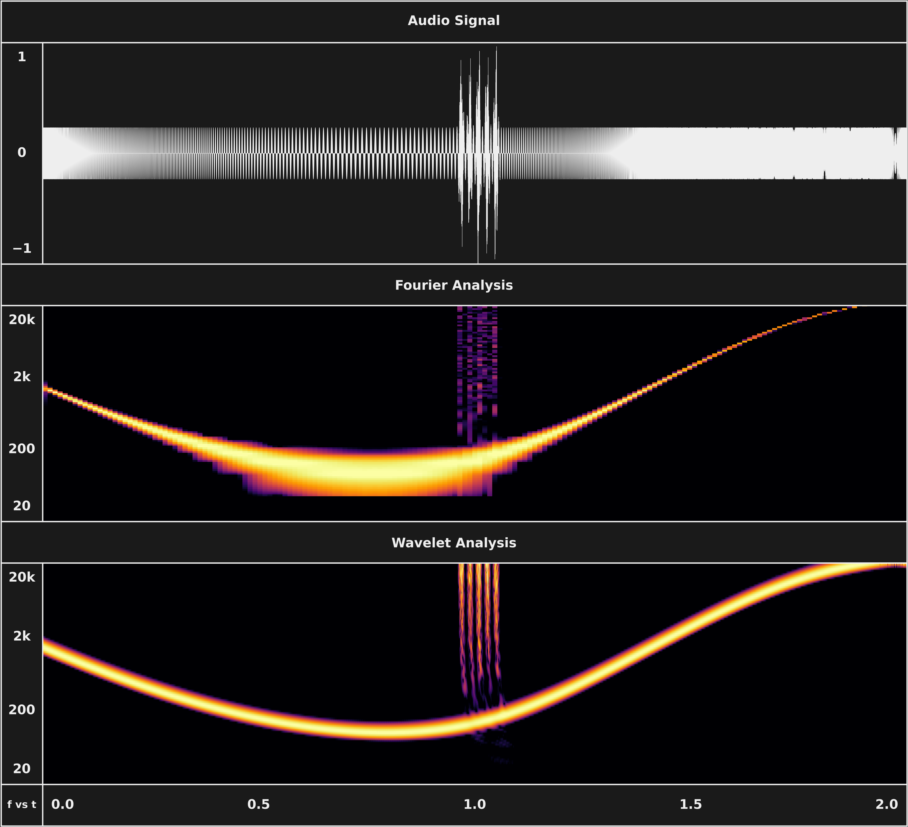
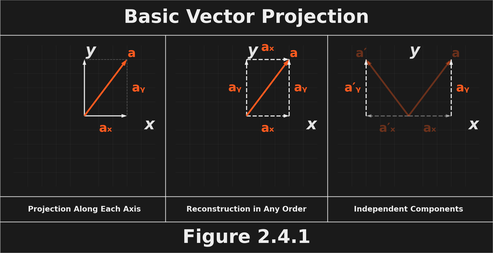
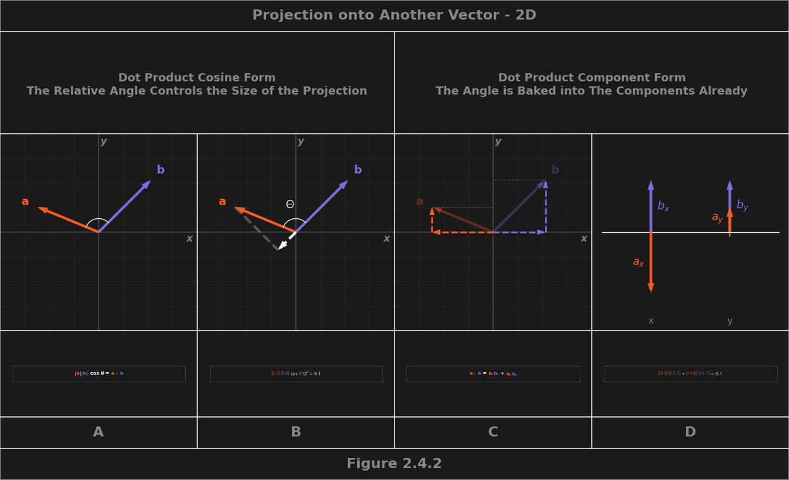
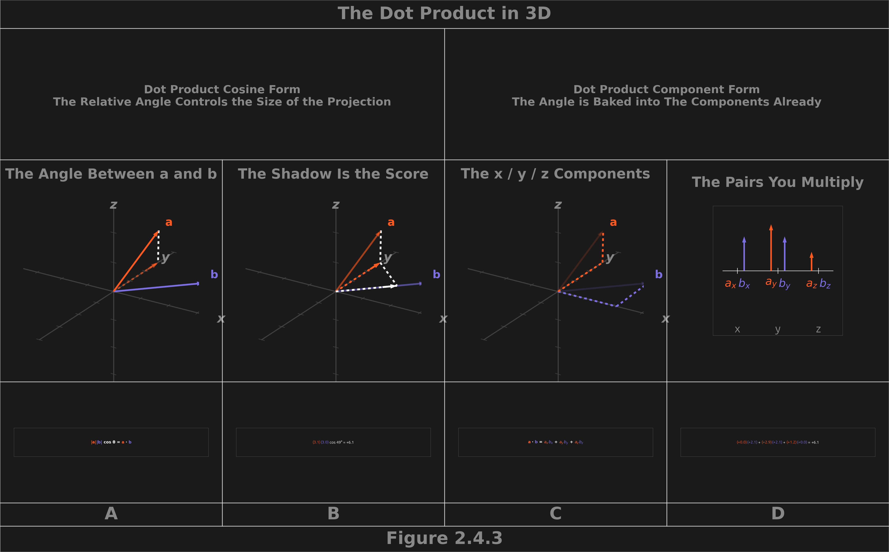
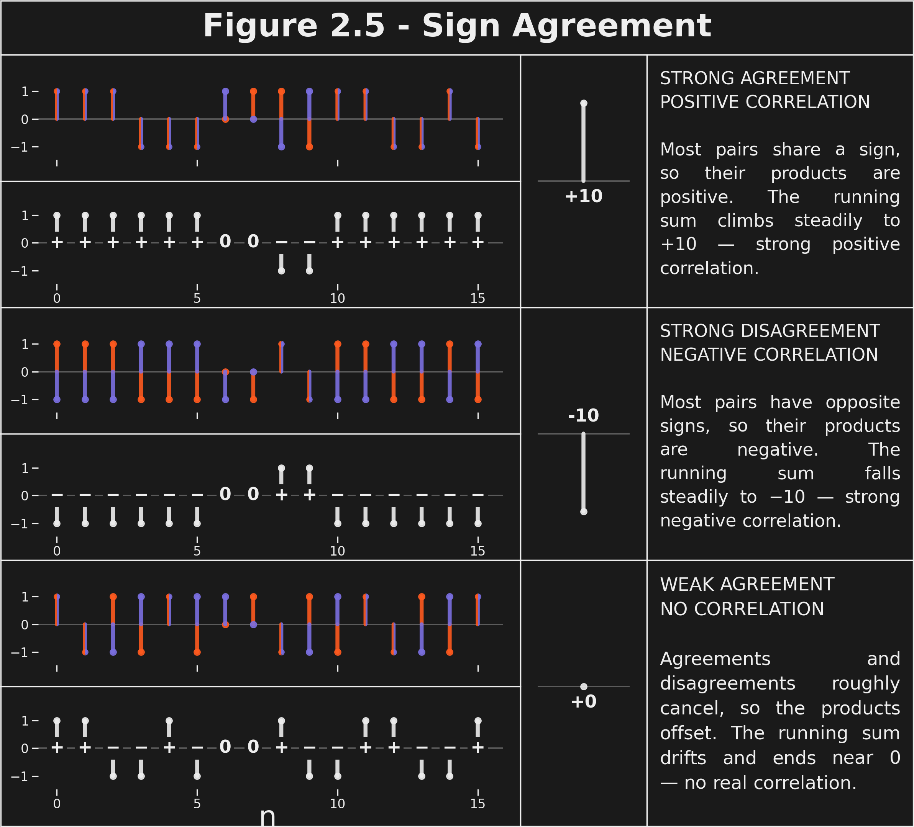
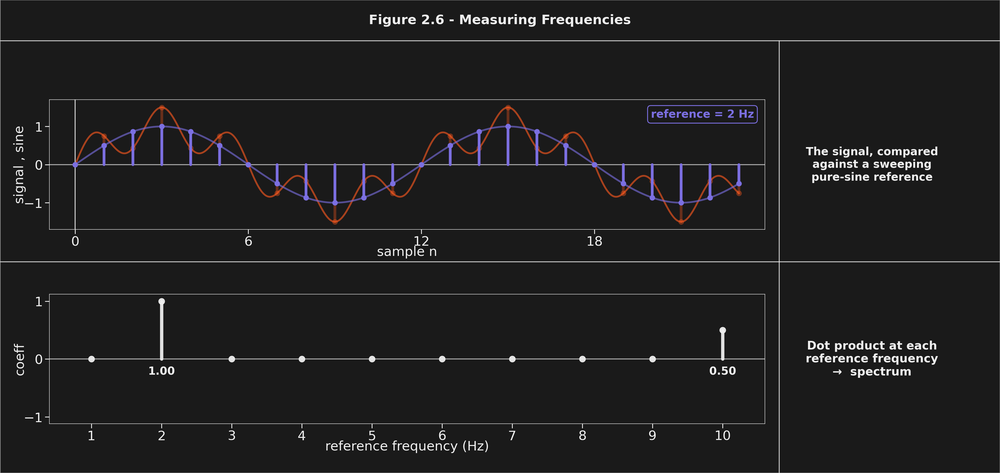

# Signal Decomposition
🚧 Under Construction 🚧


## 1. Motivations
- To visualize an audio signal effectively, we need a precise method for representing its behavior
- Specifically, we want to know **what** frequencies are present and **when** they occur in the signal 
- This is the primary motivation for finding a highly accurate **time-frequency** analysis method 
  - The textbook approach is the **Fourier Analysis**, but in this context it has limitations
  - The more recently popularized **Wavelet Analysis** is much better suited for this kind of task
- Both are built on the same foundation - **signal decomposition** 
- Beginning with simple examples, we will build up to a comprehensive and intuitive understanding of how these methods actually work, and explore the different areas where they excel and fall short → Section 2



---

## 2. Foundations

### 2.1 Signal Decomposition - The Goal

- The end goal is to **decompose** any given signal into its fundamental **components**
- In simpler terms, we want to break a signal down into its **basic building blocks** and see how much of each "block" exists in the signal originally 
- This is like trying to unmix a can of paint to figure out how much of each color ingredient contributed to the overall color of the paint - where would you even begin?
- This type of problem motivates us to do two things:
    1. **Define what a signal's fundamental components are** 
    2. **Measure the presence of each component in the signal** 
- This is where the **Inner Product** comes into play - it's a general-purpose tool for measuring signal components, and we will explore these two motivations in different contexts

### 2.2 Inner Product - The Tool

- The **Inner Product** gives us a generic way to compare and compute a "**similarity score**" between
    - A function **f** - the signal 
    - A reference function **g** - something that embodies the signal properties we want to measure 

<div align="center">

$$
\langle \, 
\mathbf{f} \, , \, 
\mathbf{g} \,
\rangle 
$$

<em>Inner Product Notation</em>

</div>

- The result is a measurement of how **correlated** these functions are, indicating their **similarity**
- But to understand how this actually works, it's helpful to see how the Inner Product operates in its simplest form - the **Dot Product**

### 2.3 Dot Product - The Basic Case

- The Inner Product generalizes what the **Dot Product** does to **vectors** in $\mathbb{R}^n$ 
- All this means is we will just be applying these concepts to just plain, regular, real numbers - no imaginary or abstract numbers in weird math domains (yet)
- As long as you can do basic **multiplication** and **addition**, it's really not too bad

<div align="center">

$$
\vec{a} \cdot\vec{b} = \sum_{i=0}^{n} a_i b_i
$$

<em>Dot Product Notation</em>
</div>

- In plain English this is called a **sum of products** - **multiply** each term in vector **a** with each term in vector **b** and then **add** them all together
    <!-- 1. Take the first term from **a** 
    2. Take the first term from **b**
    3. **Multiply** them together
    4. Repeat 1-3 for each pair of terms
    5. **Add** up all the multiplied terms together -->

<div align="center">

$$
\vec{a} = 
    ( \,
    a_0 \, , \,
    a_1 \, , \,
    a_2 \, , \, 
    \ldots \, , \,
    a_n \, )
$$

</div>

<div align="center">

$$
\vec{b} = 
    ( \,
    b_0 \, , \,
    b_1 \, , \,
    b_2 \, , \, 
    \ldots \, , \,
    b_n \, )
$$

</div>

<div align="center">

$$
\vec{a} \cdot\vec{b} = 
    a_0 \cdot b_0 \, + \,
    a_1 \cdot b_1 \, + \,
    a_2 \cdot b_2 \, + \, 
    \ldots \, + \,
    a_n \cdot b_n \, 
$$

<em> Dot Product Operation </em>
</div>

- But what does this result even really mean? And what does this operation even really do? 
- Spoiler, the result indicates how **parallel** vectors **a** and **b** are - this is the key insight to understanding that the Dot Product operation measures **"similarity"** by calculating how **aligned** **a** and **b** are in terms of their "parallel-ness"
- This clicks more visually during **Vector Projection**, our first attempt at any form of **decomposition**

### 2.4 Vector Projection - The Geometric Interpretation

#### 2.4.1 Projecting onto a Reference Direction

- A **vector** can be thought of as an **arrow** described by two of its properties
  - **magnitude** - how long it is 
  - **direction** - where it points

- To **decompose** a vector, or break it down into its most basic components, we **project it along** the directions of **all the dimensions** it exists in - **Figure 2.4.1.a**
  - Since **a** is defined by two dimensions, think of it like the vector casting its **"shadows"** onto the x and y axes 
  - Notice how as **a** grows or shrinks in any particular direction, the "shadow" **aligned** with each dimension compensates itself accordingly
  - This illustrates how projecting **a** onto these axes reveals the components of **a** that are **parallel** to x and y 

- We are able to designate these "shadow" lengths as the vector's **basic components** since they
  1. **Can be combined in any order** to reconstruct the original - **Figure 2.4.1.b** 
      - Stacking the components tip-to-tail rebuilds vector **a** 
      - Notice when recombining these components - either starting with x first and then y, or y first and then x, regardlessly, you still end up with the **original**
  2. **Measure independent information** about the original - **Figure 2.4.1.c**
      - Being independent of each other means knowing the value of one component **tells you nothing** about the other 
      - Notice how as the vector sweeps through each direction, the other direction's component is fully unaware and unaffected 
      - Since they point at **right angles** to each other, each dimension is **unrelated** - **x cannot measure any information that y measures** and vice versa - we call this being **orthogonal**



#### 2.4.2 Projecting onto Another Vector

- So far we've established how projection reveals a vector's **parallel component**  
  - Previously, we projected onto the directions of the familiar **x and y axes** to reveal the components **parallel to them** 
  - Similarly, we can project onto the direction of **any other vector** to reveal the component **parallel to it**
  - This involves the two vectors in an interesting relationship 

- The relative **angle** between **a** and **b** has direct control of the projected parallel component - **Figure 2.4.2.a**
  - Here you can see its **size and direction** track the **alignment** of the two vectors by 
    - Growing **large in one direction** when they point **similarly parallel** 
    - Reducing to **zero** when they point perpendicularly (perfectly **not parallel**)
    - Growing **large in the other direction** when they point **oppositely parallel**

- This relationship should sound familiar
  - Earlier, we claimed performing the Dot Product on two vectors produces a "similarity score" for the same thing
  - Yet the operation itself is deceptively simple - all you do is **multiply** corresponding terms and **add** them together
  - How does a simple **multiply-and-add** operation, performing *no visible trig*, capture a relationship clearly so dependent on the vectors' relative angle?

- It turns out the Dot Product and Vector Projection are two views of a shared geometric relationship - **Figure 2.4.2.b**
  - Notice how they both produce the **same result** even as the angle changes
  - Apparently, the Dot Product can be derived from the **triangle** formed by the vectors like in [this video](https://youtu.be/PnJoKGynu_U?si=qr-2XD9gF5MeU9n5) - it abides the age-old [Law of Cosines](https://www.reddit.com/media?url=https%3A%2F%2Fcf.preview.redd.it%2Flaw-of-cosines-v0-arli6kvsxkga1.jpg%3Fwidth%3D1080%26crop%3Dsmart%26auto%3Dwebp%26s%3D6fd1802a88aa4c78470f2878b22f684e43d8765b) which is like the Pythagorean Theorem but for any triangle
  - Basically, as the angle between the vectors changes, their **x** and **y** components are simultaneously **changing with it**
  - This means the Dot Product already has this precious angle **baked into** the components **before** operating on them directly

<div align="center">

$$
\vec{a} \cdot \vec{b}
=
|\vec{a}| |\vec{b}| \cos(\theta)
=
a_x b_x + a_y b_y
$$

<em>2D Dot Product - Cosine and Component Form</em>

</div>

- This lets us use the Dot Product and Vector Projection as different framings of the same relationship - parallelism
  - Both measure the **alignment** of two vectors, which we said reflects their **similarity**
    - Projection reveals this geometrically through **trig** using each vector as a whole
    - The Dot Product computes it using a simple **sum of products** on their individual components
  - Naturally, this relationship exists beyond two dimensions



<!-- Figure 2.4.2.b (dot product and projection producing the same result as the
     angle changes) - final render TBD; animated cycle exists at
     ../../../assets/images/dsp/figures/by_figure/fig_2_4_2_a_onto_b/fig_2_4_2_a_onto_b_cycle_v1.gif -->

#### 2.4.3 Projection in 3D and Beyond

- The Vector Projection and Dot Product equivalence also extends to vectors described by **three** dimensions - **Figure 2.4.3.a**
  - To add a third dimension, we orient the z axis at **right angles** to the others x and y 
  - It's important they are all **perpendicular** - as we said in §2.4.1 this relationship relies on them all being **independent** of one other
  - This way, the parallel projection and triangle relationship still occur here, however, the angle becomes tough to isolate even with trig now that it cuts through multiple planes
  - It's a lot simpler for us to just use the Dot Product on the individual components to score their similarity

- To no surprise, this relationship applies to **any number** of dimensions
  - Past three dimensions, we can no longer visualize the parallel projection - it's not visually possible to orient any more axes at right angles to the others
    - At this point, we need to **reconsider what a vector and its components really are**
    - For three dimensions, each vector is a set of three components whose values represent the independent contributions of each dimension
    - For any number of dimensions, we will treat every vector like a **set of "independent values"** instead of "dimensions"
  - The audio signals we'll be working with are all just collections of independently measured **values** sampled in time
    - Not measured along x, y, or z - just values captured at regular intervals, usually far more than three
    - Each value belongs to an **independent moment in time**, so just like for vector components, knowing the value of one **tells you nothing** about the others
    - Because of this, the Dot Product can still measure this concept of similarity and is why we even care about doing this beyond three dimensions
  - To lock this in, we'll drop the geometric view entirely and examine what the Dot Product is actually doing operationally



### 2.5 Sign Accumulation - The Agreement Mechanism

- The Dot Product's multiply-and-add operation measures how two sets of values **move together or apart** by assessing their total **sign agreement** 
  - This is basically what is known as **correlation** - typically we'd normalize all the values but the underlying operation is functionally the same
  - Each **product** reveals whether or not each pair of values move in the same direction or in opposition
    - When they **agree** in sign, their product **increases** the sum - making it more **positively correlated**
    - When they **disagree** in sign, their product **decreases** the sum - making it more **negatively correlated**
    - When one is **zero**, their product does **nothing** to the sum - implying **no correlation**
  - The **sum** of all these products capture the net sign agreement across every pair

  <!-- example all except one sign are the same, some are same, some are oppsoite, all except one are opposite, some are zeros, all are zeros -->

- This **agreement mechanism** is the true essence of what the Dot Product is really doing
  - The result is strongest when each set share the same **sign pattern**, most negative when completely opposite, and zero when no net agreement
  - This is effectively **pattern detection** - assessing each pair's sign agreement accumulates **evidence of a shared pattern** between the two
  - Vector Projection introduced the concept of breaking something whole into its parts and parallel components revealed the parts that two vectors have in common 
  - The Dot Product captures this same exact relationship by pair-wise comparing their individual parts 
  - So now that we have the ability to detect the presence of a common pattern between two sets of data, how do we specifically choose the patterns we're looking for?



### 2.6 Basis Functions - Full Signal Decomposition

- In its raw form, a signal's properties are all mixed together - we can't see or work with any of them individually
  - To separate what's been entangled, we need a way to measure each property on its own - this is exactly what the Dot Product allows us to do
  - It compares two sets of values - measuring how much of one pattern exists within the other
    - One set is the audio signal
    - The other is a reference function - a pattern that embodies the property we want to measure
  - To measure for a **particular frequency**, we make the reference function a **pure sine wave** oscillating at that frequency - **Figure 2.6**
  - This is the goal of **full signal decomposition** - break down a signal into all of its parts by measuring the properties embodied in a set of reference patterns

- To do this **completely** and **non-redundantly** - no information lost, no information double-counted
  - We transform the signal into a format where every property has been independently accounted for
  - Transforming **N independent samples** in time into **N independent measurements** in frequency - preserving equivalent amounts of information in the new format
  - This set of N reference functions is called a **basis**

- Creating a sinusoidal basis transforms the signal into a format where we can see the presence of each frequency
  - By completely representing all information, we preserve the ability to **reconstruct** the original
  - How do we pick the specific frequencies? → Section 3



---

## 3. Fourier Analysis - Frequency Representation

### 3.1 Sampling Rate and Duration

- To create a complete frequency representation - really just a bunch of dot products with different frequencies - we need to understand what we can measure in the first place

- **Sampling rate** controls how far apart each sample is spaced in time
  - We only have snapshots at each sample time - we can't know what's going on between samples
  - To detect a frequency, you need at least two samples per cycle - **Nyquist limit**
  - Audio is sampled at 44.1kHz - ceiling at ~22kHz
  - **Figure 3.1.a** - continuous signal with samples overlaid, the invisible gap

- **Duration** controls how finely we measure frequencies below the ceiling
  - To measure 1Hz, you need 1 second - one complete cycle
  - This is the lowest measurable frequency - the **fundamental** (1/duration)
  - To distinguish 10Hz from 11Hz, you need enough time for them to diverge
  - **Figure 3.1.b** - 10Hz vs 11Hz, short duration: identical, longer: clearly different

### 3.2 Building the Orthogonal Basis

- Integer multiples of the fundamental fill the range from floor to ceiling
  - 1Hz vs 2Hz: half the time they agree in sign, half they disagree - cancels to zero
  - Same for all integer multiples - sign agreement always balances out
  - Callback to §2.4.1: same **orthogonality**, now at the function level
  - **Figure 3.2.a** - 1Hz vs 2Hz, 1Hz vs 3Hz sign cancellation

- N orthogonal frequencies for N samples = complete, non-redundant basis
  - **Figure 3.2.b** - 5Hz + 0.1 amp 10Hz, only those bins light up

### 3.3 The Stationarity Assumption

**GAP TO CALL OUT:** We need to bridge from "we have a perfect basis" to "but it breaks in practice" - the bridge is: this works great for signals whose frequencies don't change. Real audio changes.

- The Fourier transform completely turns time-domain data into pure frequency information - but we lose all concept of *when*
  - The basis functions (sine waves) assume the frequency exists the **entire time** of the window
  - A sine wave in reality exists forever - its frequency is persistent - we're only computing it for one window
  - So the DFT measures *what frequencies exist in the window you gave it* - not when they happened

- What happens when a frequency changes **during** the window?
  - The dot product accumulates evidence in the first half when the frequency is active
  - After it goes away, it stops accumulating - the result is half as strong
  - When reconstructing, it takes that value and assumes the frequency existed throughout - reconstructing a half-strength sine wave across the entire window
  - This is inaccurate - the frequency was full-strength for half the time, not half-strength for all the time

- **Figure 3.3.a** - two signals, same spectrum (callback to ataspinar concept). Signal A: four frequencies simultaneously. Signal B: same four, one per quarter. Identical spectrums.

- **Goal visual** - 3D spectrogram of the chirp from Figure 1, GIF showing the dot product being assessed at each point in time

### 3.4 STFT and the Resolution Tradeoff

- So what do we do? We take the DFT **multiple times**
  - After the window: place the next window right after, no overlap - chunk the signal into moments of time
  - During the window: overlap the windows by some amount - a little redundant (overlapped part measures same signal twice) but worth it for a smoother representation

- But what about the edge effects?
  - The stationarity assumption implies the signal is one period of itself
  - When the edges are non-zero, we accumulate evidence of energy (or lack of) that skews results
  - Apply a **Hanning window** to taper edges - reduces artifacts but affects overall energy
  - Smart windowing helps: placing the peak of one frame's window over the edge of the other
  - Plant flag: this is a form of **shaping the analysis window** - becomes important for wavelets

- What about adjusting the window size?
  - **Shorter window**: you've limited the lower range (higher fundamental), fewer samples = fat blocky resolution, many frequencies per bin - accurate, just not high-definition
  - **Longer window**: do you extend the sine wave? It stops mid-cycle, skewing correlation. Do you scale it? You've stretched the frequency - it doesn't measure the same thing anymore
  - So you pick a window size to measure the lowest frequency you want - and stick with it

- This is the fundamental tradeoff
  - No matter what window you pick, it's ideal for one end and not the other
  - Tune for better high-frequency resolution → low frequencies suffer
  - Tune for better low-frequency resolution → high frequencies suffer
  - **Figure 3.4.a** - same signal, wide vs narrow STFT windows showing the tradeoff

- What if the window **adapted** to the frequency? → Section 4

### 3.5 Convolution Theorem

- FFT computes same N dot products in O(N log N) instead of O(N²) by reusing redundant math
  - Same answers, same dot products, just faster
- Correlation in time = multiplication in frequency domain
  - CWT uses this same trick
- No visual needed

**GAPS IDENTIFIED (authoring notes):**

1. **2.6 → 3.1 bridge**: Currently solid - "how do we pick the frequencies" → "understand what we can measure first"

2. **3.2 → 3.3 bridge**: Need to say "this basis works perfectly for stationary signals - but real audio isn't stationary"

3. **3.3 → 3.4 bridge**: Need to explicitly say "we need time localization - the STFT gives us that, but introduces new problems"

4. **Visual: 3D spectrogram GIF**: Where does it go? Probably 3.3 or 3.4 - showing the row-by-row, column-by-column construction of the STFT, then reused for CWT with variable window length

5. **Edge effects**: Currently in 3.4 - should this be its own subsection or stay folded in? Given your preference for fewer sections, keep it folded.

6. **Convolution theorem placement**: 3.5 feels disconnected - could fold into 3.4 as a brief note, or keep separate as a short canonical beat that plants the flag for CWT.

---

## 4. Wavelet Transform: Adaptive Resolution

<!-- Synced from dsp.ipynb planning outline (cell ceefb0f6) 2026-08-10 - the newest
planned structure for this section; merge during authoring. (Note: its Section 3
numbering differs by one from the live 3.x sections above.)

### 4.1 The Wavelet as a Basis Function
- Sinusoid shaped by a Gaussian envelope
- Callback to STFT windowing - the wavelet *is* the window
- No artificial periodicity assumption - the Gaussian naturally tapers to zero

### 4.2 Scaling the Wavelet
- Stretching for low frequencies, compressing for high
- This is where the adaptive resolution comes from
- Callback to §3.3: CWT answers the question STFT couldn't
- Wide wavelet (low freq) → good frequency resolution
- Narrow wavelet (high freq) → good time resolution

### 4.3 Sliding the Wavelet
- Correlation at every time position - this is where the "sliding" concept enters
- Callback to §3.1 where we explicitly said "Fourier doesn't slide"
- Each position gives one correlation result - stack all positions across all scales → time-frequency matrix

### 4.4 Overcomplete and Redundant
- CWT deliberately breaks orthogonality from §2.6
- Callback to the orthogonality flag: DFT and DWT preserve it, CWT trades it for smoother coverage and better edge resolution
- The redundancy is the feature, not the bug

### 4.5 Edge Effects and the Cone of Influence
- Callback to STFT windowing artifacts from §3.2
- Wider wavelets (low freq) extend further beyond signal boundaries → more edge contamination
- The cone of influence marks which results are reliable

## Visuals Summary

| Figure | Section | What it shows | Why it matters |
|  ------|---------|---------------|----------------|
| 3.1.a | 3.1 | Two close sinusoids diverging over time | Signal length = frequency resolution |
| 3.1.b | 3.1 | 5Hz + 10Hz signal, dot products across all bins | Orthogonality payoff - only matching bins light up |
| 3.2.a | 3.2 | Two signals, same spectrum | DFT collapses temporal information |
| 3.3.a | 3.3 | Wide vs narrow STFT windows on same signal | The resolution tradeoff made visible |
| 3.4 | 3.4 | None needed | Just acknowledge the speedup exists |
| 4.1 | 4.1 | Morlet wavelet - sinusoid × Gaussian | The wavelet IS the window |
| 4.2 | 4.2 | Scaled wavelets at different frequencies | Adaptive window size |
| 4.3 | 4.3 | Wavelet sliding across signal | Time-localized correlation |
| 4.4 | 4.4 | DFT uniform tiling vs CWT adaptive tiling | Why redundancy gives better resolution |
| 4.5 | 4.5 | Cone of influence mask | Which results to trust |

## Callback Map

| Flag planted | Where | Called back | Where |
|-------------|-------|------------|-------|
| Orthogonality (independence) | §2.4.1 | Function-level orthogonality | §2.6, §3.1 |
| Orthogonality (independence) | §2.4.1 | CWT breaks orthogonality | §4.4 |
| Sign accumulation = correlation | §2.5 | Fourier = correlation with sinusoids | §3.1 |
| Basis = complete, non-redundant | §2.6 | DFT achieves this, CWT deliberately doesn't | §3.1, §4.4 |
| Fourier doesn't slide | §3.1 | CWT slides the wavelet | §4.3 |
| STFT window shaping | §3.2 | Wavelet IS the window | §4.1 |
| Fixed resolution tradeoff | §3.3 | CWT adapts the window | §4.2 |
| Convolution theorem | §3.4 | CWT uses same trick | §4.3 |
| STFT edge artifacts | §3.2 | Cone of influence | §4.5 |
| Chirp/clicks motivation | §1 | DFT can't capture them | §3.2 |
| Chirp/clicks motivation | §1 | CWT handles them | §4.2 |
-->

### 4.1 Core Idea

- What if the basis function's width varied with frequency?
- Low frequencies → wide basis function (good frequency resolution)
- High frequencies → narrow basis function (good time resolution)

### 4.2 Wavelets as Basis Functions

- Localized oscillations (not infinite like sine waves)
- The prototype shape is called the **mother wavelet** - the base pattern before any scaling
- Scaled (stretched/compressed) versions detect different frequencies
- Still using inner product - same fundamental operation
- In implementation, the wavelet becomes the **kernel** - the pattern we slide across the signal

### 4.3 Why This Works for Audio

- Matches how human hearing perceives frequency differences
- Matches how musical information is structured (chromatic scale)
- Computational cost is higher, but results are more meaningful

<!-- Relocated from README §2 (2026-08-17) — authored prose, lands in this beat: -->

Low-end frequencies take longer in time to complete cycles, so knowing **when** they happen doesn't need super fine precision in time. However, small variations in frequency at the low-end produce a relatively drastic and perceivably different pitch, so knowing **which** particular frequency matters a lot. High-end frequencies are the opposite where cycles complete almost instantly, so knowing **when** they happen is everything. At the high-end, a small change in frequency is proportionally negligible and audibly unnoticeable, so a coarser frequency resolution is totally fine. Because of this proportional trade, each detail is measured at the appropriate resolution it needs.

### 4.4 Convolution Implementation

- To get coefficients at every time point, we slide the kernel across the signal
- At each position: compute inner product → get coefficient for that time and frequency
- This sliding inner product operation is called **convolution**
- The kernel is also called the **impulse response** - what you'd get if you fed a single spike through a filter
- Convolution with a wavelet kernel = correlation at every time point = full time-frequency map

---

## 5. Implementation Deep Dive

### 5.1 Wavelet Construction

- Gaussian envelope
- Carrier frequency
- Admissibility conditions
- Mother wavelet → daughter wavelets (scaled versions)

### 5.2 Post-Processing Pipeline

#### 5.2.1 Scale Normalization

- Why normalization is needed
- Different approaches (1/√f vs other methods)
- Impact on visualization

#### 5.2.2 Edge Effects

- Cone of Influence (COI)
- Why edges are unreliable
- Strategies for handling edge artifacts

#### 5.2.3 Magnitude Conversion

- Complex → magnitude
- Magnitude vs power (|CWT| vs |CWT|²)
- dB scaling for visualization

#### 5.2.4 Downsampling

- From full resolution to target width
- Interpolation strategies
- Preserving temporal accuracy

### 5.3 GPU Acceleration

- Memory bandwidth bottlenecks
- Ring buffer optimization
- CPU-GPU transfer reduction
- Performance benchmarks

---

## 6. Beyond Time-Frequency: Hierarchical Feature Extraction

### 6.1 The Feature Hierarchy

Understanding audio analysis requires thinking in layers of abstraction:

#### Low-Level Features (What CWT Gives You)

- **Time-frequency coefficients**: Raw CWT output matrix
- **Spectral energy distribution**: Power across frequency bands
- **Onset/offset detection**: Sharp changes in energy
- **Zero-crossing rates**: Rapid oscillations vs smooth signals
- **Spectral flux**: Change in spectrum over time

These are direct measurements from the signal - no interpretation yet.

#### Mid-Level Features (Built on CWT Output)

- **Tempo/BPM**: Periodic patterns in coefficient envelope
  - Look for regularity in low-frequency energy peaks
  - Autocorrelation of energy over time
  
- **Pitch tracking**: Frequency trajectory over time
  - Follow the dominant frequency ridge in the scalogram
  - Harmonics appear as parallel ridges
  
- **Harmonic structure**: Overtone relationships
  - Integer multiples of fundamental frequency
  - Strength and spacing of harmonics define timbre
  
- **Timbre descriptors**: Spectral shape statistics
  - Spectral centroid (brightness)
  - Spectral rolloff (bandwidth)
  - Spectral contrast (peaks vs valleys)
  - MFCC (Mel-Frequency Cepstral Coefficients)

These require aggregating and interpreting low-level features.

#### High-Level Features (Semantic Understanding)

- **Genre classification**: Rock vs Jazz vs Classical
- **Mood/emotion detection**: Happy, sad, energetic, calm
- **Speech recognition**: Phoneme patterns → words
- **Instrument identification**: Piano vs guitar vs violin
- **Music similarity**: "Sounds like..." recommendations

These require machine learning models trained on mid-level features.

### 6.2 CWT as a Feature Extractor

**Why wavelets matter for ML:**

1. **Non-stationary signal handling**
   - Music, speech, and biological signals change constantly
   - CWT captures time-varying features FFT misses
   - Essential for: onset detection, transient analysis, dynamic events

2. **Adaptive resolution**
   - Efficient feature space representation
   - Fewer coefficients needed vs raw audio samples
   - Better than fixed-resolution STFT for variable-rate phenomena

3. **Perceptual relevance**
   - Logarithmic frequency spacing matches human hearing
   - Better ML generalization - features align with perception
   - Improves classification accuracy for audio tasks

**Practical Examples:**

**Beat Tracking**
```
Audio → CWT → Extract low-freq coefficients (< 200 Hz)
      → Find periodic peaks in energy envelope
      → Estimate tempo from peak spacing
```

**Onset Detection**
```
Audio → CWT → High-freq coefficients (> 2000 Hz)
      → Compute spectral flux (frame-to-frame change)
      → Threshold crossings = note onsets
```

**Pitch Estimation**
```
Audio → CWT → Track dominant frequency ridge
      → Smooth trajectory over time
      → Output: F0 (fundamental frequency) contour
```

---

## 7. Future Directions: Machine Learning Integration

### 7.1 Classical ML Pipeline

```
Audio → CWT → Feature Engineering → ML Model → Prediction
```

**Example Workflow:**

1. **CWT coefficients** → 2D time-frequency representation
   - Input: audio waveform (e.g., 3 seconds @ 44.1kHz = 132,300 samples)
   - CWT output: (120 frequencies × 512 time bins) matrix
   
2. **Statistical features** per frequency band:
   - **Temporal statistics**: mean, variance, skewness, kurtosis
   - **Derivatives**: rate of change over time
   - **Spectral moments**: centroid, spread, rolloff, flux
   - **Energy ratios**: low/mid/high frequency balance
   
3. **Dimensionality reduction**: 
   - PCA (Principal Component Analysis): Find main variance directions
   - LDA (Linear Discriminant Analysis): Maximize class separation
   - Feature selection: Keep most informative coefficients
   
4. **Classification**: 
   - **SVM** (Support Vector Machines): Find optimal decision boundary
   - **Random Forest**: Ensemble of decision trees
   - **kNN** (k-Nearest Neighbors): Classify by similarity to training examples
   
**Use cases:** Genre classification, mood detection, speaker identification

### 7.2 Deep Learning Approaches

```
Audio → CWT → CNN/RNN → End-to-End Learning
```

**Modern Architectures:**

#### 2D CNNs on Spectrograms

- **Treat CWT output as "images"**
  - Each pixel = coefficient at (time, frequency)
  - Convolutional layers learn local time-frequency patterns
  - Pooling layers reduce dimensionality
  
- **Architecture example:**
  ```
  CWT Spectrogram (120×512)
    ↓ Conv2D (32 filters, 3×3)
    ↓ MaxPool2D (2×2)
    ↓ Conv2D (64 filters, 3×3)
    ↓ MaxPool2D (2×2)
    ↓ Flatten → Dense(128) → Dense(num_classes)
  ```

- **Applications:**
  - Music genre tagging (10-50 genres)
  - Environmental sound classification (dog bark, car horn, etc.)
  - Acoustic scene classification (park, office, street)

#### Recurrent Networks (LSTM/GRU)

- **Temporal sequence modeling**
  - Process time slices sequentially
  - Maintain memory of past context
  - Natural for evolving patterns
  
- **Architecture example:**
  ```
  CWT Spectrogram (120×512)
    ↓ Slice into 512 frames of 120 features
    ↓ LSTM(256 units, return_sequences=True)
    ↓ LSTM(128 units)
    ↓ Dense(num_classes)
  ```

- **Applications:**
  - Pitch/melody tracking over time
  - Speech recognition (phoneme sequences)
  - Music generation (predict next time slice)

#### Hybrid Models

- **CNN for spatial + RNN for temporal**
  ```
  CWT Spectrogram
    ↓ CNN: Extract frequency patterns per time frame
    ↓ RNN: Model temporal evolution of patterns
    ↓ Output: High-level prediction
  ```

- **Example: Music Transcription**
  1. CNN detects notes present at each time
  2. LSTM models note sequences
  3. Output: MIDI note events

- **Modern variants:**
  - **WaveNet**: Dilated convolutions for raw audio synthesis
  - **Transformer models**: Self-attention on time-frequency patches
  - **U-Net**: Encoder-decoder for source separation

### 7.3 Why Wavelets + Neural Networks?

**Computational Advantages:**

1. **Reduce input dimensionality**
   - Raw audio: 132,300 samples (3s @ 44.1kHz)
   - CWT: 61,440 coefficients (120 × 512)
   - ~50% reduction, even before network compression

2. **Faster convergence**
   - Networks learn from structured features, not raw samples
   - Fewer parameters needed
   - Training time reduces significantly

**Perceptual Advantages:**

3. **Meaningful representations**
   - CWT features align with human perception
   - Better generalization across datasets
   - More robust to noise and distortion

4. **Multi-scale analysis**
   - Single representation captures:
     - Transients (high frequencies, short time)
     - Sustained tones (low frequencies, long time)
   - No need for multiple parallel networks

**Practical Advantages:**

5. **Real-time capable**
   - GPU-accelerated CWT is fast (40+ FPS achievable)
   - Smaller networks = faster inference
   - Suitable for interactive applications

**Example: Speech Recognition**

```
Traditional Approach:
Raw Audio (16kHz) → MFCC (39 features) → HMM/DNN → Phonemes → Words

Wavelet Approach:
Raw Audio → CWT (5-50ms resolution) 
         → CNN (phonetic patterns) 
         → LSTM (temporal context) 
         → Phonemes → Words

Benefits:
- Captures formant transitions better (vocal tract dynamics)
- Robust to speaking rate variations (adaptive resolution)
- Fewer hand-crafted features (network learns from CWT)
```

---

## 8. Practical Applications

### 8.1 Music Information Retrieval (MIR)

**Audio Fingerprinting (Shazam-style)**
- Hash unique spectral patterns from CWT
- Create robust signatures invariant to:
  - Background noise
  - Compression artifacts
  - Tempo/pitch variations
- Database lookup for song identification

**Auto-Tagging**
- Train classifiers on CWT features for:
  - **Genre**: Rock, Jazz, Electronic, Classical, Hip-Hop
  - **Mood**: Happy, Sad, Energetic, Calm, Aggressive
  - **Instrumentation**: Vocals, Guitar, Drums, Strings
- Use cases: music library organization, playlist generation

**Recommendation Systems**
- Compute similarity metrics in wavelet space
- "Sounds like..." suggestions based on:
  - Spectral similarity (timbre)
  - Rhythmic patterns (tempo, groove)
  - Harmonic content (chord progressions)

### 8.2 Audio Production

**Source Separation**
- Isolate vocals, drums, bass from mixed tracks
- Time-frequency masking:
  1. CWT of mixed signal
  2. Identify frequency regions for each source
  3. Create masks to extract individual sources
- Applications: remixing, karaoke, sampling

**Noise Reduction**
- Adaptive filtering in wavelet domain
- Distinguish between:
  - Signal (music, speech)
  - Noise (hiss, hum, clicks)
- Threshold wavelet coefficients to remove noise

**Dynamic Range Compression**
- Frequency-dependent gain control
- Compress loud parts, boost quiet parts
- Per-band processing for natural sound

### 8.3 Health & Accessibility

**Cardiac Sound Analysis**
- Heart murmur detection from phonocardiogram
- CWT reveals:
  - S1/S2 heart sounds (normal)
  - Abnormal clicks, murmurs (pathological)
- Early detection of valve disorders

**Seizure Detection**
- EEG time-frequency patterns
- Identify seizure signatures:
  - Spike-wave discharges
  - Rhythmic oscillations
- Real-time monitoring for epilepsy patients

**Hearing Aid Signal Processing**
- Selective amplification by frequency
- Adaptive to environment:
  - Boost speech frequencies in noise
  - Compress loud transients
- Improve speech intelligibility

### 8.4 Research & Science

**Bioacoustics**
- Whale song analysis
  - Track frequency modulation patterns
  - Identify individual whales by vocalizations
- Bird call classification
  - Species identification from recordings
  - Population monitoring

**Seismology**
- Earthquake waveform analysis
- Distinguish:
  - P-waves (primary, compression)
  - S-waves (secondary, shear)
  - Surface waves
- Early warning systems

**Astronomy**
- Gravitational wave detection (LIGO)
- CWT reveals:
  - Chirp signals from black hole mergers
  - Frequency sweep as objects spiral inward
- Nobel Prize-winning application (2017)

---

## 9. Appendix: Terminology Reference

### Concept Ladder

Same ideas, different contexts:

| Stage | What you have | What you compare against | The comparison operation | The result |
|-------|---------------|--------------------------|--------------------------|------------|
| 2D/3D Vectors | vector | basis vector | dot product | component, projection |
| N-Element Vectors | sequence, array | pattern, basis function | dot product | similarity score |
| Discrete Signals | signal, samples | basis function, pattern | correlation | correlation value |
| Continuous Functions | function, waveform | basis function | inner product | coefficient |
| Fourier Analysis | signal | sinusoid, harmonic | Fourier transform | Fourier coefficient, spectrum |
| STFT | windowed signal | windowed sinusoid | windowed FFT | spectrogram bin |
| Wavelet Analysis | signal | wavelet, mother wavelet | convolution, CWT | wavelet coefficient, scalogram |
| Implementation | input | kernel, filter, impulse response | convolution | output, filtered signal |
| Machine Learning | audio | learned features | neural network | prediction, classification |

### Key Terms

**Basis vector / Basis function**  
The reference direction (vectors) or reference pattern (functions) you compare against. The "ruler" you use to measure.

**Component / Coefficient**  
The scalar result of the comparison. "How much" of the basis is present.

**Correlation**  
Measuring similarity between two signals by multiply-accumulate. Same as inner product for signals.

**Convolution**  
Correlation applied at every position - sliding the kernel across the signal.

**Kernel**  
The pattern used in convolution. Implementation term for basis function / wavelet / filter.

**Filter**  
A kernel designed to keep certain features and remove others.

**Impulse Response**  
What a system outputs when given a single spike input. Characterizes the system's behavior. Becomes the kernel in convolution.

**Mother Wavelet**  
The prototype wavelet shape at a reference scale. Scaled copies (daughter wavelets) detect different frequencies.

**Spectrum**  
The collection of Fourier coefficients. Shows frequency content without time information.

**Scalogram**  
The collection of wavelet coefficients across time and scale/frequency. The time-frequency map.

**Feature**  
A measurable property extracted from a signal. Can be low-level (spectral energy), mid-level (tempo), or high-level (genre).

**Feature Engineering**  
The process of transforming raw data into features suitable for machine learning.

**Feature Extraction**  
Using the inner product (or other operations) to measure how much of each pattern (basis function) is present in the data.

---

## Notes for Future Development

- Add interactive visualizations for vector projection
- Include audio examples comparing FFT vs STFT vs CWT
- Provide code examples for feature extraction pipeline
- Add case studies from real-world applications
- Include links to relevant research papers
- Develop Jupyter notebooks with hands-on exercises

---

**Related:** [MAP](../../../notes/MAP.md) · [AUDIO](../audio/AUDIO.md) · [RENDERER](../renderer/RENDERER.md) · [TIMING](../../../assets/timing/TIMING.md) · [README](../../../README.md) · [Continuous Wavelet Transform](../../../notes/concepts/continuous-wavelet-transform.md) · [Time-Frequency Resolution Tradeoff](../../../notes/concepts/time-frequency-resolution-tradeoff.md)
