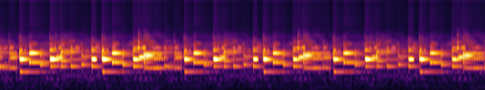

# TEMP — smooth playback test (delete before merge)

Avril 14th, 30–50 s. Tap a link to play it in your browser:

- ▶️ [**Side by side** — top: current (5.4 fps), bottom: smooth (60 fps)](https://github.com/eddie-water/sub-shader/raw/gsd/phase-08-codebase-refactoring-and-module-cleanup/tmp/smooth_test/smooth_compare.mp4)
- ▶️ [Smooth 60 fps](https://github.com/eddie-water/sub-shader/raw/gsd/phase-08-codebase-refactoring-and-module-cleanup/tmp/smooth_test/smooth_60fps.mp4)
- ▶️ [Smooth 30 fps](https://github.com/eddie-water/sub-shader/raw/gsd/phase-08-codebase-refactoring-and-module-cleanup/tmp/smooth_test/smooth_30fps.mp4)

Same moment in all three — left: current, middle: 30 fps, right: 60 fps (same look, only the motion changes):

